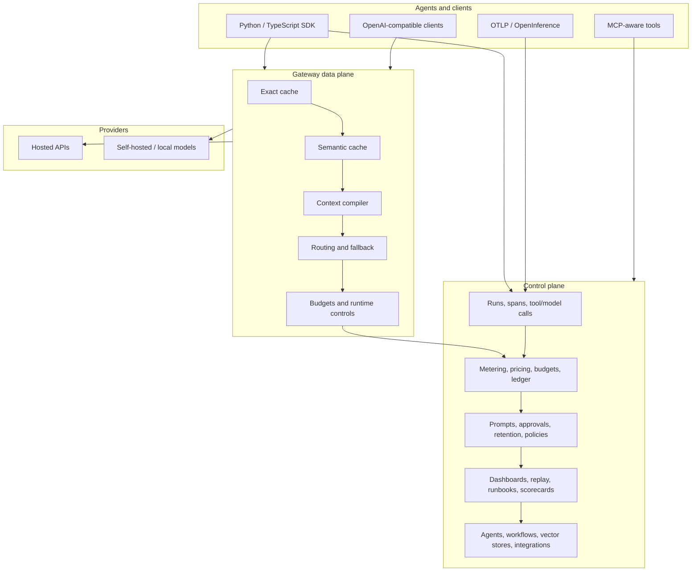
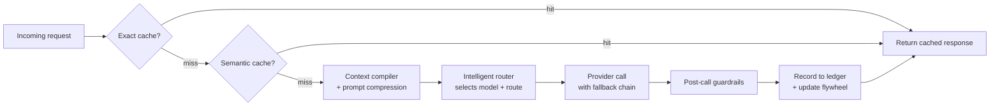
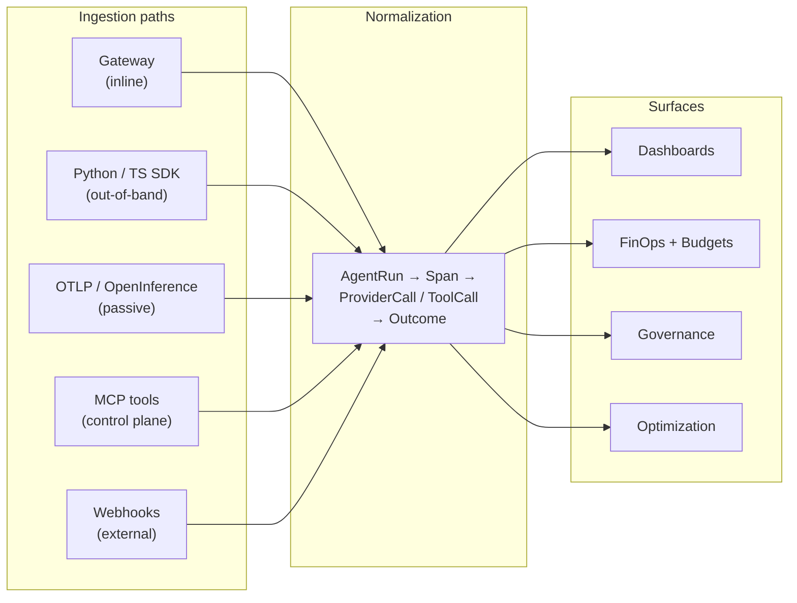
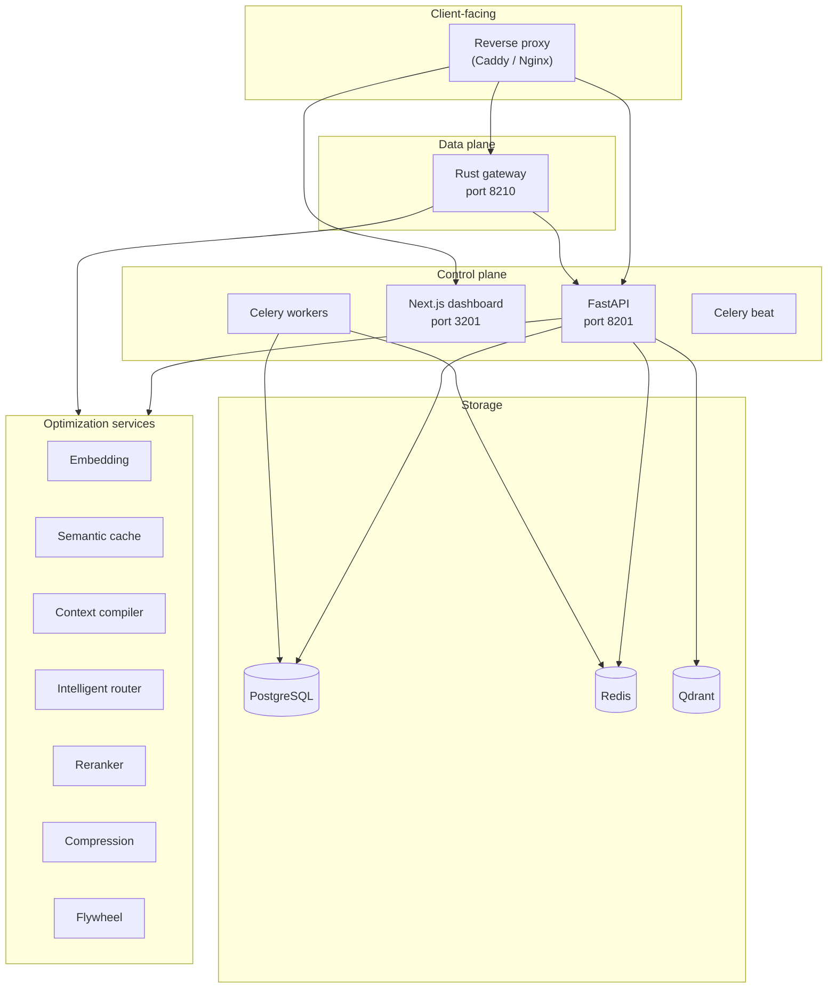

<div align="center">


# RunLedger Community

**Self-hosted AI operations control plane — observability, governance, optimization, and cost intelligence in one stack.**

[](LICENSE)
[](https://www.python.org/)
[](https://github.com/astral-sh/uv)
[](https://codespaces.new/avs6/runledger-community)

[Documentation](docs/introduction.mdx) · [Quickstart](#quickstart) · [Architecture](#architecture) · [Features](#features) · [Deployment](#deployment)

</div>

---

RunLedger is the operations layer between your AI agents and every model provider — OpenAI, Anthropic, Google, Mistral, Cohere, and any OpenAI-compatible endpoint including self-hosted models. It unifies cost accounting, budget enforcement, governance, and token optimization into a single control plane that runs entirely on your infrastructure.

<table>
<tr>
<td width="50%">

**As an inline gateway** — route, cache, enforce budgets, and optimize tokens across providers through an OpenAI-compatible API.

</td>
<td width="50%">

**As an out-of-band control plane** — ingest telemetry via SDK, OTLP, MCP, or webhooks for observability and governance without touching the request path.

</td>
</tr>
</table>

RunLedger is fully self-hosted, multi-tenant, and designed for local models, hosted providers, and hybrid deployments. For infrastructure monitoring, it integrates with Prometheus, Grafana, and the OpenTelemetry Collector rather than rebuilding a parallel stack.

> Tracing tools tell you what happened.
> RunLedger tells you what it cost, who owns it, whether it was allowed, whether it worked, and what to optimize next.

---

## Features

<table>
<tr>
<td width="33%" valign="top">

### Instrumentation
- [Python SDK](docs/instrumentation/python-sdk.mdx)
- [TypeScript SDK](docs/instrumentation/typescript-sdk.mdx)
- [OTLP / OpenTelemetry](docs/otlp.md)
- [OpenInference](docs/openinference.md)
- [MCP integrations](docs/integration-options-mcp.md)
- [Desktop agent setup](docs/integrations/desktop-agent-setup.md)
- Publishable [skills](skills/) for Claude, Codex, Cursor, Devin

</td>
<td width="33%" valign="top">

### Gateway
- [Overview](docs/gateway/overview.mdx) — OpenAI-compatible
- [Routing and fallback](docs/gateway/routing.mdx) — cost, latency, quality, canary, budget-aware
- [Caching](docs/gateway/caching.mdx) — exact + semantic
- [Runtime controls](docs/gateway/runtime-controls.mdx)
- [Providers](docs/gateway/providers.mdx)
- [Performance and scale](docs/gateway/performance-and-scale.mdx)

</td>
<td width="33%" valign="top">

### Cost and FinOps
- [Metering](docs/finops/metering.mdx)
- [Pricing engine](docs/finops/pricing.mdx)
- [Cost attribution](docs/finops/attribution.mdx)
- [Budgets](docs/finops/budgets.mdx)
- [Outcomes and ROI](docs/finops/outcomes.mdx)
- [Tamper-evident ledger](docs/finops/ledger.mdx)
- [Cost and savings](docs/finops/cost-savings.mdx)
- [Chargeback](docs/finops/chargeback.mdx)

</td>
</tr>
<tr>
<td width="33%" valign="top">

### Token Optimization
- [Optimization overview](docs/optimization.mdx)
- [Semantic cache](docs/optimization/semantic-cache.mdx)
- [Context compiler](docs/optimization/context-compiler.mdx)
- [Prompt compression](docs/optimization/prompt-compression.mdx)
- [Intelligent routing](docs/optimization/intelligent-routing.mdx)
- [Tool filtering](docs/optimization/tool-filtering.mdx)
- [Optimization flywheel](docs/optimization/flywheel.mdx)

</td>
<td width="33%" valign="top">

### Governance
- [Evaluations](docs/governance/evaluations.mdx)
- [Prompt registry](docs/governance/prompts.mdx)
- [Approvals](docs/governance/approvals.mdx)
- [RBAC and multi-tenancy](docs/governance/rbac.mdx)
- [Alerts](docs/governance/alerts.mdx)
- [Data retention](docs/governance/retention.mdx)
- [Policy dry-run](docs/governance/policy-dry-run.mdx)
- [Governance audit pack](docs/governance/governance-audit-pack.mdx)
- [Data capture studio](docs/governance/data-capture-studio.mdx)

</td>
<td width="33%" valign="top">

### Observability
- [AI Ops dashboards](docs/observability/ai-ops-dashboards.mdx)
- [Analytics](docs/observability/analytics.mdx)
- [Runs](docs/observability/runs.mdx) / [Sessions](docs/observability/sessions.mdx)
- [Request flow](docs/observability/request-flow.mdx) / [Request explorer](docs/observability/request-explorer.mdx)
- [Engineering dashboard](docs/observability/engineering.mdx)
- [Model usage](docs/observability/model-usage.mdx) / [Model scorecards](docs/observability/model-scorecards.mdx)
- [Optimization simulator](docs/observability/optimization-simulator.mdx)
- [Runbooks](docs/observability/runbooks.mdx) / [Replay lab](docs/observability/replay-lab.mdx)
- [Onboarding](docs/observability/onboarding.mdx) / [Product tour](docs/observability/product-tour.mdx)

</td>
</tr>
<tr>
<td width="33%" valign="top">

### Agentic
- [Agents](docs/agentic/agents.mdx)
- [Workflows](docs/agentic/workflows.mdx)
- [Vector stores](docs/agentic/vector-stores.mdx)
- [API playground](docs/agentic/playground.mdx)

</td>
<td width="33%" valign="top">

### Administration
- [MCP registry](docs/administration/mcp-registry.mdx)
- [AI Hub model catalog](docs/administration/ai-hub.mdx)
- [Backup and restore](docs/backup-restore.md)
- [Email delivery](docs/administration/email-delivery.md)
- Tags, search tools, tool policies, access groups, security settings

</td>
<td width="33%" valign="top">

### Resources
- [Full documentation](docs/introduction.mdx)
- [Product/data contract](docs/product-data-alignment.md)
- [Demo runbook](docs/demo-runbook.md)
- [Demo script](docs/demo-script.md)
- [Demo asset bundle](docs/demo-asset-bundle.md)

</td>
</tr>
</table>

## Architecture

RunLedger operates as two complementary layers:

- **Control plane** — metering, budgets, analytics, outcomes, prompts, policies, approvals, and auditability
- **Inline data plane** (optional) — gateway routing, exact and semantic caching, context compilation, runtime controls, fallback chains, and optimization stages

All telemetry normalizes into a single model:

`AgentRun → Span → ProviderCall / ToolCall → Outcome`



See [Core concepts](docs/concepts.mdx) for the data model and ingestion trade-offs, or [Architecture](docs/architecture.md) for the full system view.

### Optimization pipeline

Every request through the gateway passes through a staged optimization pipeline. Each stage is independently configurable per workspace, and the flywheel continuously tunes the configuration based on observed traffic.



### How data flows in

RunLedger accepts telemetry through multiple ingestion paths. All paths normalize into the same data model, so dashboards, budgets, and governance apply uniformly regardless of how the data arrived.



## Quickstart

```bash
git clone https://github.com/avs6/runledger-community
cd runledger-community
cp .env.example .env
docker compose up -d
```

Bootstrap the initial admin:

```bash
curl -s -X POST http://localhost:8201/admin/bootstrap \
  -H "X-Admin-Secret: runledger-admin" \
  -H "Content-Type: application/json" \
  -d '{"email":"admin@example.com","password":"Admin123!","full_name":"Admin","org_name":"My Org"}'
```

| URL | Purpose |
|---|---|
| `http://localhost:3201` | Dashboard |
| `http://localhost:8201/reference` | Interactive API reference |
| `http://localhost:8210/gateway` | Rust gateway (OpenAI-compatible) |
| `http://localhost:4318` | OTLP/HTTP receiver |
| `http://localhost:8201/mcp` | RunLedger MCP endpoint |
| `http://localhost:8206/mcp` | Optimization MCP gateway |

See [Service ports](docs/deployment/configuration.mdx) for the full map.

### Instrument your first application

```python
from runledger_sdk import RunLedger
import openai

rl = RunLedger(api_key="rl_...")
rl.instrument()

with rl.context(end_user_id="u_123", feature_tag="support-chat"):
    openai.OpenAI().chat.completions.create(model="gpt-4o-mini", messages=[...])
```

Alternatively, point any OpenAI-compatible client at the gateway directly:

```python
import openai

client = openai.OpenAI(
    base_url="http://localhost:8210/gateway",
    api_key="rl_...",
)
client.chat.completions.create(model="gpt-4o-mini", messages=[...])
```

To populate a full local demo environment, run `uv run python scripts/full_simulate.py`.
See [scripts/README.md](scripts/README.md) and the [demo runbook](docs/demo-runbook.md) for details.

## Deployment

RunLedger supports four integration models, each suited to different operational requirements:

| Model | In request path | Enforcement | Typical use |
|---|:---:|---|---|
| **Inline gateway** | Yes | Full routing, cache, budget, runtime controls | OpenAI-compatible apps and agents |
| **Out-of-band SDK** | No | Advisory pre-checks + rich telemetry | App code you can instrument |
| **Passive OTLP** | No | Observe-only | Existing telemetry estates |
| **MCP control plane** | Sometimes | Budget, policy, run logging, optimization guidance | Desktop agents and external tools |

### Deployment topology

A typical production deployment separates the control plane from the data plane. The Rust gateway handles latency-sensitive traffic, while the Python API serves dashboards, configuration, and background processing.



### Compose profiles

RunLedger uses Docker Compose profiles to scale from a minimal local setup to a full production stack:

| Profile | What it includes | Use case |
|---|---|---|
| *(default)* | API, dashboard, gateway, Postgres, Redis, workers | Development and evaluation |
| `infra` | + Qdrant, MinIO, Redpanda, Letta | Semantic search, backups, streaming export |
| `aux` | + All optimization and agentic services | Full optimization pipeline |
| `observability` | + OpenTelemetry Collector | OTLP ingestion from external sources |
| `full-demo` | Everything above combined | End-to-end demonstrations |

```bash
# Minimal (core services only)
docker compose up -d

# With optimization services
docker compose --profile aux up -d

# Full stack
docker compose --profile full-demo up -d
```

| | |
|---|---|
| [Docker Compose](docs/deployment/docker-compose.mdx) | [Configuration](docs/deployment/configuration.mdx) |
| [Helm / Kubernetes](docs/helm.md) | [High availability](docs/ha.md) |
| [Backup and restore](docs/backup-restore.md) | [Architecture](docs/architecture.md) |
| [Versioning policy](docs/versioning-policy.md) | [Changelog](CHANGELOG.md) |

## Contributing

Contributions are welcome. See [CONTRIBUTING.md](CONTRIBUTING.md) for setup and workflow.

## License

[Apache License 2.0](LICENSE)
