# RunLedger Community

[](LICENSE)
[](https://www.python.org/)
[](https://github.com/astral-sh/uv)
[](https://codespaces.new/avs6/runledger-community)

**The self-hosted control plane that makes AI agents observable, governable, and cheaper to run.**

RunLedger sits between your agents and every model provider — OpenAI, Anthropic, Gemini, Mistral, Cohere, and any self-hosted or OpenAI-compatible endpoint — and turns raw inference traffic into trace-linked cost accounting, budget enforcement, outcome-to-cost visibility, and active token optimization. Payload logging is off by default.

> Tracing tools tell you *what happened.*
> RunLedger tells you *what it cost, who pays, whether you're over budget, what the ROI was — and how to spend fewer tokens next time.*

---

## Why RunLedger

Shipping AI agents to production is easy. Keeping them accountable is not. Every team hits the same five walls:

- **Spend explodes** — a retry loop or runaway agent silently burns through the API budget overnight, and nobody notices until the invoice lands.
- **Attribution is guesswork** — cost can't be tied to a tenant, user, or feature without custom instrumentation.
- **Routing ignores economics** — models are chosen for capability, never for cost-per-outcome.
- **Context is bloated** — agents ship tens of thousands of redundant tokens on every call, paying frontier rates for context the model never needed.
- **No audit trail** — nothing links internal metering back to the exact agent run that generated the spend.

RunLedger closes all five in one self-hosted control plane — no vendor lock-in, no data leaving your infrastructure, no GPU required.

---

## Capabilities

Everything below is **available today** in RunLedger Community.

### Model Gateway & Routing

| | Capability |
|:--:|---|
| ✅ | OpenAI-compatible gateway — drop-in `base_url` swap for any OpenAI client |
| ✅ | Multi-provider: OpenAI, Anthropic, Google Gemini, Mistral, Cohere |
| ✅ | Self-hosted & local models: Ollama, vLLM, or any OpenAI-compatible endpoint |
| ✅ | Provider fallback with automatic retries on transient errors |
| ✅ | Cost-aware routing policies — cost, latency, quality, weighted, canary, budget-aware, complexity, and outcome strategies |
| ✅ | Intelligent routing — classify complexity × business risk → model tier, plus reasoning-effort, per request |
| ✅ | Exact-match prompt cache (sub-5ms hits, tenant-scoped) |
| ✅ | Semantic near-duplicate cache with strict scope isolation (tenant / model / prompt / version) |
| ✅ | Context Compiler — shrink oversized requests before the model (dedup, tool-output compression, relevance rerank/prune, conversation compaction) |
| ✅ | Prompt compression — opt-in LLMLingua-2 token compression on the compiled context, under a quality floor |
| ✅ | Dynamic tool filtering & skill injection — keep only relevant tools; inject the body of matched skills |
| ✅ | Optimization flywheel — learns the cheapest config per traffic segment that still holds your quality SLA, then recommends or auto-applies it (guardrailed) |
| ✅ | Per-route runtime controls — cost caps, per-user rate limits, PII redaction |

### Cost, Metering & FinOps

| | Capability |
|:--:|---|
| ✅ | Provider-aware token metering — input, output, and cached tokens |
| ✅ | Config-driven pricing engine — add a model by inserting a pricing row, no code change |
| ✅ | Cost attribution by user, tenant, and feature |
| ✅ | Budgets with automatic actions — throttle, block, or downgrade the model |
| ✅ | Unit-economics breakdown across steps, tools, retrieval, and retries |
| ✅ | Tamper-evident, HMAC-signed usage ledger for billing integrity |
| ✅ | Outcome & ROI ledger — cost-per-success, ROI by workflow, success-rate trends |

### Observability

| | Capability |
|:--:|---|
| ✅ | OTLP / OpenTelemetry ingestion — accepts OTel and OpenInference traces, no SDK required |
| ✅ | Python & TypeScript SDKs — two-line instrumentation |
| ✅ | Run Explorer with interactive DAG viewer and CSV export |
| ✅ | Session tracking — multi-turn conversations and cost-over-turns |
| ✅ | Analytics — top spenders, cohorts, and anomaly detection |
| ✅ | Normalized domain model — `AgentRun → Span → ProviderCall / ToolCall` |

### Quality & Governance

| | Capability |
|:--:|---|
| ✅ | Evaluations & experiments — prompt × model × dataset, with regression tracking |
| ✅ | Prompt registry — versioning, diff viewer, promote-to-production, variable substitution |
| ✅ | Approvals & governance workflows for sensitive actions |
| ✅ | Multi-tenant RBAC — org and workspace roles with scoped isolation |
| ✅ | Privacy-first payload logging — off by default; errors-only / sampled / full are explicit opt-ins |
| ✅ | Data retention policies |
| ✅ | Alert rules and metric-threshold monitoring |

### Integrations & Deployment

| | Capability |
|:--:|---|
| ✅ | MCP server — connect Claude Desktop or Claude Code directly to your instance |
| ✅ | Works with any OpenAI-compatible client, framework, or agent (LangChain, LangGraph, and more) |
| ✅ | Cognitive layer — shared workspace memory, knowledge graph, and skills over MCP |
| ✅ | Dynamic tool filtering + skill injection — keep only relevant tools, inject matched skill bodies |
| ✅ | Fully self-hosted — Docker Compose, no external dependencies, no GPU required |

---

## Architecture

RunLedger is a **control plane** (metering, budgets, analytics, governance) fronting an **inline data plane** (the gateway and its caching/routing stages). Agents reach it three ways — SDK, OpenTelemetry, or the model gateway — and everything normalizes into a single domain model.


The request path in detail — the inline gateway data plane, and how every ingestion route feeds one control plane:

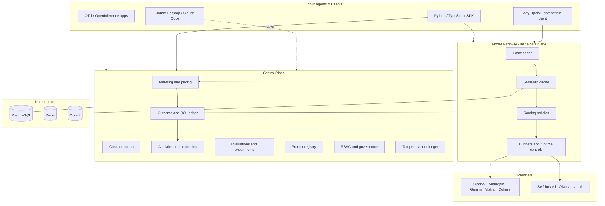

**Ingestion paths — pick any, mix freely:**

| Path | When to use |
|------|-------------|
| **RunLedger SDK** | Full control — budget enforcement, `rl.score()`, prompt fetch, propagation headers |
| **OTLP direct** | You already emit OTel / OpenInference — zero instrumentation change |
| **OTLP via Collector** | Production — batching, retry, attribute enrichment |
| **Model Gateway** | Drop-in `base_url` swap — works for any OpenAI-compatible client |

All paths normalize into the same domain model: `AgentRun → Span → ProviderCall / ToolCall`.

---

## Deployment & Integration Models

RunLedger fits your stack in whichever way matches your latency, enforcement, and code-change constraints. Pick one, or mix them per service.

### 1. Inline — Model Gateway in the request path

Clients swap only their `base_url`. Inference flows **through** RunLedger, so caching, routing, fallback, and budgets are enforced in-band — a runaway loop can be throttled or blocked before it reaches the provider.

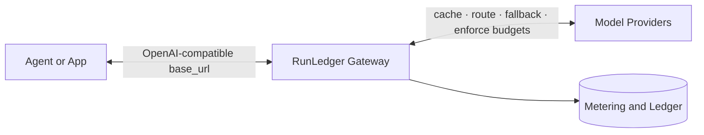

**Best for:** active cost control and optimization. **Trade-off:** adds one hop to the request path.

### 2. Out-of-band — SDK instrumentation

The SDK wraps your provider client. Inference calls go **directly** to the provider, while telemetry is sent to RunLedger asynchronously. Budgets can still gate requests through a fast pre-check before the call.

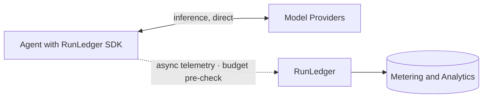

**Best for:** the richest per-run context with **zero added inference latency**. **Trade-off:** enforcement is advisory unless you block on the pre-check.

### 3. Passive — OTLP / OpenTelemetry

Applications already emitting OpenTelemetry or OpenInference traces send them to a Collector, which forwards to RunLedger. No SDK, no gateway, no code change.

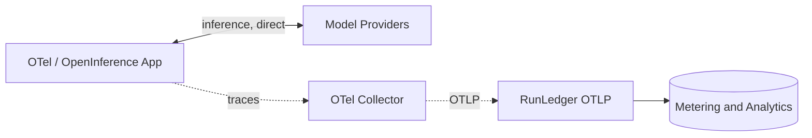

**Best for:** drop-in observability on an existing OTel stack. **Trade-off:** observe-only — no caching, routing, or enforcement.

### 4. Hybrid — inline where it matters, out-of-band elsewhere

Route high-spend or agentic services through the gateway for full control, and instrument the rest with the SDK or OTLP. Everything normalizes into the same ledger and dashboards.

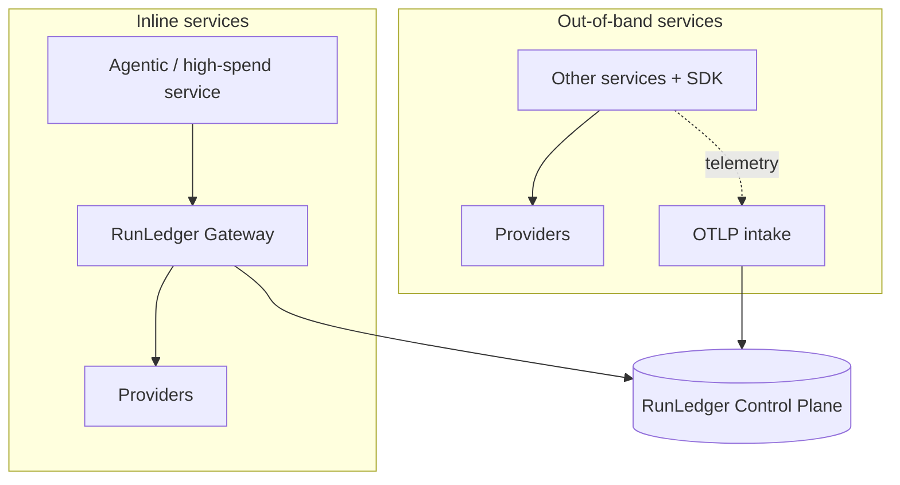

**Best for:** large estates that want enforcement on the expensive paths without re-routing everything.

> **MCP overlay (any model):** Claude Desktop and Claude Code can connect to RunLedger's MCP server to query cost, budgets, and analytics as tools — independent of how inference traffic is routed.

### At a glance

| Model | In request path | Enforcement | Inference latency overhead | Code change |
|-------|:---------------:|-------------|:--------------------------:|-------------|
| **Inline gateway** | Yes | Full, blocking (cache · route · budget) | One hop | `base_url` swap |
| **Out-of-band SDK** | No | Advisory pre-checks | None | ~2 lines |
| **Passive OTLP** | No | None (observe-only) | None | None, if already on OTel |
| **Hybrid** | Per service | Per service | Per service | Mixed |

---

## Roadmap

RunLedger is evolving from **observing and controlling** AI cost into **actively minimizing** it — cutting tokens before they are ever sent, subject to a customer-defined quality and outcome SLA. On the way:

- **Cost × quality optimization flywheel** — automatically settle on the cheapest configuration that still holds your quality SLA.

---

## Quickstart

**Docker Compose (recommended):**

```bash
git clone https://github.com/avs6/runledger-community
cd runledger-community
cp .env.example .env   # set SECRET_KEY
docker compose up -d   # add --build to build from source instead of pulling images
```

Bootstrap the admin:

```bash
curl -s -X POST http://localhost:8201/admin/bootstrap \
  -H "X-Admin-Secret: runledger-admin" \
  -H "Content-Type: application/json" \
  -d '{"email":"admin@example.com","password":"Admin123!","full_name":"Admin","org_name":"My Org"}'
```

| URL | What it is |
|-----|------------|
| `http://localhost:3201` | Dashboard |
| `http://localhost:8201/reference` | Interactive API reference (Scalar) |
| `http://localhost:4318` | OTLP/HTTP receiver (via OTel Collector) |

---

## Instrument Your Code

### Python — 2 lines

```python
from runledger_sdk import RunLedger
import openai

rl = RunLedger(api_key="rl_...")   # or RUNLEDGER_API_KEY env var
rl.instrument()                     # wraps openai.OpenAI + AsyncOpenAI

client = openai.OpenAI()

with rl.context(end_user_id="u_123", feature_tag="support-chat") as run_id:
    resp = client.chat.completions.create(
        model="gpt-4o-mini",
        messages=[{"role": "user", "content": "Hello!"}],
    )

rl.shutdown()
```

Also supports Anthropic, LangChain, LangGraph, async, and cross-service propagation.

### TypeScript — 2 lines

```typescript
import OpenAI from 'openai'
import { RunLedger } from '@runledger/sdk'

const rl = new RunLedger({ apiKey: process.env.RUNLEDGER_API_KEY })
const openai = new OpenAI()
rl.instrument(openai)

const result = await rl.withContext(
  { endUserId: 'u_123', featureTag: 'support-chat' },
  async () => openai.chat.completions.create({ model: 'gpt-4o-mini', messages: [{ role: 'user', content: 'Hello!' }] }),
)
await rl.flush()
```

Also supports Gemini, Mistral, Cohere.

---

## Model Gateway

Point any OpenAI client at RunLedger's proxy — change only `base_url`:

```python
import openai

client = openai.OpenAI(
    api_key="rl_...",
    base_url="http://localhost:8201/gateway",
)
resp = client.chat.completions.create(model="gpt-4o-mini", messages=[...])
# First call → forwarded to provider. Identical second call → cache hit (<5ms).
```

Routes are defined per model alias, so the same client call can fall back across providers, cache exactly and semantically, and enforce budgets — all without touching application code. Self-hosted models (Ollama, vLLM, or any OpenAI-compatible server) are configured as ordinary routes and are metered like any hosted provider.

---

## Supported Providers

| Provider | Access |
|----------|--------|
| OpenAI (gpt-4o, gpt-4o-mini, o1, o3-mini, …) | SDK · Gateway |
| Anthropic (Claude Opus, Sonnet, Haiku, …) | SDK · Gateway |
| Google Gemini | SDK · Gateway |
| Mistral | SDK · Gateway |
| Cohere | SDK · Gateway |
| Self-hosted & OpenAI-compatible (Ollama, vLLM, Groq, Azure, Bedrock, Vertex) | Gateway |

Add a new model by inserting a row into `provider_pricing` — no code change required.

---

## Dashboard

| Page | Path | Description |
|------|------|-------------|
| Dashboard | `/dashboard` | Spend summary, key metrics |
| Run Explorer | `/runs` | Filter + paginate runs; DAG viewer; CSV export |
| Sessions | `/sessions` | Multi-turn conversations; cost-over-turns chart |
| Analytics | `/analytics` | Spend charts, top spenders, economics |
| Budgets | `/budgets` | Create budgets, live spend progress, breach history |
| Outcomes & ROI | `/outcomes` | Cost-per-outcome, workflow ROI, success-rate trends |
| Evaluations | `/evaluations` | Submit + view quality scores, regressions |
| Experiments | `/experiments` | Run prompt × model × dataset evaluations |
| Prompts | `/prompts` | Version-controlled registry, diff viewer, promote |
| Gateway | `/gateway` | Routes, routing log, runtime controls |
| Approvals | `/approvals` | Governance queue for sensitive actions |
| Monitoring | `/monitoring` | Alert rules, metric thresholds |
| Settings | `/settings` | API keys, MCP setup, alerts, integrations, retention |

---

## Screenshots

### Login
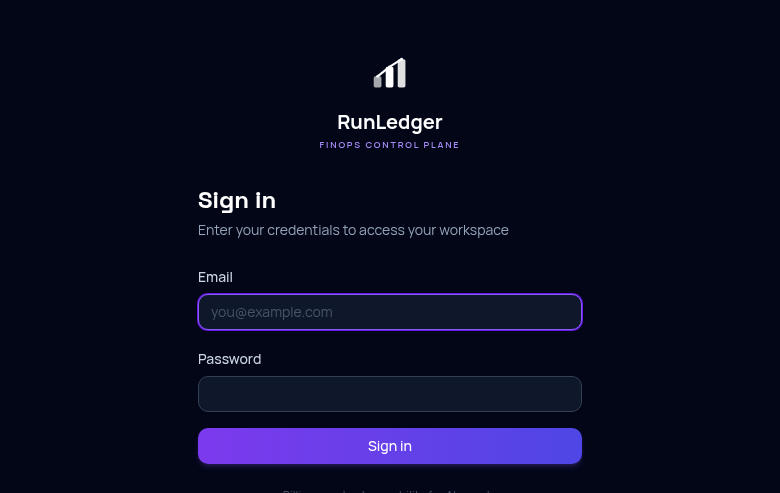

### Dashboard
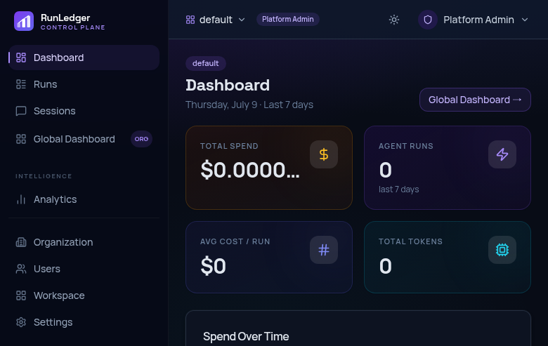

### Run Explorer
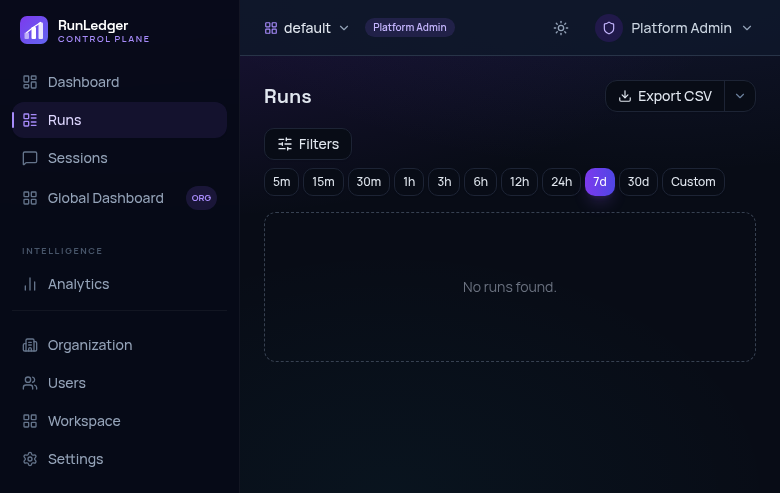

### Analytics
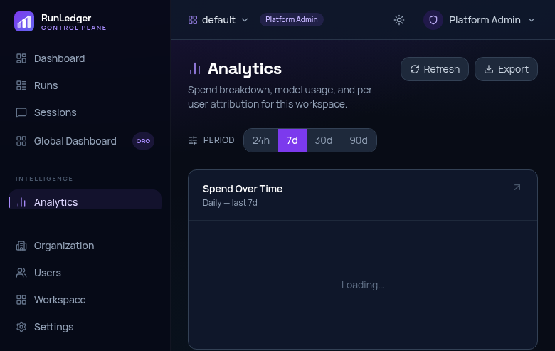

### Model Gateway
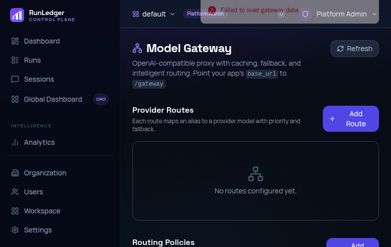

### Prompt Registry
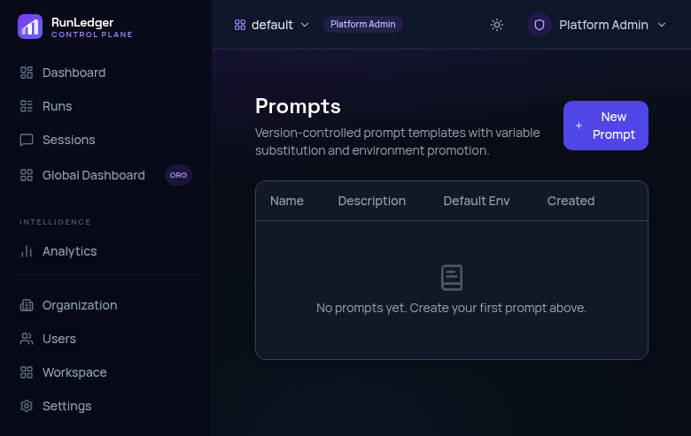

### Evaluation & Experiments
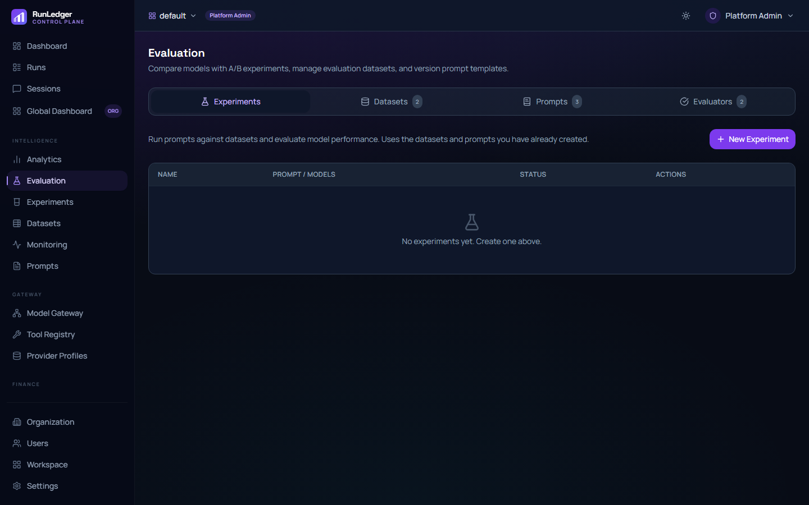

### Outcomes & ROI
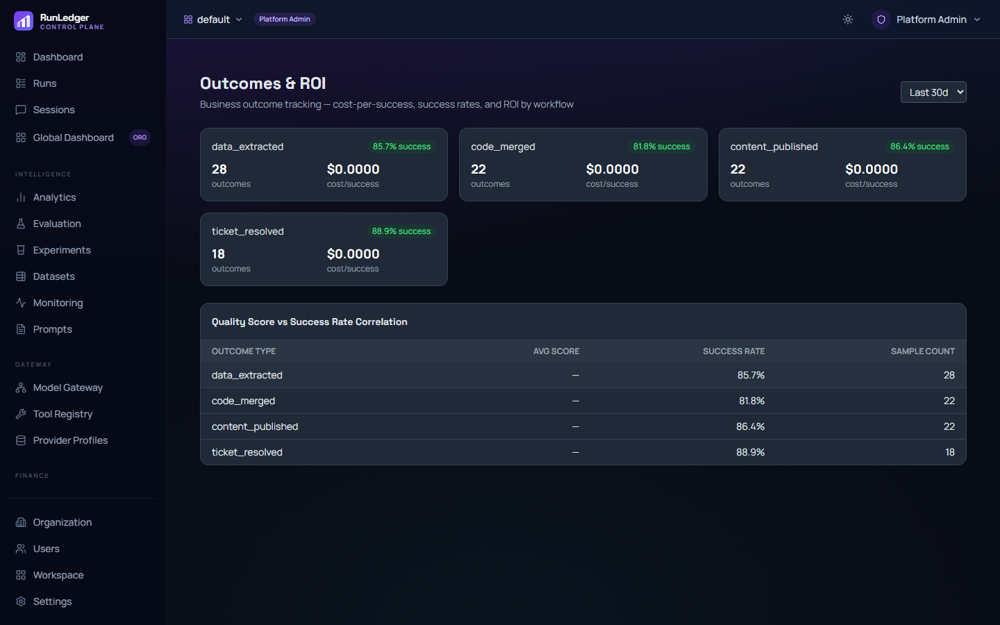

### Approvals & Governance
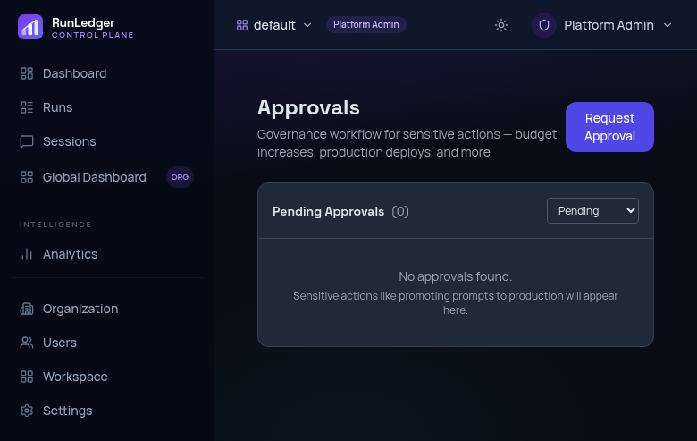

### Settings
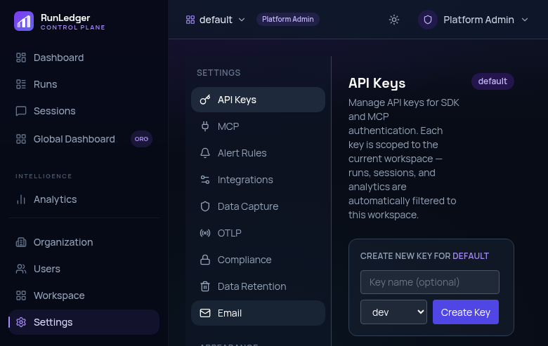

### Users & RBAC
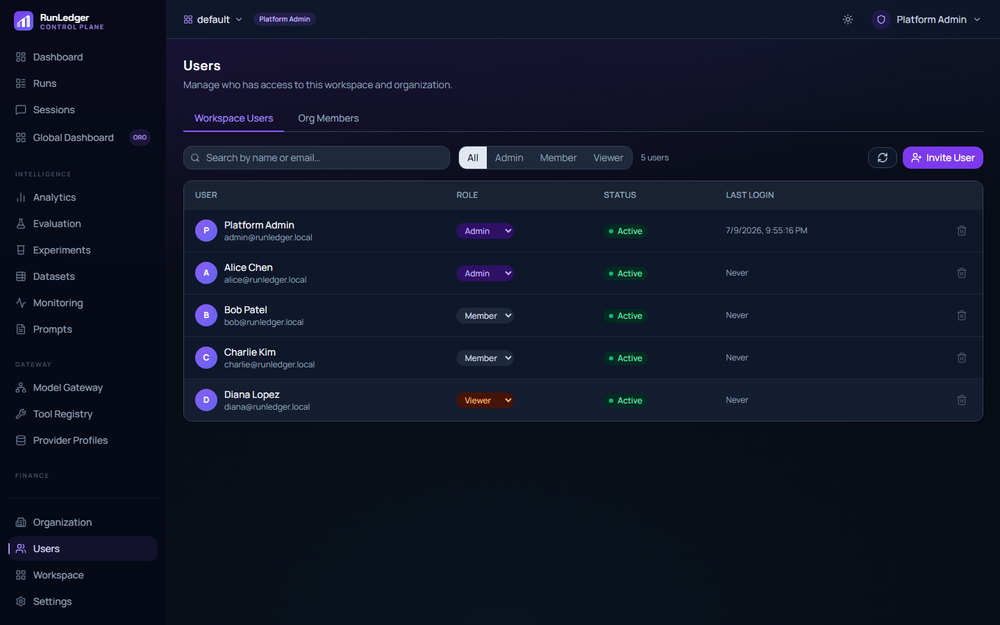

### Organization
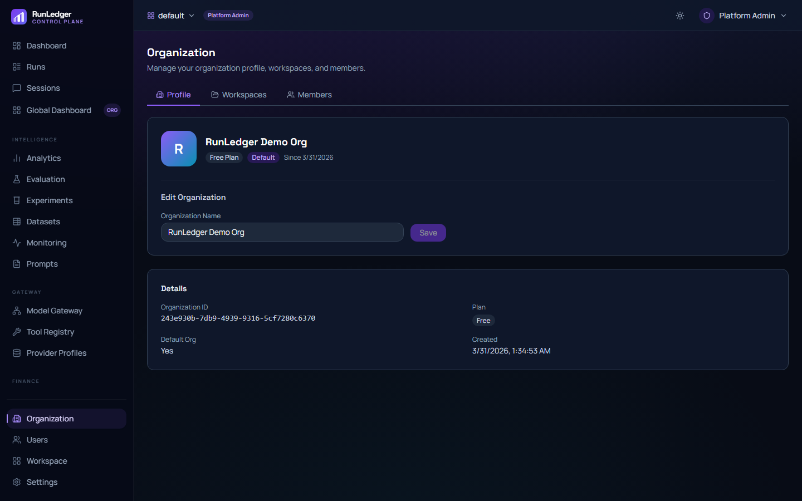

---

## Tech Stack

| Layer | Choice |
|-------|--------|
| Language | Python 3.13 |
| API framework | FastAPI (async) |
| Database | PostgreSQL 16 (partitioned tables + materialized views) |
| Queue / cache | Redis 7 (Streams + budget hot-path) |
| Vector store | Qdrant (semantic cache) |
| Workers | Celery + Redis broker |
| SDKs | Python (`runledger-sdk`) + TypeScript (`@runledger/sdk`) |
| Frontend | Next.js 14, App Router, TypeScript, Tailwind, shadcn/ui, Recharts |
| Migrations | Alembic |
| Package manager | uv (workspaces) |
| Deploy | Docker Compose (local), Railway (managed) |

---

## Community vs Enterprise

| Feature | Community | Enterprise |
|---------|:---------:|:----------:|
| SDK instrumentation (Python + TypeScript) | ✅ | ✅ |
| OTLP / OpenTelemetry ingestion | ✅ | ✅ |
| Core metering + pricing engine | ✅ | ✅ |
| Budgets + spend guardrails | ✅ | ✅ |
| Analytics + dashboards | ✅ | ✅ |
| Model gateway + prompt caching | ✅ | ✅ |
| Semantic cache | ✅ | ✅ |
| Self-hosted & local model routing | ✅ | ✅ |
| Evaluations + experiments | ✅ | ✅ |
| Prompt registry | ✅ | ✅ |
| Outcomes & ROI | ✅ | ✅ |
| Approvals & governance | ✅ | ✅ |
| Multi-tenant RBAC | ✅ | ✅ |
| Alert rules | ✅ | ✅ |
| Data retention policies | ✅ | ✅ |
| Provider invoice reconciliation | | ✅ |
| Chargeback engine + cost centers | | ✅ |
| SSO / OIDC + SCIM provisioning | | ✅ |
| Warehouse export (S3/GCS/R2) | | ✅ |
| BYOK / KMS encryption | | ✅ |
| Advanced routing policies | | ✅ |
| Finance system exports (QuickBooks, NetSuite) | | ✅ |
| Kafka event streaming | | ✅ |
| Pricing contracts + credits | | ✅ |

Enterprise features are available separately — [contact for details](mailto:abijith13@gmail.com).

---

## Contributing

Contributions welcome. See [CONTRIBUTING.md](CONTRIBUTING.md) for development setup and the PR process.

---

## License

[Apache License 2.0](LICENSE)
