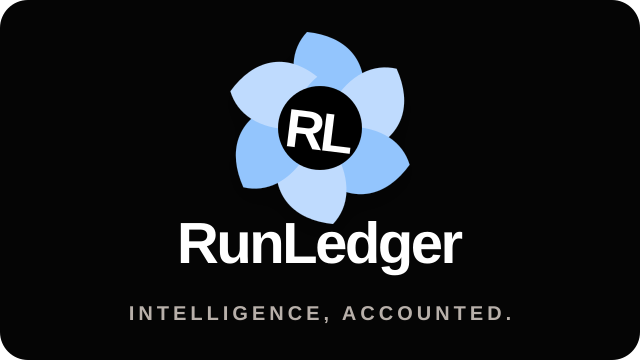
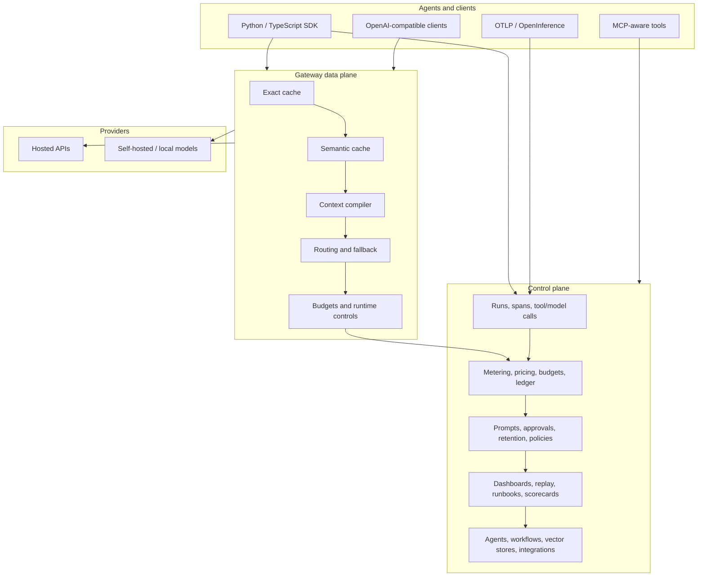

<div align="center">



# RunLedger Community

**The self-hosted AI operations control plane for observability, governance, optimization, and cost intelligence.**

[](LICENSE)
[](https://www.python.org/)
[](https://github.com/astral-sh/uv)
[](https://codespaces.new/avs6/runledger-community)

[Documentation](docs/introduction.mdx) · [Quickstart](#quickstart) · [Architecture](#architecture) · [Features](#features) · [Deployment](#deployment) · [Community vs Enterprise](#community-vs-enterprise)

</div>

---

RunLedger helps teams understand what their AI systems are doing, what they cost, why they cost it, and how to improve them. It supports both inline gateway control and out-of-band telemetry, so you can use it as:

- an OpenAI-compatible gateway for routing, caching, budgets, and runtime controls
- an observability and FinOps layer for SDK, OTLP, MCP, and webhook-driven agents
- a governance and optimization plane for prompts, approvals, policies, retention, and outcomes

For generic infrastructure monitoring, RunLedger is designed to plug into OSS tooling such as
Prometheus, Grafana, and the OpenTelemetry Collector rather than rebuild a parallel infra-monitoring stack.

It is fully self-hosted, multi-tenant, and designed for local models, hosted providers, and hybrid deployments.

> Tracing tools tell you what happened.  
> RunLedger tells you what it cost, who owns it, whether it was allowed, whether it worked, and what to optimize next.

## What Ships Today

RunLedger Community currently includes:

- Python and TypeScript SDKs, OTLP ingestion, OpenInference support, MCP tools/resources/prompts, and webhook ingest
- an OpenAI-compatible gateway with exact caching, semantic caching, intelligent routing, fallback chains, deployment health, and runtime controls
- cost metering, pricing, budgets, chargeback foundations, outcome tracking, ROI analysis, and a tamper-evident ledger
- governance features including approvals, alerts, prompt registry, evaluations, policy dry-run, retention controls, and scoped data-capture controls
- agent operations features including agent registry, workflow runs, API playground, vector store management, runbooks, replay lab, and onboarding
- advanced management surfaces for tags, search tools, tool policies, access groups, response cache controls, and workspace security settings
- demo tooling including one-click demo mode, full simulator flows, labs, and local LocalAI/MinIO helper scripts
- infra operator surfaces for queue visibility, hardening checks, feature flags, storage policy posture, and profile-aware local deployment

## Features

### Instrumentation and integration

- [Python SDK](docs/instrumentation/python-sdk.mdx)
- [TypeScript SDK](docs/instrumentation/typescript-sdk.mdx)
- [OTLP / OpenTelemetry signals](docs/otlp.md)
- [OpenInference](docs/openinference.md)
- [MCP integration options](docs/integration-options-mcp.md)
- [Desktop agent setup and validation](docs/integrations/desktop-agent-setup.md)
- publishable skills for Claude, Codex, Cursor, and Devin under [`skills/`](skills)

### Gateway and optimization

- [Gateway overview](docs/gateway/overview.mdx)
- [Routing and fallback](docs/gateway/routing.mdx)
- [Caching](docs/gateway/caching.mdx)
- [Runtime controls](docs/gateway/runtime-controls.mdx)
- [Providers](docs/gateway/providers.mdx)
- [Optimization overview](docs/optimization.mdx)
- [Semantic cache](docs/optimization/semantic-cache.mdx)
- [Context compiler](docs/optimization/context-compiler.mdx)
- [Prompt compression](docs/optimization/prompt-compression.mdx)
- [Intelligent routing](docs/optimization/intelligent-routing.mdx)
- [Tool filtering](docs/optimization/tool-filtering.mdx)
- [Optimization flywheel](docs/optimization/flywheel.mdx)

### FinOps and governance

- [Metering](docs/finops/metering.mdx)
- [Pricing](docs/finops/pricing.mdx)
- [Cost attribution](docs/finops/attribution.mdx)
- [Budgets](docs/finops/budgets.mdx)
- [Outcomes and ROI](docs/finops/outcomes.mdx)
- [Ledger](docs/finops/ledger.mdx)
- [Cost and savings](docs/finops/cost-savings.mdx)
- [Chargeback](docs/finops/chargeback.mdx)
- [Evaluations](docs/governance/evaluations.mdx)
- [Prompts](docs/governance/prompts.mdx)
- [Approvals](docs/governance/approvals.mdx)
- [RBAC](docs/governance/rbac.mdx)
- [Alerts](docs/governance/alerts.mdx)
- [Retention](docs/governance/retention.mdx)
- [Policy dry-run](docs/governance/policy-dry-run.mdx)
- [Governance audit pack](docs/governance/governance-audit-pack.mdx)
- [Data capture studio](docs/governance/data-capture-studio.mdx)

### Observability and operations

- [AI Ops dashboards](docs/observability/ai-ops-dashboards.mdx)
- [Analytics](docs/observability/analytics.mdx)
- [Runs](docs/observability/runs.mdx)
- [Sessions](docs/observability/sessions.mdx)
- [Request flow](docs/observability/request-flow.mdx)
- [Request explorer](docs/observability/request-explorer.mdx)
- [Engineering dashboard](docs/observability/engineering.mdx)
- [Model usage](docs/observability/model-usage.mdx)
- [Optimization simulator](docs/observability/optimization-simulator.mdx)
- [Runbooks](docs/observability/runbooks.mdx)
- [Replay lab](docs/observability/replay-lab.mdx)
- [Model scorecards](docs/observability/model-scorecards.mdx)
- [Onboarding](docs/observability/onboarding.mdx)
- [Product tour](docs/observability/product-tour.mdx)
- [Demo runbook](docs/demo-runbook.md)
- [Demo script](docs/demo-script.md)
- [Demo asset bundle](docs/demo-asset-bundle.md)

### Agentic and admin surfaces

- [Agents](docs/agentic/agents.mdx)
- [Workflows](docs/agentic/workflows.mdx)
- [Vector stores](docs/agentic/vector-stores.mdx)
- [API playground](docs/agentic/playground.mdx)
- [Backup and restore](docs/backup-restore.md)
- [Email delivery and reporting](docs/administration/email-delivery.md)
- tag management, search tools, tool policies, access groups, response cache controls, and security settings in the dashboard

📘 [Browse the docs index](docs/introduction.mdx)  
🧭 [Read the product/data contract](docs/product-data-alignment.md)

## Architecture

RunLedger has two major personalities:

- **Control plane**: metering, budgets, analytics, outcomes, prompts, policies, approvals, auditability
- **Optional inline data plane**: gateway routing, exact cache, semantic cache, runtime controls, fallback, and optimization stages

Everything normalizes into the same model:

`AgentRun -> Span -> ProviderCall / ToolCall -> Outcome`



See [Core concepts](docs/concepts.mdx) for the full model and ingestion trade-offs.
For a fuller system view, see [docs/architecture.md](docs/architecture.md).

## Quickstart

```bash
git clone https://github.com/avs6/runledger-community
cd runledger-community
cp .env.example .env
docker compose up -d
```

Bootstrap the initial admin:

```bash
curl -s -X POST http://localhost:8201/admin/bootstrap \
  -H "X-Admin-Secret: runledger-admin" \
  -H "Content-Type: application/json" \
  -d '{"email":"admin@example.com","password":"Admin123!","full_name":"Admin","org_name":"My Org"}'
```

Useful local URLs:

| URL | Purpose |
|---|---|
| `http://localhost:3201` | Dashboard |
| `http://localhost:8201/reference` | Interactive API reference |
| `http://localhost:4318` | OTLP/HTTP receiver |
| `http://localhost:8201/mcp` | Canonical RunLedger MCP endpoint |

Python example:

```python
from runledger_sdk import RunLedger
import openai

rl = RunLedger(api_key="rl_...")
rl.instrument()

with rl.context(end_user_id="u_123", feature_tag="support-chat"):
    openai.OpenAI().chat.completions.create(model="gpt-4o-mini", messages=[...])
```

Seed a full local demo:

```bash
uv run python scripts/full_simulate.py
```

See [scripts/README.md](scripts/README.md) and [docs/demo-runbook.md](docs/demo-runbook.md) for the full demo flow.

## Deployment

RunLedger supports several deployment styles:

| Model | In request path | Enforcement | Typical use |
|---|:---:|---|---|
| Inline gateway | Yes | Full routing, cache, budget, runtime controls | OpenAI-compatible apps and agents |
| Out-of-band SDK | No | Advisory pre-checks + rich telemetry | App code you can instrument |
| Passive OTLP | No | Observe-only | Existing telemetry estates |
| MCP control plane | Sometimes | Budget, policy, run logging, optimization guidance | Desktop agents and external tools |

Deployment docs:

- [Docker Compose](docs/deployment/docker-compose.mdx)
- [Configuration](docs/deployment/configuration.mdx)
- [Helm](docs/helm.md)
- [High availability](docs/ha.md)
- [Backup and restore](docs/backup-restore.md)
- [Architecture](docs/architecture.md)
- [Versioning policy](docs/versioning-policy.md)
- [Release checklist](docs/release-checklist.md)
- [Changelog](CHANGELOG.md)

## Community vs Enterprise

| Feature | Community | Enterprise |
|---|:---:|:---:|
| SDKs, OTLP, MCP, webhook ingest | ✅ | ✅ |
| Gateway, caching, routing, budgets, runtime controls | ✅ | ✅ |
| Analytics, dashboards, run explorer, request explorer | ✅ | ✅ |
| Outcomes, ROI, scorecards, replay, runbooks | ✅ | ✅ |
| Prompt registry, evaluations, approvals, alerts, retention | ✅ | ✅ |
| Agent registry, workflows, vector stores, playground | ✅ | ✅ |
| Tags, search tools, tool policies, access groups | ✅ | ✅ |
| Kafka export and backup operations foundations | ✅ | ✅ |
| Basic workspace security settings and key ownership controls | ✅ | ✅ |
| SSO / SCIM / advanced secret managers |  | ✅ |
| Finance-system export and fuller compliance hardening |  | ✅ |
| Enterprise support and commercial packaging |  | ✅ |

## Tech Stack

Python 3.13 · FastAPI · PostgreSQL 16 · Redis 7 · Celery · Qdrant · Next.js 14 · Tailwind · Alembic · uv workspaces · Docker Compose · Helm.

## Contributing

Contributions are welcome. See [CONTRIBUTING.md](CONTRIBUTING.md) for setup and workflow.

## License

[Apache License 2.0](LICENSE)
