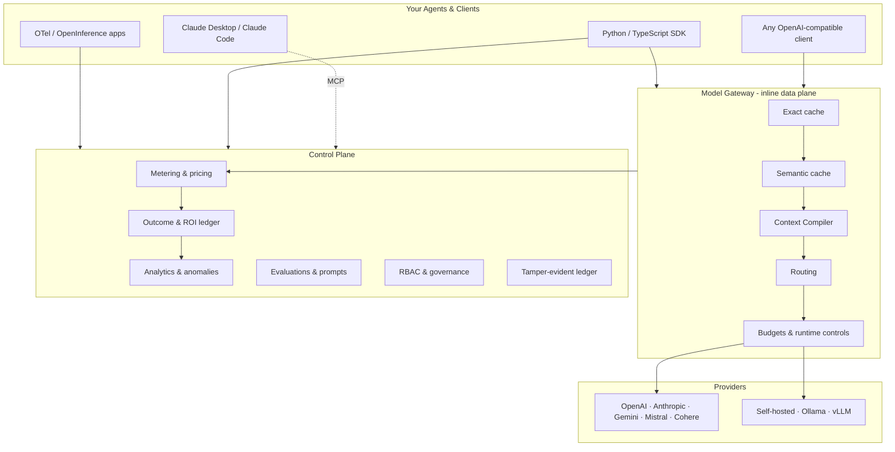

<div align="center">

# RunLedger Community

**The self-hosted control plane that makes AI agents observable, governable, and cheaper to run.**

[](LICENSE)
[](https://www.python.org/)
[](https://github.com/astral-sh/uv)
[](https://codespaces.new/avs6/runledger-community)

[Documentation](docs/introduction.mdx) · [Quickstart](#quickstart) · [Features](#features) · [Deployment](#deployment) · [Community vs Enterprise](#community-vs-enterprise)

</div>

---

RunLedger sits between your agents and every model provider — OpenAI, Anthropic, Gemini, Mistral, Cohere, and any self-hosted or OpenAI-compatible endpoint — and turns raw inference traffic into trace-linked cost accounting, budget enforcement, outcome-to-cost visibility, and active token optimization. No vendor lock-in, no data leaving your infrastructure, no GPU required.

> Tracing tools tell you *what happened.*
> RunLedger tells you *what it cost, who pays, whether you're over budget, what the ROI was — and how to spend fewer tokens next time.*

**Every team shipping AI agents hits the same walls:** spend explodes overnight from a runaway loop · cost can't be attributed to a tenant, user, or feature · routing ignores economics · context is bloated with tokens the model never needed · nothing links metering back to the run that caused it. RunLedger closes all of them in one place.

---

## Features

Everything below is **available today** in RunLedger Community. Click through for architecture, usage, and examples.

<table>
<tr>
<td width="33%" valign="top">

### 🔌 Instrumentation
- [Python SDK](docs/instrumentation/python-sdk.mdx) — 2-line wrap
- [TypeScript SDK](docs/instrumentation/typescript-sdk.mdx)
- [OTLP / OpenTelemetry](docs/otlp.md)
- [OpenInference](docs/openinference.md)

</td>
<td width="33%" valign="top">

### 🚦 Model Gateway
- [Overview](docs/gateway/overview.mdx) — OpenAI-compatible
- [Advanced routing & fallback](docs/gateway/routing.mdx) — cost · latency · quality · outcome · canary · budget-aware
- [Caching](docs/gateway/caching.mdx) — exact + semantic
- [Runtime controls](docs/gateway/runtime-controls.mdx)
- [Providers](docs/gateway/providers.mdx)

</td>
<td width="33%" valign="top">

### 💰 Cost & FinOps
- [Metering](docs/finops/metering.mdx)
- [Pricing engine](docs/finops/pricing.mdx)
- [Cost attribution](docs/finops/attribution.mdx)
- [Budgets](docs/finops/budgets.mdx)
- [Outcomes & ROI](docs/finops/outcomes.mdx)
- [Tamper-evident ledger](docs/finops/ledger.mdx)

</td>
</tr>
<tr>
<td width="33%" valign="top">

### ⚡ Token Optimization
- [Semantic cache](docs/optimization/semantic-cache.mdx)
- [Context Compiler](docs/optimization/context-compiler.mdx)
- [Prompt compression](docs/optimization/prompt-compression.mdx)
- [Intelligent routing](docs/optimization/intelligent-routing.mdx)
- [Cognitive layer](docs/optimization/cognitive-layer.mdx)
- [Tool filtering & skills](docs/optimization/tool-filtering.mdx)
- [Optimization flywheel](docs/optimization/flywheel.mdx)

</td>
<td width="33%" valign="top">

### 🛡️ Quality & Governance
- [Evaluations & experiments](docs/governance/evaluations.mdx)
- [Prompt registry](docs/governance/prompts.mdx)
- [Approvals](docs/governance/approvals.mdx)
- [RBAC & multi-tenancy](docs/governance/rbac.mdx)
- [Alerts](docs/governance/alerts.mdx)
- [Data retention](docs/governance/retention.mdx)

</td>
<td width="33%" valign="top">

### 📊 Observability
- [Run Explorer](docs/observability/runs.mdx)
- [Sessions](docs/observability/sessions.mdx)
- [Analytics](docs/observability/analytics.mdx)
- [Product tour](docs/observability/product-tour.mdx) 📸

</td>
</tr>
</table>

📖 **[Browse the full documentation →](docs/introduction.mdx)**

---

## Architecture

RunLedger is a **control plane** (metering, budgets, analytics, governance) fronting an optional **inline data plane** (the gateway and its caching / routing / optimization stages). Agents reach it four ways — SDK, OpenTelemetry, the model gateway, or MCP — and everything normalizes into one domain model: `AgentRun → Span → ProviderCall / ToolCall`.



See [Core Concepts](docs/concepts.mdx) for the domain model and the four ingestion paths, and their latency / enforcement trade-offs.

---

## Quickstart

```bash
git clone https://github.com/avs6/runledger-community
cd runledger-community
cp .env.example .env   # set SECRET_KEY
docker compose up -d   # add --build to build from source instead of pulling images
```

Bootstrap the admin:

```bash
curl -s -X POST http://localhost:8201/admin/bootstrap \
  -H "X-Admin-Secret: runledger-admin" \
  -H "Content-Type: application/json" \
  -d '{"email":"admin@example.com","password":"Admin123!","full_name":"Admin","org_name":"My Org"}'
```

| URL | What it is |
|-----|------------|
| `http://localhost:3201` | Dashboard |
| `http://localhost:8201/reference` | Interactive API reference (Scalar) |
| `http://localhost:4318` | OTLP/HTTP receiver (via OTel Collector) |

**Instrument your code in two lines** ([full guide](docs/instrumentation/python-sdk.mdx)):

```python
from runledger_sdk import RunLedger
import openai

rl = RunLedger(api_key="rl_...")   # or RUNLEDGER_API_KEY
rl.instrument()                     # wraps openai.OpenAI + AsyncOpenAI

with rl.context(end_user_id="u_123", feature_tag="support-chat"):
    openai.OpenAI().chat.completions.create(model="gpt-4o-mini", messages=[...])
```

Or point any OpenAI client at the gateway — change only `base_url` ([gateway guide](docs/gateway/overview.mdx)).

**Populate demo data** — turn an empty stack into a fully-populated demo (multiple orgs, gateway routes, runs, budgets, outcomes, and pricing — including **priced local Ollama models**) by running every scenario through the API:

```bash
uv run python scripts/full_simulate.py
```

It resets the cluster, imports [`scripts/pricing.yaml`](scripts/pricing.yaml), and runs every scenario under [`scripts/scenarios/`](scripts/scenarios) (organized in `hosted/` and `ollama/` folders — add your own). See [scripts/README.md](scripts/README.md) for the full flow and how to write scenarios.

---

## Deployment

RunLedger fits your stack however matches your latency, enforcement, and code-change constraints — pick one or mix per service.

| Model | In request path | Enforcement | Latency overhead | Code change |
|-------|:---------------:|-------------|:----------------:|-------------|
| **[Inline gateway](docs/gateway/overview.mdx)** | Yes | Full, blocking (cache · route · budget) | One hop | `base_url` swap |
| **[Out-of-band SDK](docs/instrumentation/python-sdk.mdx)** | No | Advisory pre-checks | None | ~2 lines |
| **[Passive OTLP](docs/otlp.md)** | No | Observe-only | None | None, if already on OTel |
| **Hybrid** | Per service | Per service | Per service | Mixed |

**Host it:** [Docker Compose](docs/deployment/docker-compose.mdx) (single host) · [Kubernetes / Helm](docs/helm.md) (self-host or HA) · [High availability](docs/ha.md) (autoscaling + pluggable stores) · [Backup & restore](docs/backup-restore.md).

---

## Community vs Enterprise

| Feature | Community | Enterprise |
|---------|:---------:|:----------:|
| SDK instrumentation (Python + TypeScript) | ✅ | ✅ |
| OTLP / OpenTelemetry ingestion | ✅ | ✅ |
| Core metering + pricing engine | ✅ | ✅ |
| Budgets + spend guardrails | ✅ | ✅ |
| Analytics + dashboards | ✅ | ✅ |
| Model gateway + prompt caching + semantic cache | ✅ | ✅ |
| Advanced routing policies (cost · latency · quality · outcome · weighted · canary · budget-aware · complexity) | ✅ | ✅ |
| Intelligent routing (complexity × risk → model tier) | ✅ | ✅ |
| Token optimization (compiler, compression, routing, flywheel) | ✅ | ✅ |
| Self-hosted & local model routing | ✅ | ✅ |
| Evaluations, prompt registry, outcomes & ROI | ✅ | ✅ |
| Approvals, multi-tenant RBAC, alerts, retention | ✅ | ✅ |
| Kubernetes Helm chart + HA + backup/restore | ✅ | ✅ |
| Provider invoice reconciliation · chargeback engine | | ✅ |
| SSO / OIDC + SCIM provisioning | | ✅ |
| Warehouse export (S3/GCS/R2) · Kafka streaming | | ✅ |
| BYOK / KMS encryption · finance-system exports | | ✅ |

Enterprise features are available separately — [contact for details](mailto:abijith13@gmail.com).

---

## Tech Stack

Python 3.13 · FastAPI (async) · PostgreSQL 16 · Redis 7 · Qdrant · Celery · Next.js 14 (App Router, Tailwind, shadcn/ui, Recharts) · Alembic · uv workspaces · Docker Compose / Helm. Python (`runledger-sdk`) + TypeScript (`@runledger/sdk`) SDKs.

## Contributing

Contributions welcome. See [CONTRIBUTING.md](CONTRIBUTING.md) for development setup and the PR process.

## License

[Apache License 2.0](LICENSE)
