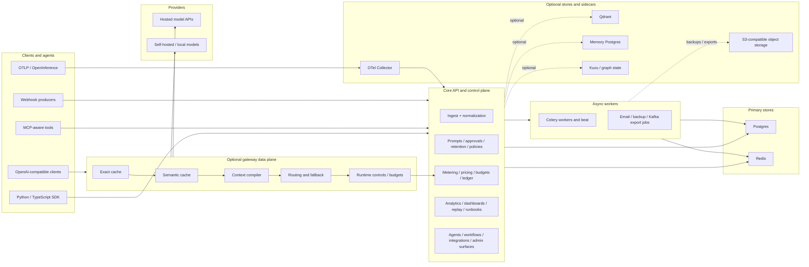
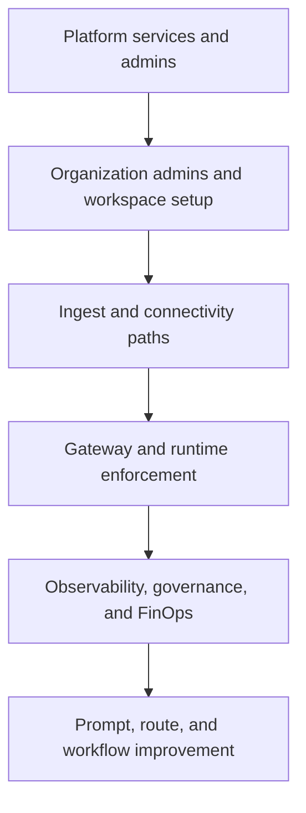
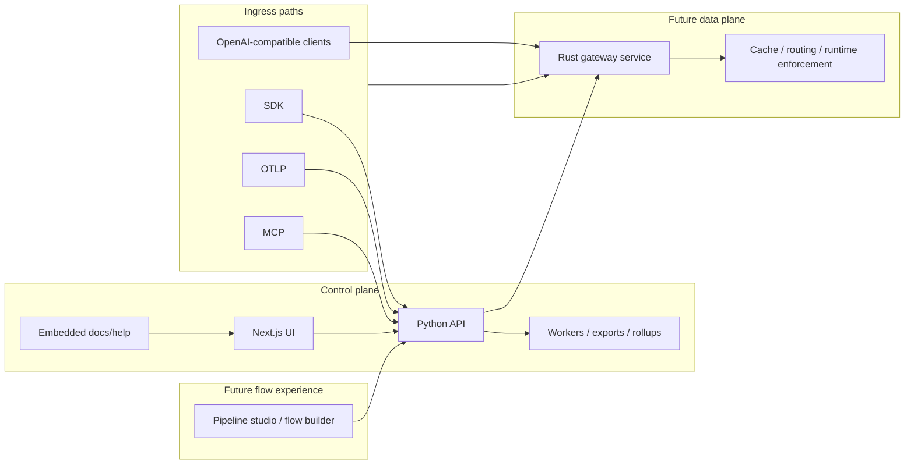

# Architecture

RunLedger Community is a self-hosted AI operations control plane with an optional inline gateway.

This document describes the practical system architecture as of Friday, August 7, 2026.

## System personalities

RunLedger has two main operating modes:

- `control plane`: receive telemetry, normalize activity, meter cost, enforce policy, and expose dashboards plus operator workflows
- `inline data plane`: sit in front of model traffic to apply cache, routing, fallback, runtime controls, and optimization stages

Both modes feed the same shared product model:

`AgentRun -> Span -> ProviderCall / ToolCall -> Outcome`

## High-level topology

## Operational hierarchy

The practical operating hierarchy looks like this:

## Core components

## 1. Web application

- Next.js dashboard under `apps/web`
- provides operator, governance, analytics, and demo-mode surfaces
- talks to the API using workspace-scoped or privileged auth flows

## 2. API service

- FastAPI service under `apps/api`
- acts as the main control-plane entrypoint
- handles ingest, gateway management, analytics, settings, approvals, prompts, budgets, and admin operations

## 3. Workers and schedulers

- Celery worker and beat process async jobs
- background work includes rollups, alert evaluation, email/report jobs, backup operations, and export workflows

## 4. Gateway and optimization sidecars

The product can call into specialized services for optimization-heavy paths, including:

- embedding service
- semantic cache service
- context compiler
- reranker
- compression service
- router
- memory service
- knowledge graph service
- skill registry
- flywheel service

These are profile-aware in local deployment and can be brought up only when needed.

## Target architecture evolution

The current architecture is still heavily centered on the Python API service, even when the gateway path becomes performance-sensitive.

The planned target state is a cleaner split between:

- a **Python control plane** for management, analytics, governance, and operator workflows
- a **dedicated high-performance gateway service** for hot-path routing, cache, runtime enforcement, and budget checks
- a **future pipeline studio** that visualizes and eventually authors execution paths from ingest through final reporting

This split should let the gateway scale independently while preserving one control-plane source of truth for routing definitions, policy, pricing, and workspace scope.

## Storage model

## Required stores

- `Postgres`: source of truth for tenants, workspaces, runs, prompts, policies, outcomes, approvals, and operator configuration
- `Redis`: queues, transient coordination, and rate-limiting/runtime state

## Optional stores

- `Qdrant`: vector-backed semantic cache and related retrieval features
- `Memory Postgres`: memory/cognitive-layer persistence when enabled
- `Kuzu`: graph-oriented cognitive/knowledge state
- `S3-compatible object storage`: backup artifacts, export artifacts, and related operator workflows

## Ingestion paths

RunLedger intentionally supports multiple adoption paths:

- `SDK`: best when you control application code and want rich model/tool/outcome telemetry
- `OTLP/OpenInference`: best when you already have telemetry infrastructure and want low-friction ingest
- `Gateway`: best when you want inline routing, cache, and enforcement without changing every app
- `MCP`: best for desktop agents, coding tools, and tool-governed workflows
- `Webhook`: best for systems that cannot adopt SDK, OTLP, or MCP directly

## Deployment profiles

The repository currently supports these practical local profiles:

- `core`: API, web, worker, database, and redis
- `aux`: optimization and agentic sidecars
- `backup`: MinIO-backed local object storage
- `observability`: bundled OpenTelemetry Collector
- `streaming`: Redpanda and console for Kafka-compatible demos
- `tls-demo`: local HTTPS proxy for realistic demos
- `full-demo`: all optional demo-facing services together

## Operational principles

- Postgres is the source of truth for product state.
- Kafka/export streaming is fanout, not authoritative storage.
- Optional services can be disabled without removing the core control plane.
- Demo and lab tooling exercise the public API instead of writing directly to the database.
- Docs, scripts, and demo mode are expected to stay aligned so local evaluation is replayable.

## Related documents

- [Core concepts](./concepts.mdx)
- [Docker Compose deployment](./deployment/docker-compose.mdx)
- [High availability](./ha.md)
- [Backup and restore](./backup-restore.md)
- [Infra hardening](./infra-hardening.md)
