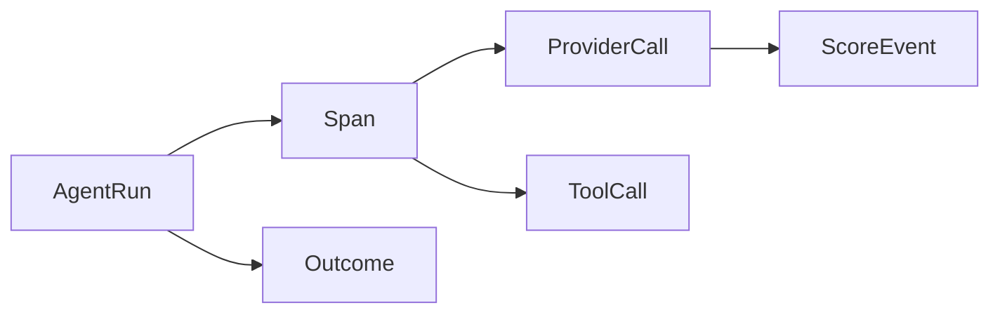
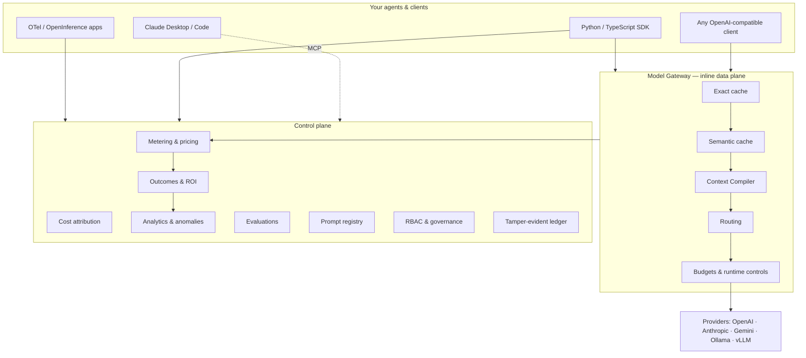

RunLedger is a **control plane** (metering, budgets, analytics, governance) fronting an optional **inline
data plane** (the model gateway and its caching / routing / optimization stages). However an agent reaches
it, everything normalizes into one domain model.

## The domain model

Every path produces the same shape:

| Entity | What it is |
|---|---|
| **AgentRun** | One top-level unit of work — a request, a task, a conversation turn. |
| **Span** | A step within a run (a chain node, a tool invocation, a retrieval). |
| **ProviderCall** | A single model call — tokens, cost, latency, model, cache status. |
| **ToolCall** | A single tool / function invocation and its result. |
| **ScoreEvent** | A quality score attached to a run/span (human, heuristic, or LLM judge). |
| **Outcome** | A business result linked to a run — success/failure + optional value. |

This normalized model is what makes cost, quality, and outcomes *joinable* — the basis for cost-per-success,
ROI-by-workflow, and the [optimization flywheel](/optimization/flywheel).

## Control plane vs data plane

- The **control plane** always runs — it stores runs, meters cost, enforces budgets, and powers the dashboard.
- The **data plane** (gateway) is optional and only sits in the request path when you route inference
  through it — that's what enables caching, routing, and in-band budget enforcement.

## Four ways to connect

Pick one, or mix them per service.

| Path | In request path | Enforcement | Latency overhead | Code change |
|---|:---:|---|:---:|---|
| **[Model Gateway](/gateway/overview)** | Yes | Full, blocking (cache · route · budget) | One hop | `base_url` swap |
| **[SDK](/instrumentation/python-sdk)** (out-of-band) | No | Advisory pre-checks | None | ~2 lines |
| **[OTLP](/otlp)** (passive) | No | Observe-only | None | None, if already on OTel |
| **Hybrid** | Per service | Per service | Per service | Mixed |

- **Inline gateway** — clients swap only their `base_url`; inference flows *through* RunLedger, so caching,
  routing, fallback, and budgets are enforced in-band. Best for active cost control.
- **Out-of-band SDK** — the SDK wraps your provider client; inference goes *directly* to the provider while
  telemetry streams to RunLedger asynchronously. Richest per-run context, zero added latency.
- **Passive OTLP** — apps already emitting OpenTelemetry / OpenInference send traces via a collector. No SDK,
  no gateway, no code change. Observe-only.
- **Hybrid** — route high-spend services through the gateway, instrument the rest with the SDK or OTLP;
  everything lands in the same ledger.

<Note>
**MCP overlay (any model):** Claude Desktop and Claude Code can connect to RunLedger's MCP server to query
cost, budgets, memory, and analytics as tools — independent of how inference traffic is routed.
</Note>

## Where to go next

<CardGroup cols={2}>
  <Card title="Quickstart" icon="rocket" href="/quickstart">
    Stand up the stack and bootstrap an admin.
  </Card>
  <Card title="Instrument with the SDK" icon="python" href="/instrumentation/python-sdk">
    Two-line instrumentation for your provider clients.
  </Card>
  <Card title="Model Gateway" icon="server" href="/gateway/overview">
    Route inference through RunLedger for in-band control.
  </Card>
  <Card title="Metering" icon="gauge-high" href="/finops/metering">
    How tokens become trustworthy cost numbers.
  </Card>
</CardGroup>
