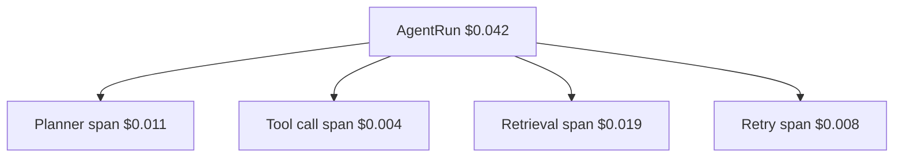

Metered cost is only useful if you can slice it. RunLedger attributes every dollar to the dimensions you
tag at instrumentation time — no custom pipeline required.

## Dimensions

Attach these via the SDK `context()` / `withContext()`, gateway headers, or OTLP attributes:

| Dimension | Field | Example |
|---|---|---|
| **Tenant / workspace** | workspace | `acme-corp` |
| **End user** | `end_user_id` | `u_123` |
| **Feature** | `feature_tag` | `support-chat` |
| **Session** | `session_id` | multi-turn conversation |

## Unit economics

Because the domain model is `AgentRun → Span → ProviderCall / ToolCall`, cost decomposes by **step** — you
can see how much of a run's spend went to the planner vs a tool call vs retrieval vs retries.

## Where to see it

- **[Analytics](/observability/analytics)** — top spenders, cohorts, and feature/tenant breakdowns.
- **[Run Explorer](/observability/runs)** — per-run cost decomposition and the DAG.

## Related

<CardGroup cols={2}>
  <Card title="Budgets" icon="shield-check" href="/finops/budgets">
    Enforce limits on any attribution dimension.
  </Card>
  <Card title="Outcomes & ROI" icon="chart-line" href="/finops/outcomes">
    Attribute value, not just cost.
  </Card>
</CardGroup>

See [`examples/09_economics_query.py`](https://github.com/avs6/runledger-community/blob/master/examples/09_economics_query.py).
