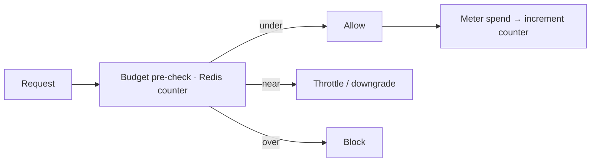

Budgets turn cost visibility into cost *control*. Set a limit on any attribution dimension and choose what
happens when it's approached or breached.

## Key features

- **Scoped limits** — per workspace, end user, feature tag, access group, API key, or provider profile.
- **Automatic actions** — **throttle**, **block**, or **downgrade** to a cheaper model.
- **Runaway protection** — a background job catches sudden spikes between rollups.
- **Fast enforcement** — spend counters live in Redis, so a pre-check adds negligible latency.

## Supported scopes

The current shipped budget scope model is:

- `workspace`
- `end_user`
- `feature_tag`
- `access_group`
- `api_key`
- `provider_profile`

Access-group budgets are especially useful when a workspace wants one shared financial envelope and downstream billing or chargeback views for a governed member cohort.

## How it works

Spend is tracked against the budget in Redis on the hot path and reconciled from Postgres on a schedule
(so a Redis eviction can't lose accounting). The **runaway protection** worker runs every few minutes to
catch spikes that would otherwise slip between rollups.

## Actions

| Action | Effect when the threshold is hit |
|---|---|
| **Throttle** | Rate-limit further requests on the scope. |
| **Block** | Reject requests until the window resets. |
| **Downgrade** | Route to a cheaper alias (see [budget_aware routing](/gateway/routing)). |

## Per-user spend breakdown

Budget detail now includes a per-user spend breakdown table. When a budget has `end_user_id` attribution on its provider calls, the detail view shows each user's share of the budget spend — cost, run count, call count, and percentage of total. This is available on the budget detail page and via `GET /budgets/{id}/breakdown`.

Platform users can also view their own financial exposure at `/users/{id}`, which shows 30-day and total spend, run/call counts, and any budgets scoped to their identity.

## Enforcement modes

- **Inline (gateway)** — blocking, enforced before the provider call.
- **Out-of-band (SDK)** — an advisory pre-check you can choose to block on.

## Related

<CardGroup cols={2}>
  <Card title="Runtime controls" icon="sliders" href="/gateway/runtime-controls">
    Per-route cost caps + rate limits.
  </Card>
  <Card title="Cost attribution" icon="building" href="/finops/attribution">
    The dimensions you budget on.
  </Card>
</CardGroup>

See [`examples/08_budget_enforcement.py`](https://github.com/avs6/runledger-community/blob/master/examples/08_budget_enforcement.py).
