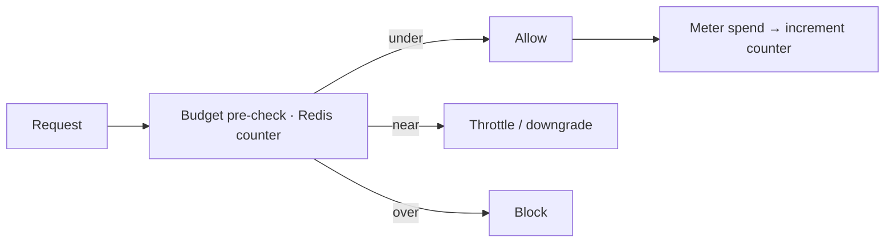

Budgets turn cost visibility into cost *control*. Set a limit on any attribution dimension and choose what
happens when it's approached or breached.

## Key features

- **Scoped limits** — per workspace, end user, feature tag, access group, API key, or provider profile.
- **Automatic actions** — **throttle**, **block**, or **downgrade** to a cheaper model.
- **Runaway protection** — a background job catches sudden spikes between rollups.
- **Fast enforcement** — spend counters live in Redis, so a pre-check adds negligible latency.

## Supported scopes

The current shipped budget scope model is:

- `workspace`
- `end_user`
- `feature_tag`
- `access_group`
- `api_key`
- `provider_profile`

Access-group budgets are especially useful when a workspace wants one shared financial envelope and downstream billing or chargeback views for a governed member cohort.

## How it works



Spend is tracked against the budget in Redis on the hot path and reconciled from Postgres on a schedule
(so a Redis eviction can't lose accounting). The **runaway protection** worker runs every few minutes to
catch spikes that would otherwise slip between rollups.

## Actions

| Action | Effect when the threshold is hit |
|---|---|
| **Throttle** | Rate-limit further requests on the scope. |
| **Block** | Reject requests until the window resets. |
| **Downgrade** | Route to a cheaper alias (see [budget_aware routing](/gateway/routing)). |

## Per-user spend breakdown

Budget detail now includes a per-user spend breakdown table. When a budget has `end_user_id` attribution on its provider calls, the detail view shows each user's share of the budget spend — cost, run count, call count, and percentage of total. This is available on the budget detail page and via `GET /budgets/{id}/breakdown`.

Platform users can also view their own financial exposure at `/users/{id}`, which shows 30-day and total spend, run/call counts, and any budgets scoped to their identity.

## Enforcement modes

- **Inline (gateway)** — blocking, enforced before the provider call.
- **Out-of-band (SDK)** — an advisory pre-check you can choose to block on.

## Access-group budget scoping

Access groups are first-class budget scopes. When you set `scope_type: access_group` and point `scope_id` at an access-group UUID, every request authenticated by a member of that group is metered against the budget. This works with all enforcement modes and breach actions.

Typical workflow:

1. Create the access group in **Organization → Access Groups** (or `POST /access-groups`).
2. Create a budget with `scope_type: access_group` and the group's UUID as `scope_id`.
3. Members are evaluated against the budget automatically on the gateway hot path.
4. View the **Org & Access Scope Context** card on the budget detail page to see group membership, workspace-level spend, and AI Hub model usage.

Overrides also support access-group scoping — the override inherits the parent budget's scope, so a temporary limit bump applies to the same member cohort.

See [`examples/49_access_group_budget_scope.py`](https://github.com/avs6/runledger-community/blob/master/examples/49_access_group_budget_scope.py).

## API-key budget scoping

API keys are first-class budget scopes. When you set `scope_type: api_key` and point `scope_id` at a key UUID, every request authenticated with that key is metered against the budget. This is useful for service-account isolation, per-integration spend caps, and key-level chargeback.

Typical workflow:

1. Create the API key in **Organization → API Keys** (or `POST /settings/api-keys`).
2. Create a budget with `scope_type: api_key` and the key's UUID as `scope_id`.
3. All traffic bearing that key is metered against the budget.
4. The budget detail page shows key-level context (name, prefix, ownership type) in the **Org & Access Scope Context** card.

See [`examples/48_api_key_budget_scope.py`](https://github.com/avs6/runledger-community/blob/master/examples/48_api_key_budget_scope.py).

## Org & Access Scope Posture

The analytics endpoint `GET /analytics/budget-org-scope-posture/{budget_id}` returns cross-feature context for any budget. The response includes:

- **org_context** — workspace user count, API key count, access group count, total active budgets, 30-day workspace spend.
- **hub_context** — AI Hub model catalog size, distinct models used in the last 30 days.
- **scope_entity** — detailed attributes of the scoped entity (access-group name and member count, or API-key name and prefix).

The budget detail UI renders this as the blue **Org & Access Scope Context** card with drill-through links to Organization, Access Groups, API Keys, and AI Hub.

## Budget Detail × Observe Bridge

Budget posture is surfaced across Observe surfaces so operators can understand cost context without leaving their investigation or analytics workflow.

The analytics endpoint `GET /analytics/budget-detail-observe-posture` returns workspace-level budget context including:

- **budget_context** — total/active budget counts, total limit, breach count.
- **spend_context** — 30-day spend, run count, average cost per run, distinct models used.
- **user_budget_context** — users with budgets, active users, user-scoped budget totals and spend.
- **engineering_context** — feature-scoped budgets, active budgets, breach count, total limit.

This endpoint powers the **Budget Posture** card on the Workspace Dashboard, the **Budget & Per-User Attribution** card on Analytics Users, the **Budget Context** card on User Detail, and the **Budget Signals** card on the Engineering Dashboard. Each card includes drill-through links to Budgets, Billing Periods, Chargeback, and Economics.

## Budget Detail × Build & Improve Bridge

Budget detail posture is surfaced across all Build & Improve surfaces so builders can understand cost context while developing, evaluating, and optimising prompts, agents, workflows, and experiments.

The analytics endpoint `GET /analytics/budget-detail-build-posture` returns workspace-level budget and build context including:

- **budget_context** — active budgets, total limit, breach count, feature-scoped budget count.
- **build_context** — prompt, agent, workflow, and workflow-run counts.
- **experiment_context** — eval and replay experiment counts, score events (30d).
- **spend_context** — 30-day spend and distinct models used.

This endpoint powers the emerald **Budget & Build Context** card on Playground, Prompts list, Prompt detail, Agents list, Agent detail, Workflows list, Workflow detail, Evaluation studio, Experiments, Replay lab, Replay experiment detail, and Model scorecards. Each card includes drill-through links to Budgets, Feature Budgets, Economics, and Model Scorecards.

## Budget Control × Platform Scope Bridge

Budget control posture is surfaced on platform-admin surfaces so operators can govern spend across all organizations from a single view.

The analytics endpoint `GET /analytics/budget-control-platform-posture` (platform admin only) returns cross-org budget governance context including:

- **platform_totals** — organization count, total budgets, aggregate limit, breach count.
- **org_budgets** — per-organization budget count, limit, and breach count.
- **override_context** — total and active budget overrides across all organizations.
- **spend_context** — platform-wide 30-day spend and distinct models used.

This endpoint powers the emerald **Budget Control — Platform Posture** card on All Organizations and Platform Settings. Each card includes drill-through links to Budgets, Feature Budgets, All Organizations / Platform Settings, and Economics.

## Budget Override × Safety & Governance Bridge

Budget overrides connect to the Safety & Governance feature family via approval workflows, alert rules, audit logging, tags, and governance pack context.

The analytics endpoint `GET /analytics/budget-override-governance-posture` returns workspace-level override governance context including:

- **approval_context** — pending, approved, and denied override approval counts (30d), overrides with approval linkage.
- **alert_context** — budget-related alert rules total and active count.
- **audit_context** — override audit events (30d), total and active overrides.
- **governance_context** — approval coverage percentage, active overrides.
- **tag_context** — tag counts on budgets and overrides.

This endpoint powers the amber **Safety & Governance Context** card on the budget detail page with drill-through links to Approvals, Alert Rules, Audit Log, Tags, and Governance Pack.

## Billing × Org Scope Bridge

Billing periods connect to the Organization & Access feature family via workspace users, access groups, API keys, telemetry, and AI hub context.

The analytics endpoint `GET /analytics/billing-org-scope-posture` returns workspace-level billing org scope context including:

- **billing_context** — total periods, open/closed counts, total billed USD.
- **org_context** — workspace users, active access groups, active API keys.
- **attribution_context** — 30-day call count, distinct models, average cost per call.
- **spend_context** — 30-day total spend and distinct models.

This endpoint powers the emerald **Billing × Org Scope Context** card on Billing and Billing Period Detail pages with drill-through links to Access Groups, API Keys, Organization, Telemetry, and AI Hub.

## FinOps Internal Posture Bridge

The FinOps internal posture endpoint connects all FinOps sub-features — budgets, billing periods, chargeback rules, ledger snapshots, overrides, and notifications — into a single cross-surface context view.

The analytics endpoint `GET /analytics/finops-internal-posture` returns workspace-level internal FinOps context including:

- **budget_context** — total budgets, active count, aggregate limit, breached count.
- **billing_context** — total periods, open count, total billed USD.
- **chargeback_context** — total and active chargeback rules.
- **ledger_context** — total snapshots, latest snapshot date.
- **override_context** — total and active budget overrides.
- **notification_context** — total notifications, 30-day spend.

This endpoint powers the emerald **FinOps Internal Posture** card on Budgets, Budget Detail, and Chargeback pages with drill-through links to Billing, Chargeback, Ledger, and Budgets.

## Budget Control — Observe Posture Bridge

The budget control observe posture endpoint surfaces budget health metrics for Observe-family pages — analytics users, user detail, engineering, and model usage — so operators can correlate spend patterns with budget policy state.

The analytics endpoint `GET /analytics/budget-control-observe-posture` returns:

- **budget_policy** — total, active, breached, and at-risk budgets, average utilization percentage, total limit USD.
- **override_status** — total and active budget overrides.
- **notification_summary** — total notifications.
- **spend_context** — 30-day spend and call count.

This endpoint powers the emerald **Budget Control — Observe Posture** card on Analytics Users, User Detail, Engineering, and Model Usage pages with drill-through links to Budgets, Overrides, Notifications, and Billing.

## Budget Control — Build Posture Bridge

The budget control build posture endpoint surfaces budget health metrics for Build-family pages — playground, prompts, agents, workflows, evaluation, experiments, replay, model scorecards, and runbooks — so builders can see budget constraints while constructing AI features.

The analytics endpoint `GET /analytics/budget-control-build-posture` returns:

- **budget_policy** — total, active, breached budgets, average utilization percentage, total limit USD.
- **override_context** — total and active budget overrides.
- **scope_context** — count of budgets per scope type.
- **spend_context** — 30-day spend and distinct model count.

This endpoint powers the emerald **Budget Control — Build Posture** card on all Build pages with drill-through links to Budgets, Overrides, and Billing.

## Budget Scope & Governance Posture Bridge

The budget scope governance posture endpoint surfaces identity scope, runtime context, governance signals, and spend alongside budget data so operators can see the full landscape of actors, routes, and rules that feed budget enforcement.

```
GET /analytics/budget-scope-governance-posture
```

Returns identity context (users, API keys, access groups, hub models), runtime context (routes, active providers, cache configs), governance context (alert rules, audit events, tags), and 30-day spend.

This endpoint powers the emerald **Budget Scope & Governance Context** card on Budgets with drill-through links to Users, API Keys, Access Groups, AI Hub, Gateway, Alert Rules, Audit Log, and Tags.

## Budget Detail Drillback Posture Bridge

The budget detail drillback posture endpoint surfaces scope owners, runtime consequences, evidence context, and workflow activity alongside budget detail so operators can trace a budget from summary into cache effects, throttles, scope owners, and related workflow usage.

```
GET /analytics/budget-detail-drillback-posture
```

Returns scope context (users, access groups, API keys), runtime context (cache configs, rate-limited routes), evidence context (runs, requests, audit events), workflow context (workflows, workflow runs), and 30-day spend.

This endpoint powers the emerald **Budget Detail Drillback Context** card on Budget Detail with drill-through links to Users, Access Groups, API Keys, Gateway, Runs, Request Flow, Audit Log, and Workflows.

## Override Exception Posture Bridge

The override exception posture endpoint surfaces the full exception lifecycle — override counts, approval workflow state, runtime side effects, and monitoring signals — so operators can see whether temporary spend exceptions are governed, observed, and bounded.

```
GET /analytics/budget-override-exception-posture
```

Returns override context (total, active, expired overrides, active limit USD), approval context (pending, approved, denied), runtime context (active routes, rate-limited routes), monitoring context (alert rules, audit events), and 30-day spend.

This endpoint powers the emerald **Override Exception Context** card on Budget Detail with drill-through links to Approvals, Alert Rules, Gateway, Audit Log, and Governance.

## Related

<CardGroup cols={2}>
  <Card title="Runtime controls" icon="sliders" href="/gateway/runtime-controls">
    Per-route cost caps + rate limits.
  </Card>
  <Card title="Cost attribution" icon="building" href="/finops/attribution">
    The dimensions you budget on.
  </Card>
</CardGroup>

See [`examples/08_budget_enforcement.py`](https://github.com/avs6/runledger-community/blob/master/examples/08_budget_enforcement.py).
