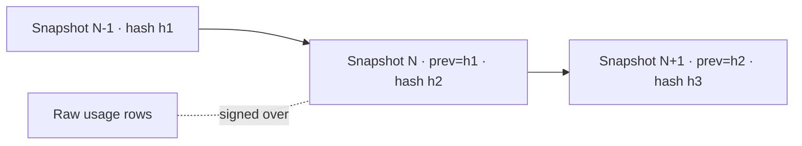

For metering to be trustworthy enough to bill on, it has to be **tamper-evident**. RunLedger periodically
snapshots usage into a signed, hash-chained ledger — any later modification to the underlying data breaks
the chain and is detectable.

## Key features

- **HMAC-signed snapshots** — each snapshot carries a `snapshot_hash` over its contents.
- **Hash chaining** — each snapshot references the previous one, so the sequence is append-only.
- **Verifiable** — re-compute the hash over the raw data and compare; a mismatch proves modification.
- **Suspicious-sequence detection** — a background job flags gaps or reordering.

## How it works



Snapshots are produced on a schedule (daily) and on demand. Each is signed with the workspace key; because
each references the prior hash, you can't alter or drop a snapshot without breaking every one after it.

## Verify

```python
# List recent snapshots and re-verify their hashes
snapshots = client.get("/ledger/snapshots?limit=5")
# Each snapshot_hash can be recomputed from the raw rows; a mismatch = tampering.
```

Or via the API: `GET /ledger/snapshots`.

## Related

<CardGroup cols={2}>
  <Card title="Metering" icon="gauge-high" href="/finops/metering">
    The data the ledger signs.
  </Card>
  <Card title="Backup & restore" icon="database" href="/backup-restore">
    Verify ledger integrity after a restore.
  </Card>
</CardGroup>

See [`examples/11_ledger_verify.py`](https://github.com/avs6/runledger-community/blob/master/examples/11_ledger_verify.py).
