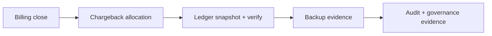

RunLedger's ledger is the compliance-close layer for FinOps. It is no longer best understood as a standalone workspace page. The real operator home is **Platform Settings -> Compliance**, while `/ledger` remains a compatibility route for legacy navigation and API entry.

## What exists today

- **Signed daily snapshots** - daily spend snapshots are signed with HMAC-SHA256.
- **On-demand generation** - platform admins can generate the latest snapshot immediately.
- **Integrity verification** - snapshots can be recomputed and verified against the stored hash.
- **Closure summary** - the Compliance tab now shows ledger status together with latest billing close, chargeback evidence, backup evidence, and audit activity.
- **Evidence chain links** - operators can jump from compliance closure into Billing, Chargeback, Audit Log, and Tool Registry.

## Platform ownership

Ledger is now owned under **Platform Settings -> Compliance** because the user question is not just:

- "Did a snapshot exist?"

It is also:

- "Was the billing period closed?"
- "Was ownership allocation reviewed?"
- "Is there backup evidence?"
- "Do we have audit activity and governance evidence for the close?"

That makes Ledger a **closure workflow**, not a standalone daily operating page.

## API surfaces

- `GET /ledger/closure-summary`
- `GET /ledger/snapshots`
- `POST /ledger/snapshots/generate`
- `GET /ledger/verify/{snapshot_date}`

## Closure workflow

## Closure summary fields

| Field | Purpose |
|---|---|
| `readiness_status` | Overall close posture: `ready`, `partial`, `at_risk`, or `empty` |
| `evidence_score` | Quick score across billing, snapshot, verification, chargeback, and backup evidence |
| `missing_evidence` | Explicit list of what is still missing before the close package is trustworthy |
| `latest_closed_period` | Most recent closed billing period |
| `latest_snapshot` | Most recent signed ledger snapshot |
| `verification` | Counts of verified, tampered, and pending snapshots |
| `chargeback` | Current allocation posture used as ownership evidence |
| `latest_backup_snapshot` | Latest backup evidence record |
| `recent_audit_event_count` | Recent audit activity that supports the close trail |

## Related

<CardGroup cols={2}>
  <Card title="Billing" icon="receipt" href="/finops/billing">
    Close accounting periods and prepare the upstream evidence chain.
  </Card>
  <Card title="Chargeback" icon="building" href="/finops/chargeback">
    Review ownership allocation before treating the close package as complete.
  </Card>
</CardGroup>

See [`examples/11_ledger_verify.py`](https://github.com/avs6/runledger-community/blob/master/examples/11_ledger_verify.py).
