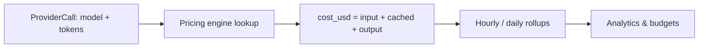

Every model call RunLedger sees — through the gateway, the SDK, or OTLP — is metered: token counts are
captured, mapped to the [pricing engine](/finops/pricing), and rolled up into cost you can trust.

## Key features

- **Provider-aware token accounting** — separate **input**, **output**, and **cached input** tokens.
- **Cache-aware costing** — cached input tokens are priced at their discounted rate.
- **Trace-linked** — every cost number ties back to the exact `ProviderCall` and `AgentRun`.
- **Rollups** — hourly and daily aggregates power the dashboards without scanning raw events.

## How it works



1. A `ProviderCall` records the model and token usage (input / output / cached).
2. The **cost enrichment** worker looks up the effective price at call time and computes `cost_usd`.
3. Costs roll up into `usage_daily` (and hourly) aggregates for fast analytics and budget checks.

Cost is computed as:

```
input_cost  = (input_tokens − cached) × input_rate/1M
cached_cost = cached × cached_rate/1M          # defaults to 50% of input if unset
output_cost = output_tokens × output_rate/1M
cost_usd    = input_cost + cached_cost + output_cost
```

## Why cached tokens matter

Providers bill cached input tokens at a discount. RunLedger meters them separately so your internal cost
matches the invoice line — and so prompt-cache savings show up in analytics.

## Related

<CardGroup cols={2}>
  <Card title="Pricing engine" icon="tags" href="/finops/pricing">
    Where the per-model rates come from.
  </Card>
  <Card title="Cost attribution" icon="building" href="/finops/attribution">
    Slice metered cost by tenant, user, feature.
  </Card>
</CardGroup>

See [`examples/07_analytics_query.py`](https://github.com/avs6/runledger-community/blob/master/examples/07_analytics_query.py).
