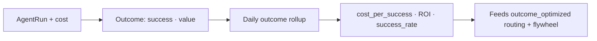

Cost alone doesn't tell you if the spend was *worth it*. Record a business **outcome** on a run and
RunLedger joins it to the metered cost to produce cost-per-success and ROI — the signal the
[optimization flywheel](/optimization/flywheel) and `outcome_optimized` routing learn from.

<Frame caption="Outcomes & ROI — cost-per-success, workflow ROI, and success-rate trends.">
  
</Frame>

## Key features

- **Outcome events** — `success` (bool) + optional `value_usd`, tagged by `outcome_type` and linked to a run.
- **Cost-per-success** — total cost ÷ successful outcomes, per workflow.
- **ROI** — value produced vs cost spent.
- **Trends & alerts** — success-rate and cost-per-success over time, with spike/drop alerts.

## How it works



## Record an outcome

```python
rl.outcome("refund_resolved", True, run_id=run_id, value_usd=12.00)
```

`outcome(outcome_type, success, ...)` — type and success are positional; `run_id` defaults to the current
context. Or `POST /outcomes` with the run id. Outcomes roll up nightly into per-workflow metrics.

## Why it matters

Cost-per-success is the headline FinOps metric — it lets you compare a cheaper model that fails more often
against a pricier one that succeeds, on the only axis that matters: **cost to actually get the job done.**
It's also the ground-truth quality signal the flywheel holds against your SLA.

## Related

<CardGroup cols={2}>
  <Card title="Optimization flywheel" icon="arrows-spin" href="/optimization/flywheel">
    Cheapest config that holds the SLA.
  </Card>
  <Card title="Routing & fallback" icon="route" href="/gateway/routing">
    outcome_optimized route selection.
  </Card>
</CardGroup>

See [`examples/25_outcomes_roi.py`](https://github.com/avs6/runledger-community/blob/master/examples/25_outcomes_roi.py).
