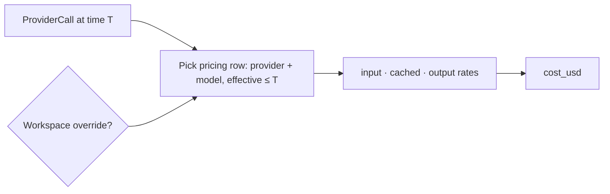

RunLedger prices every call from a **pricing table**, not hard-coded constants. Adding a model or changing
a rate is a data change, not a code change.

## Key features

- **Config-driven** — add a model by inserting a `provider_pricing` row.
- **Input / output / cached rates** — per 1M tokens, with a cached-input discount.
- **Time-effective** — rates carry an effective date, so historical calls are costed at the rate that was
  in force at call time.
- **Workspace overrides** — a workspace can carry negotiated / contract pricing that takes precedence.

## How it works



When costing a call, the engine selects the pricing row for the call's provider + model whose effective
date is the latest **at or before** the call time — checking a workspace-specific override first, then the
global catalogue.

## Import a pricing catalog (YAML)

A fresh install starts with an **empty** catalog. Load your models in one shot from the dashboard —
**Settings → Provider Profiles → Import YAML** — instead of adding them one at a time.

```yaml
models:
  - provider: openai
    model: o3-mini
    display_name: OpenAI o3-mini
    input_per_1m: 1.10
    output_per_1m: 4.40
    cached_input_per_1m: 0.55      # optional (else 50% of input)
    tags: [reasoning, coding]      # optional freeform tags
  - provider: ollama
    model: nomic-embed-text
    input_per_1m: 0.00
    output_per_1m: 0.00
    tags: [local, embedding]
```

- **Idempotent** — re-importing the same file is a no-op; a changed price **updates the row in place**; a
  new `provider` + `model` is inserted.
- **DB is the source of truth** — once imported the catalog lives in the database, not in a file. The YAML
  is only the transport.
- **Download the example** button gives you a broad starter catalog (`config/pricing.example.yml`) covering
  Google, Azure, Bedrock, Vertex, and more.

Local models (Ollama, vLLM) go in the same file — set the rates to `0` (or your internal cost of compute)
so self-hosted traffic still shows up in analytics.

<Note>
The bundled `config/pricing.yml` is a curated starter (Ollama + latest OpenAI / Anthropic). Nothing is
seeded automatically — import it (or your own) from the GUI.
</Note>

## Tags

Each model can carry freeform **tags** — `reasoning`, `coding`, `embedding`, `vision`, `local`, `cheap`, or
anything you invent. They render as chips on the Provider Profiles page and make a large catalog easy to
scan and filter.

## Add or edit one model

You can still add or edit a single model directly on the Provider Profiles page (workspace-scoped
overrides), including its tags — handy for a negotiated rate on one model.

## Related

<CardGroup cols={2}>
  <Card title="Metering" icon="gauge-high" href="/finops/metering">
    How rates become cost.
  </Card>
  <Card title="Providers" icon="plug" href="/gateway/providers">
    Add a provider route.
  </Card>
</CardGroup>
