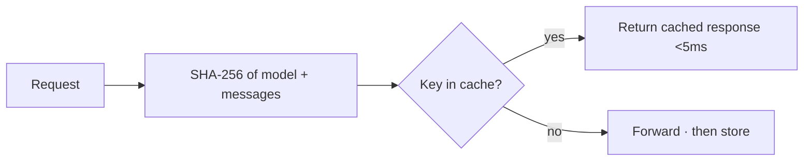

The gateway checks two caches before forwarding a request, so repeated and near-duplicate prompts are
served without paying for inference again.

## Exact cache

A SHA-256 of `{model, messages}` keys a per-tenant response cache. A byte-for-byte identical request
returns the stored response in **under 5 ms**. Enable it per request with `"cache": true`.



## Semantic cache

The semantic cache also hits on a **paraphrase** whose embedding is within a similarity threshold — so
`"how much parental leave do employees get"` hits an earlier `"How much parental leave do employees get?"`.
It is **scope-isolated**: a mandatory `{tenant, model, system-prompt, knowledge-version, security}` key
means a cached answer can never cross a permission or version boundary.

Enable it per route (`semantic_cache_enabled`) or per request (`"semantic_cache": true`). It is fail-open
and defaults off. Full details, tuning, and the vector pipeline are in
[Semantic Cache](/optimization/semantic-cache).

## Choosing

| | Exact cache | Semantic cache |
|---|---|---|
| Hits on | Identical request | Paraphrase within threshold |
| Backing store | Postgres | Qdrant (vectors) |
| Latency | < 5 ms | ~embedding + vector search |
| Default | Per-request `cache` | Off (opt-in) |
| Isolation | Tenant | Full scope key |

## FinOps budget bridge

Cache savings feed into budget and billing calculations. Use the performance posture
endpoints to see how caching affects spend:

```bash
# Per-budget cache economics
GET /analytics/budget-performance-posture/{budget_id}

# Workspace-wide cache + billing view
GET /analytics/billing-period-performance-posture
```

The response includes `cache.cache_hit_rate_pct` and `cache.estimated_savings_pct` —
use these to quantify how much caching reduces your FinOps spend.

## Related

<CardGroup cols={2}>
  <Card title="Semantic cache (deep dive)" icon="database" href="/optimization/semantic-cache">
    Scope isolation, thresholds, tuning.
  </Card>
  <Card title="Context Compiler" icon="compress" href="/optimization/context-compiler">
    Shrink what isn't cached.
  </Card>
  <Card title="Budgets" icon="shield-check" href="/finops/budgets">
    Workspace / user / feature spend limits with automatic actions.
  </Card>
  <Card title="Billing Periods" icon="calendar" href="/finops/billing">
    Period-level cache and throttle economics.
  </Card>
</CardGroup>

See [`examples/33_semantic_cache.py`](https://github.com/avs6/runledger-community/blob/master/examples/33_semantic_cache.py).
