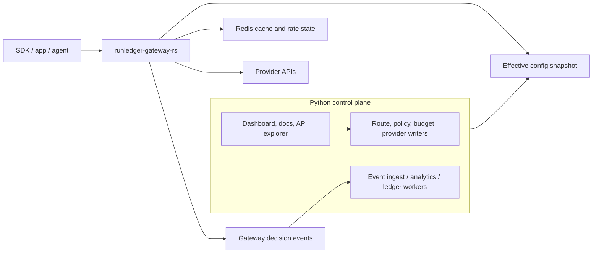
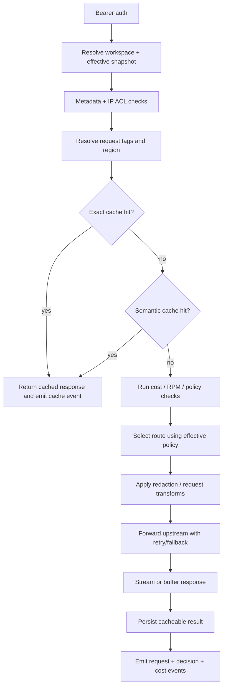

This document is the single source of truth for the RunLedger gateway runtime architecture.

As of **Friday, August 14, 2026**, the product direction is settled:

- `runledger-gateway-rs` is the only live gateway execution runtime for chat completions
- the Python API remains the control plane for configuration, governance, analytics, and operator UX
- there is no planned dual-runtime migration track for the core completion path

The existing Python gateway surface established these behaviors that the Rust runtime must preserve:

- OpenAI-compatible `/gateway/chat/completions`
- route CRUD under `/gateway/routes`
- routing groups and routing policies
- request-path runtime controls
- gateway request logging
- deployment health summaries

## Hard cut status

The first control-plane contract surfaces now exist in the Python API:

- `GET /gateway/runtime/snapshot`
- `GET /gateway/runtime/internal/snapshot`
- `POST /gateway/runtime/internal/preflight`
- `POST /gateway/runtime/internal/finalize`
- `POST /gateway/runtime/events/signed`

That means the split is no longer only conceptual. The current backend can already:

- emit an effective workspace runtime snapshot for routes, routing groups, policies, and API-key auth material
- expose an internal snapshot fetch path protected by `X-Admin-Secret`
- build a runtime execution plan that preserves cache checks, route selection, runtime controls, and pre-call guardrails for the Rust data plane
- finalize successful Rust responses back through Python so cache storage, post-call guardrails, request logs, and analytics stay consistent
- accept HMAC-signed gateway runtime events so the Rust data plane can report request, enforcement, and health outcomes back into the control plane

The current product direction is a hard cut:

- the Rust gateway becomes the only live `/chat/completions` runtime
- the Python `/gateway/chat/completions` path is intentionally removed as an execution path
- Python remains the control plane for routes, policies, auth resolution, analytics, and operator UX

## Why the runtime is split

The gateway runtime is now intentionally separated from the Python control plane because the hot request path has different operational needs:

- streaming request handling should not compete with admin and analytics APIs
- gateway scale should not require scaling unrelated control-plane capacity
- retry, fallback, mirroring, and provider IO benefit from a narrower high-performance runtime
- future pipeline visualization and flow-builder work need a cleaner execution boundary

The split is meant to improve:

- throughput
- tail latency
- isolation between runtime traffic and admin traffic
- runtime operability
- execution clarity for future gateway pipeline surfaces

## Service boundary

`runledger-gateway-rs` is the request execution engine.

The Python API remains the control plane and source of truth for:

- route CRUD
- routing-group CRUD
- routing-policy CRUD
- provider-profile configuration
- workspace and API-key management
- budgets, governance, and ledger analytics
- docs, API explorer, admin UI, and operators flows

The Rust service owns:

- gateway ingress
- provider execution
- retry, fallback, timeout, and mirror execution against control-plane-authored plans
- streaming response handling
- decision-event emission back to the control plane

The Python control plane now owns the runtime planning and finalization helpers:

- auth token resolution through control-plane-compatible key material
- effective snapshot loading
- exact cache checks
- semantic-cache orchestration hooks
- route selection planning
- request governance and pre-call guardrail evaluation
- post-call persistence and analytics finalization

## Runtime topology



## Runtime parity checklist

This is the feature inventory from the original Python `/gateway/chat/completions` path, checked against the current hard-cut runtime as of **Friday, August 14, 2026**.

| Original gateway behavior | Current hard-cut status | Notes |
|---|---|---|
| Bearer auth with workspace API keys | Complete | Rust calls the Python preflight bridge for auth resolution. |
| Bearer auth with OIDC workspace sessions | Complete | Internal auth resolution now supports API keys and OIDC bearer flows. |
| IP ACL enforcement | Complete | Evaluated in Python preflight before route execution starts. |
| Required metadata checks | Complete | Preflight returns the same metadata warning context used by the original path. |
| Exact cache lookup and cache-hit logging | Complete | Done in Python preflight with immediate cached return to Rust callers. |
| Semantic cache lookup and hit logging | Complete | Preserved in preflight for non-stream requests. |
| Context compiler | Complete | Preflight compiles messages and tools before execution planning. |
| Intelligent routing | Complete | Preflight produces the routed alias and reasoning-effort override. |
| Routing groups and routing-policy route choice | Complete | Preflight still uses the Python selection logic and returns runnable execution steps. |
| Preferred-region routing | Complete | Preserved in the planned execution steps. |
| Route retries | Complete | Rust now retries per planned step using route retry counts. |
| Configured fallback aliases | Complete | Included in the execution plan returned to Rust. |
| Trigger-based fallback rules | Complete | Execution steps now carry required trigger metadata so Rust only activates those fallbacks on matching failures. |
| Cost-cap enforcement | Complete | Evaluated in Python preflight against the candidate route set. |
| Per-user RPM enforcement | Complete | Evaluated in Python preflight before execution. |
| Pre-call guardrails including message modification | Complete | Preserved in Python preflight before provider execution. |
| Post-call and during-call guardrails | Complete | Preserved in Python finalize before success is recorded. |
| PII redaction | Complete | Streaming requests preserve route-driven redaction before execution planning. |
| Provider adapter parity for OpenAI-compatible providers | Complete | Python now prepares direct request URL, headers, and body for Rust. |
| Provider adapter parity for Azure OpenAI | Complete | Python prepares Azure-specific URL and auth header for Rust. |
| Provider adapter parity for Vertex | Complete | Non-stream direct requests are prepared by Python; streaming falls back through the internal Python adapter bridge. |
| Provider adapter parity for Bedrock | Complete | Executed through the internal Python adapter bridge behind the Rust ingress. |
| Mirror / shadow compare execution | Complete | Successful non-stream requests now call back into the control plane to preserve mirror sampling, comparison, and logging. |
| Streaming SSE response handling | Complete | Rust proxies both direct and bridged stream responses. |
| Success logging and cache persistence | Complete | Python finalize stores cache entries and records gateway requests after Rust success. |
| Route health counters and cooldown updates | Complete | Rust now reports per-attempt success and failure back to the control plane. |

The remaining intentional non-parity areas are broader gateway surfaces outside `/gateway/chat/completions`, not regressions in the hard-cut runtime path:

- pass-through endpoint execution still lives in the Python gateway surface
- route CRUD, policy CRUD, stats, deployment health, and request log remain Python control-plane ownership

## Current Python contract to preserve

The Rust implementation must match the current Python surface in these areas:

| Domain | Current shape in code | Compatibility rule |
|---|---|---|
| Gateway route config | `GatewayRoute*` schemas in `apps/api/runledger_api/schemas/gateway.py` | No route field becomes write-only or Rust-only. |
| Routing groups | `GatewayRoutingGroup*` schemas | Group aliasing and tag behavior must stay control-plane authored. |
| Routing policies | `RoutingPolicy*` schemas and `services/routing.py` | Rust must execute the same active effective strategy result. |
| Request ingress | Rust gateway runtime at `http://localhost:8210/gateway/chat/completions` plus control-plane contracts under `/gateway/runtime/*` | Same auth and request model; Rust is the only live execution path. |
| Runtime controls | cost caps, per-user RPM, metadata, IP ACL, guardrails | Deny/allow outcomes must remain explainable and auditable. |
| Request logging | `GatewayRequest` record path | Analytics, observability, and FinOps must not lose parity. |

## Required control-plane snapshots

The Rust service should not reconstruct behavior from many normalized tables during live traffic. The control plane should publish denormalized effective snapshots.

### 1. Route snapshot

One effective route entry per active route:

```json
{
  "route_id": "uuid",
  "workspace_id": "uuid",
  "alias": "gpt-4o",
  "routing_group_id": "uuid-or-null",
  "provider": "openai",
  "target_model": "gpt-4o-mini",
  "base_url": "https://api.openai.com/v1",
  "priority": 10,
  "required_tags": ["prod"],
  "excluded_tags": ["batch"],
  "region": "us",
  "timeout_ms": 45000,
  "retry_count": 2,
  "cooldown_until": "2026-08-13T12:00:00Z",
  "semantic_cache_enabled": true,
  "context_compiler_enabled": false,
  "intelligent_routing_enabled": false,
  "fallback_config": {},
  "mirror_config": {},
  "health_auto_disable": true,
  "runtime_controls": {
    "daily_cost_limit_usd": "50.00",
    "monthly_cost_limit_usd": "500.00",
    "per_user_rpm_limit": 120,
    "pii_redaction_enabled": true
  }
}
```

### 2. Routing-group snapshot

Rust needs group metadata only for effective execution:

```json
{
  "routing_group_id": "uuid",
  "workspace_id": "uuid",
  "alias": "gpt-4o",
  "name": "Primary GPT-4o",
  "match_tags": ["prod"],
  "default_tags": ["chat"],
  "strategy_type": "manual",
  "strategy_config": {}
}
```

### 3. Effective routing-policy snapshot

The current Python service calculates route choice from the active policy. Rust should consume the resolved policy input, not its own independent authoring model.

```json
{
  "workspace_id": "uuid",
  "alias": "gpt-4o",
  "policy_type": "latency_optimized",
  "config": {
    "lookback_hours": 24,
    "max_p95_ms": 2500
  },
  "version": 14,
  "published_at": "2026-08-13T12:00:00Z"
}
```

### 4. Runtime-enforcement snapshot

This is the minimum hot-path policy material Rust needs:

- workspace API-key binding
- workspace/org active state
- required metadata rules
- IP ACL policy inputs
- route-level cost caps
- workspace budget references and stale-read tolerance
- pass-through endpoint permissions if gateway passthrough stays on the data plane

## Config distribution model

The preferred model is versioned snapshots with local caching in Rust.

### Snapshot rules

- Every workspace snapshot has a monotonic `version`.
- Snapshots are publishable independently for routes, policies, and auth material, but Rust consumes one effective assembled view.
- Rust may serve with a cached snapshot inside a bounded stale window.
- The stale window for budget and enforcement-sensitive config must be smaller than the stale window for descriptive UI fields.

### Proposed stale tolerances

| Snapshot area | Max stale window | Reason |
|---|---:|---|
| API-key/workspace auth state | 30 seconds | Revocation must converge quickly. |
| Route + routing policy | 60 seconds | Supports safe rollout without hammering the DB. |
| Budget enforcement hints | 15 seconds | Cost-control drift should stay tight. |
| Health and mirror metadata | 120 seconds | Informational, not authoring-critical. |

## Data-plane request pipeline



## Event contracts back to Python

Rust should emit structured events that let the existing Python analytics and worker layer stay intact.

### 1. Gateway request event

Minimum fields:

```json
{
  "event_type": "gateway.request.completed",
  "request_id": "uuid",
  "workspace_id": "uuid",
  "route_id": "uuid",
  "model_requested": "gpt-4o",
  "model_used": "gpt-4o-mini",
  "provider": "openai",
  "status": "success",
  "decision_reason": "latency_optimized:p95=820ms (gpt-4o-mini)",
  "cache_hit": false,
  "semantic_cache_hit": false,
  "stream": true,
  "latency_ms": 1042,
  "input_tokens": 1200,
  "output_tokens": 340,
  "cost_usd": "0.014200",
  "started_at": "2026-08-13T12:00:00Z",
  "completed_at": "2026-08-13T12:00:01Z",
  "error_code": null
}
```

### 2. Gateway enforcement event

Emit when a request is denied, downgraded, throttled, or rerouted for policy reasons.

```json
{
  "event_type": "gateway.enforcement.applied",
  "request_id": "uuid",
  "workspace_id": "uuid",
  "action": "throttle",
  "source": "per_user_rpm_limit",
  "route_id": "uuid",
  "policy_version": 14,
  "detail": {
    "limit": 120,
    "window": "minute"
  }
}
```

### 3. Gateway health event

This keeps the current health-monitoring and route-disable posture compatible.

```json
{
  "event_type": "gateway.route.health",
  "workspace_id": "uuid",
  "route_id": "uuid",
  "deployment_status": "degraded",
  "consecutive_failures": 3,
  "health_summary": "timeouts above threshold"
}
```

## Analytics write-path decision

Rust should not write directly into analytics tables in phase 1.

Recommended sequence:

1. Rust emits signed or authenticated events to a Python ingest endpoint or queue.
2. Python validates, normalizes, and persists using the existing analytics model.
3. Only after parity is proven should direct-write optimization be considered.

This keeps:

- schema ownership centralized
- ledger side effects consistent
- report regressions easier to isolate

## Execution readiness

The Rust runtime is expected to prove these before it is treated as production-ready:

- auth acceptance and rejection match the control-plane contracts
- route choice respects active runtime snapshots
- request logs and runtime events populate observability and FinOps correctly
- provider errors are surfaced cleanly
- health events flow back into deployment health

## Admin and UI changes required

The gateway runtime architecture is not complete until the control plane exposes operational visibility.

The dashboard should add:

- gateway topology status: `rust-primary`
- snapshot version and last publish time
- event-ingest backlog or failure indicator
- per-workspace execution owner

## Non-blocking follow-on work

These build on the runtime architecture but should not block parity:

- visual pipeline builder
- branch-by-branch execution replay UI
- richer embedded API explorer and Swagger UI
- request-path WASM policy hooks
- direct Rust-to-warehouse export paths

## Definition of done

The gateway runtime architecture is only complete when all of the following are true:

- Rust serves customer traffic for the supported gateway path
- Python remains the only authoring control plane
- route, policy, budget, and auth behavior remain compatible
- observability and FinOps views still populate correctly
- docs, scripts, and examples reflect the split architecture
- operators can see deployment mode and runtime health clearly

## Related documents

- [Model Gateway overview](./overview.mdx)
- [Routing & fallback](./routing.mdx)
- [API Reference](../reference/api.mdx)
