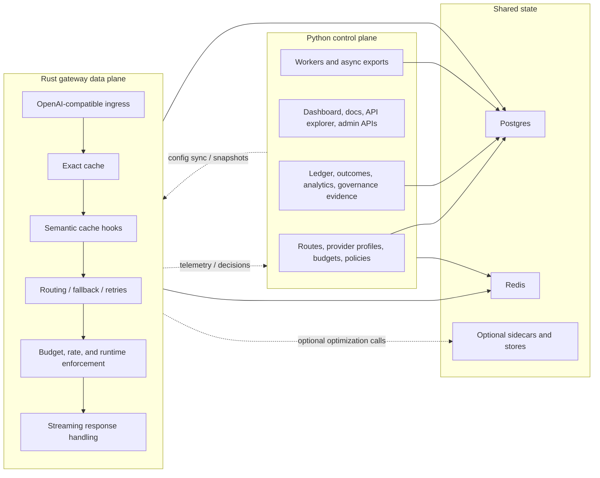
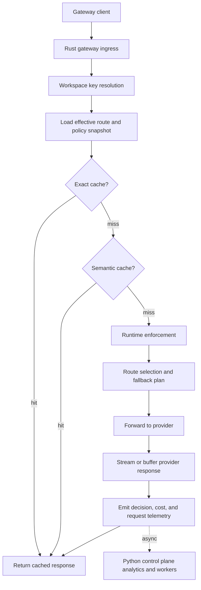

This document defines the planned gateway split for RunLedger.

As of **Thursday, August 13, 2026**, the inline gateway still runs inside the main Python API service. That is good enough for feature breadth, but it is not the long-term architecture for a high-scale data plane.

The target state is:

- keep configuration, analytics, pricing, governance, and operator workflows in the Python control plane
- move the request-path gateway runtime into a separately scalable Rust service
- preserve one source of truth for routes, policies, budgets, pricing, and workspace scope

## Why split the gateway

The current combined model is convenient, but it creates pressure in the hottest request path:

- streaming request handling shares process space with control-plane APIs
- routing, cache checks, retries, and runtime enforcement compete with admin and analytics work
- horizontal scaling of the gateway also scales unrelated Python control-plane capacity
- lower-level performance tuning is constrained by the control-plane runtime choice

The gateway split is meant to improve:

- throughput
- tail latency
- isolation between runtime traffic and admin traffic
- rollout safety for gateway-only changes
- future flow-studio execution clarity

## Control plane vs data plane

## What stays in Python

These responsibilities should remain in the control plane:

- route CRUD
- provider-profile CRUD
- budget definition and tier management
- policy and approval configuration
- prompt, evaluation, and governance workflows
- observability and FinOps dashboards
- report/export/background jobs
- API docs, docs hub, and admin UX

The Python service remains the system of record for management.

## What moves to Rust

These responsibilities should move into the dedicated gateway service:

- OpenAI-compatible request ingress
- request normalization for live gateway traffic
- cache lookup and short-circuit response handling
- route selection
- fallback and retry orchestration
- request-path budget/rate/runtime checks
- provider forwarding
- streaming aggregation and response shaping
- request decision logging and telemetry emission

The Rust service becomes the fast execution engine, not the policy authoring surface.

## Non-goals

The split should **not**:

- create a second source of truth for routing or policy
- fork business logic permanently between Python and Rust
- make the docs/API explorer depend on the Rust service
- move all telemetry ingest into Rust by default
- force every adoption path to become gateway-first

## Target request lifecycle

## Migration phases

### Phase 0: Current baseline

Current state on August 13, 2026:

- Python API owns both control plane and gateway execution
- `/reference` serves a live Scalar/OpenAPI API reference
- Postman is still maintained as a generated artifact alongside the live spec

### Phase 1: Contract extraction

Before moving any runtime path:

- define stable gateway-internal contracts for:
  - route snapshots
  - provider profile snapshots
  - budget snapshot inputs
  - runtime policy evaluation inputs
  - gateway decision events
- isolate Python code paths that the Rust service must match
- identify hard state dependencies on Postgres, Redis, and optional sidecars

### Phase 2: Shadow gateway

Introduce `runledger-gateway-rs` in shadow mode:

- receives mirrored traffic
- does not return live responses to customers yet
- records:
  - route choices
  - latency
  - cache-hit behavior
  - enforcement decisions
  - stream handling differences

Success criteria:

- no material divergence on route and enforcement decisions
- acceptable latency benefit
- stable telemetry emission back into the control plane

### Phase 3: Read-through control plane

Move configuration reads behind a cleaner interface:

- Python control plane remains the writer
- Rust gateway reads:
  - direct from shared stores, or
  - from signed/effective config snapshots

Preferred direction:

- Python remains authoritative
- Rust consumes denormalized effective snapshots for low-latency reads

### Phase 4: Incremental cutover

Cut over by route, workspace, or traffic class:

- opt-in aliases
- canary percentage
- workspace allowlist
- environment-based rollout

Keep a fast rollback path back to the Python gateway handler.

### Phase 5: Default runtime path

After stable cutover:

- Rust gateway becomes default for inline traffic
- Python gateway path remains fallback/compatibility until retirement
- control plane continues to own management APIs and analytics

## Migration matrix

| Area | Current owner | Target owner | Migration pattern | Blocking questions |
|---|---|---|---|---|
| Route definitions | Python control plane | Python control plane | No ownership move; expose effective snapshots to Rust | How are effective per-workspace route snapshots versioned? |
| Provider profiles | Python control plane | Python control plane | No ownership move; Rust reads normalized provider config | How are secrets and failover-safe provider endpoints surfaced to Rust? |
| Exact cache | Python gateway path | Rust gateway | Move request-path cache logic first | What cache-key canonicalization must remain byte-for-byte compatible? |
| Semantic cache hooks | Python + sidecars | Rust gateway calling existing sidecars | Keep sidecars, move orchestration to Rust | Which calls can fail-open and which must block? |
| Runtime budgets / cost caps | Python gateway path | Rust gateway using Python-authored policy snapshots | Move hot-path enforcement, keep authored policy in Python | What is the exact stale-config tolerance for budget enforcement? |
| Rate limits | Python/Redis | Rust/Redis | Keep shared Redis state model where possible | Do token-bucket semantics need revision before parity work? |
| Fallback / retries | Python gateway path | Rust gateway | Move after route snapshot contract is stable | How do we preserve provider-specific retry semantics? |
| Streaming responses | Python gateway path | Rust gateway | High-priority migration area | Which provider adapters need special streaming compatibility handling? |
| Gateway request logs | Python API + DB | Rust emits into Python-compatible contract | Preserve analytics schema, change producer | Should Rust write directly to DB or publish to an ingest endpoint/queue? |
| Billing / ledger linkage | Python analytics workers | Python analytics workers | Preserve downstream model; Rust only emits event contracts | What minimum event shape is required for no-reporting-regression cutover? |
| Gateway admin UI | Python control plane UI | Python control plane UI | No ownership move | What new status/health fields should the UI expose for split deployment? |
| API reference UI | Scalar at `/reference` in Python API | Python control plane, later embedded product explorer | Improve UX independently of gateway split | Do we keep Scalar, add Swagger UI, or build a custom embedded explorer over OpenAPI? |
| Pipeline studio | Not present | Python control plane UI with data-plane visibility | Build after runtime contracts are stable | What is the canonical pipeline node model? |

## Compatibility and rollout rules

The split should preserve these guarantees:

- existing gateway clients can keep the same base URL
- existing workspace API keys remain valid
- existing analytics, ledger, and governance views continue to work
- rollback to the Python gateway path is fast and low risk
- `/gateway` remains the configuration surface even if execution moves elsewhere

## Recommended implementation order

1. Extract effective route and policy snapshot contracts.
2. Define gateway decision and request-event contracts.
3. Build `runledger-gateway-rs` in shadow mode.
4. Prove parity on cache, routing, enforcement, and streaming behavior.
5. Add health, topology, and split-deployment visibility to the control plane UI.
6. Cut over incrementally by route/workspace/traffic class.
7. Revisit the API-doc explorer and in-product docs hub as control-plane UX work, not gateway-runtime work.
8. Start pipeline-studio design only after the execution contracts are stable.

## Related documents

- [Model Gateway overview](./overview.mdx)
- [Routing & fallback](./routing.mdx)
- [Architecture](../architecture.md)
- [Platform Overview](../platform-overview.mdx)
- [API Reference](../reference/api.mdx)
