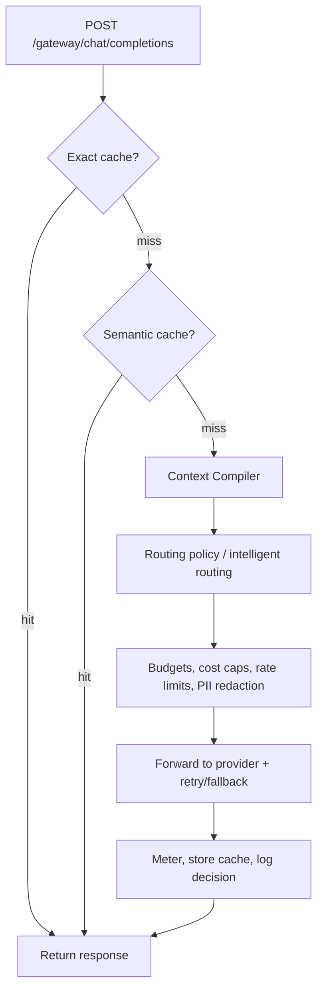

The Model Gateway is RunLedger's **Rust data plane**. Point any OpenAI-compatible client at it, change only `base_url`, and every request flows through caching, optimization, routing, and enforcement before reaching the provider.

<Frame caption="The Gateway page: routes, routing log, pass-through endpoints, benchmarking, and per-route runtime controls.">
  
</Frame>

## Key features

- **Drop-in OpenAI compatibility** via `/gateway/chat/completions` for streaming and non-streaming requests.
- **Per-alias routes** that map one logical model alias to one or more provider routes with fallback and regional preference.
- **Pass-through endpoints** for non-LLM APIs with shared auth, timeout, rate limits, and per-call cost attribution.
- **In-band enforcement** for budgets, cost caps, and rate limits before provider spend occurs.
- **Caching and optimization** with exact cache, semantic cache, Context Compiler, and intelligent routing.
- **Performance visibility** with gateway overhead, throughput, and provider-comparison benchmarking.

## The request pipeline



Each stage is opt-in and fail-open. If an optimization service is unavailable, the request proceeds unoptimized rather than failing.

## Usage

```python
import openai

client = openai.OpenAI(
    api_key="rl_...",
    base_url="http://localhost:8210/gateway",
)

resp = client.chat.completions.create(
    model="chat",
    messages=[{"role": "user", "content": "Hello"}],
)
```

## Main endpoints

| Endpoint | Purpose |
|---|---|
| `POST /gateway/chat/completions` | OpenAI-compatible gateway proxy |
| `POST/GET/PUT/DELETE /gateway/routes` | Manage model routes |
| `POST/GET/PUT/DELETE /gateway/passthrough/*` | Manage and execute pass-through endpoints |
| `GET /gateway/stats` and `GET /gateway/requests` | Routing stats and request log |
| `GET /gateway/benchmarks/compare` | Per-alias overhead and throughput comparison |

## Org identity context

Gateway routes and guardrails inherit workspace and user scope. The per-user gateway
posture endpoint surfaces the intersection of gateway, guardrail, and identity state
for a single user:

```bash
GET /analytics/user-gateway-posture?user_id={uuid}
```

Returns active and rate-limited routes, routing policies, 30-day request count,
active guardrail rules, and API key count for the user's workspace. The gateway and
guardrails pages link to Users, Workspaces, Access Groups, API Keys, Telemetry,
MCP Registry, and Provider Profiles for org-level context.

## FinOps posture

The gateway exposes a read-only financial posture for operators who need spend context
without leaving the gateway console:

```bash
GET /analytics/gateway-finops-posture
```

Returns route-level spend (30-day total, cost-cap coverage, rate-limit coverage),
active budgets and overrides, notification channel count, billing periods, and
chargeback rule count. The gateway page shows this as a **Gateway FinOps Posture**
card with drill-through links to Budgets, Budget Detail, Budget Overrides, Budget
Notifications, Billing Periods, Billing Period Detail, Chargeback, and Cost & Savings.

### Observe posture

`GET /analytics/gateway-observe-posture` returns a 30-day observability snapshot for the
gateway workspace: active-route context (cache-enabled, rate-limited), traffic breakdown
(requests, cache hits/misses, throttled, errors), run and user counts, cost and savings,
token totals, and average latency. The gateway page shows this as a **Gateway Observe
Posture** card with drill-through links to Workspace Dashboard, Sessions, Model Usage,
Economics, Cost & Savings, Outcomes & ROI, Analytics Users, Engineering, and Monitoring.

### Safety & governance posture

`GET /analytics/gateway-safety-posture` returns a workspace-wide safety and governance
snapshot: gateway context (active routes, cache-enabled, rate-limited, guardrail rules,
active guardrails, guardrail blocks in 30 days), tool governance (tool policies, active
policies, MCP servers), approvals (total 30-day, pending), audit events (total, gateway-
scoped), alert rules (total, active), and tag count. The gateway page shows this as a
**Safety & Governance Posture** card with drill-through links to MCP Servers, Tool
Registry, Tool Policies, Approvals, Data Capture, Security, Alert Rules, Audit Log,
Governance Pack, Tags, and Policy Dry Run.

### Build & improve posture

`GET /analytics/gateway-build-posture` returns a workspace-wide builder context snapshot:
gateway context (active routes, routing policies, guardrail rules, active guardrails),
prompt count, agent count, workflow count and runs, evaluation datasets and experiments,
and replay datasets and experiments. The gateway page shows this as a **Build & Improve
Posture** card with drill-through links to Playground, Prompts, Agents, Workflows,
Datasets, Evaluation Studio, Experiments, Replay Lab, Optimization, Model Scorecards,
and Runbooks.

### Performance controls org & platform posture

`GET /analytics/performance-controls-org-posture` returns workspace-scoped cache and
throttle posture: cache profiles (total, enabled, cache-enabled routes, API keys),
rate-limit context (routes with RPM, pass-through with RPM, active routes, access groups),
and platform context (workspace-scoped flag, configuration status). The gateway page shows
this as a **Performance Controls — Org & Platform Scope** card with drill-through links
to Workspaces, API Keys, Access Groups, All Organizations, and Platform Settings.

### Gateway internal & platform cohesion posture

`GET /analytics/gateway-internal-posture` returns the gateway family's internal
cohesion: active routes, providers, routing policies, pass-through endpoints,
guardrail context (rules, active count), cache context (profiles, cache-enabled
routes), throttle context (rate-limited routes), and platform visibility
(workspace-scoped flag, provider count, guardrails active, cache/throttle
configuration status). The gateway page shows this as a **Gateway Family —
Internal Cohesion** card with drill-through links to Provider Profiles,
Guardrails, All Organizations, and Platform Settings.

## Control plane bridge

`GET /analytics/gateway-control-plane-posture` returns a workspace-scoped
summary of org, observe, and governance context that downstream surfaces
consume — users and access groups, active routes and policies, pending
approvals and 30-day audit volume, active monitoring alerts, and guardrail
counts. The gateway page renders this as a **Control Plane Bridge** card with
drill-through links to Organization Profile, Onboarding, Users, Access Groups,
Workspace Dashboard, Outcomes & ROI, Analytics Users, Analytics User Detail,
Approvals, Audit Log, Governance Pack, All Organizations, and Platform Settings.

## Cache economics & evidence

`GET /analytics/response-cache-economics-posture` returns a workspace-scoped
summary of cache profiles, cache-enabled routes, FinOps context (budgets,
overrides, notifications, billing periods, ledger snapshots), governance
context (30-day audit events), and org context (user count). The gateway page
renders this as a **Cache Economics & Evidence** card with drill-through links
to Budgets, Budget Detail, Budget Overrides, Budget Notifications, Billing
Periods, Billing Summary, Ledger, Audit Log, Governance Pack, Onboarding,
Workspace Dashboard, Outcomes & ROI, Analytics Users, Analytics User Detail,
Playground, and Workflows.

## Rate limit scope & explainability

`GET /analytics/rate-limit-scope-posture` returns a workspace-scoped summary
of throttle context (routes with RPM, pass-through with RPM, routing policies),
scope context (access groups, monitoring alerts), and FinOps context (budgets,
notifications, chargeback rules, ledger snapshots). The gateway page renders
this as a **Rate Limit Scope & Explainability** card with drill-through links
to Access Groups, Onboarding, Workspace Dashboard, Analytics Overview, Model
Usage, Outcomes & ROI, Budget Detail, Budget Notifications, Chargeback, Ledger,
Governance Pack, Evaluation Studio, Experiments, and Monitoring.

## Guardrails FinOps posture

`GET /analytics/guardrails-finops-posture` returns a workspace-scoped summary
of guardrail enforcement impact on spend — 30-day evaluation and block counts,
active rules and routes, plus FinOps context (budgets, budget notifications,
billing periods, and chargeback rules). The guardrails page renders this as a
**Guardrails FinOps Posture** card with drill-through links to Budgets, Budget
Detail, Budget Notifications, Billing Periods, Chargeback, Cost & Savings, and
Ledger.

## Related

<CardGroup cols={2}>
  <Card title="Routing & fallback" icon="route" href="/gateway/routing">
    Policies, region selection, and fallback behavior.
  </Card>
  <Card title="Caching" icon="database" href="/gateway/caching">
    Exact and semantic cache behavior.
  </Card>
  <Card title="Runtime controls" icon="sliders" href="/gateway/runtime-controls">
    Cost caps, rate limits, and redaction.
  </Card>
  <Card title="Performance & scale" icon="gauge" href="/gateway/performance-and-scale">
    Benchmarking, pass-through analytics, and scaling guidance.
  </Card>
  <Card title="Budgets" icon="shield-check" href="/finops/budgets">
    Spend limits with automatic actions, linked from the gateway posture card.
  </Card>
  <Card title="Billing Periods" icon="calendar" href="/finops/billing">
    Period-level attribution with gateway spend breakdown.
  </Card>
  <Card title="Org & Identity" icon="building" href="/org/overview">
    Users, workspaces, access groups, and API key scoping for gateway routes.
  </Card>
  <Card title="Analytics Overview" icon="chart-mixed" href="/observe/analytics-overview">
    Workspace-wide traffic, cost, and performance summary linked from the observe posture card.
  </Card>
  <Card title="Monitoring" icon="monitor-waveform" href="/observe/monitoring">
    Live gateway metrics, alert rules, and health dashboards.
  </Card>
  <Card title="Safety & Governance" icon="shield-halved" href="/safety/overview">
    Tool policies, approvals, audit trail, and governance posture linked from the safety card.
  </Card>
  <Card title="Build & Improve" icon="hammer" href="/build/overview">
    Prompts, agents, workflows, evaluation, and replay assets that interact with gateway routing.
  </Card>
</CardGroup>

See [`examples/18_gateway.py`](https://github.com/avs6/runledger-community/blob/master/examples/18_gateway.py).
