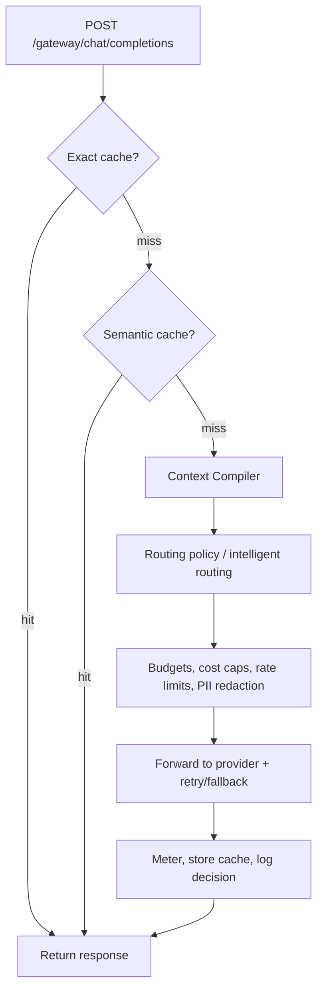

The Model Gateway is RunLedger's **Rust data plane**. Point any OpenAI-compatible client at it, change only `base_url`, and every request flows through caching, optimization, routing, and enforcement before reaching the provider.

<Frame caption="The Gateway page: routes, routing log, pass-through endpoints, benchmarking, and per-route runtime controls.">
  
</Frame>

## Key features

- **Drop-in OpenAI compatibility** via `/gateway/chat/completions` for streaming and non-streaming requests.
- **Per-alias routes** that map one logical model alias to one or more provider routes with fallback and regional preference.
- **Pass-through endpoints** for non-LLM APIs with shared auth, timeout, rate limits, and per-call cost attribution.
- **In-band enforcement** for budgets, cost caps, and rate limits before provider spend occurs.
- **Caching and optimization** with exact cache, semantic cache, Context Compiler, and intelligent routing.
- **Performance visibility** with gateway overhead, throughput, and provider-comparison benchmarking.

## The request pipeline



Each stage is opt-in and fail-open. If an optimization service is unavailable, the request proceeds unoptimized rather than failing.

## Usage

```python
import openai

client = openai.OpenAI(
    api_key="rl_...",
    base_url="http://localhost:8210/gateway",
)

resp = client.chat.completions.create(
    model="chat",
    messages=[{"role": "user", "content": "Hello"}],
)
```

## Main endpoints

| Endpoint | Purpose |
|---|---|
| `POST /gateway/chat/completions` | OpenAI-compatible gateway proxy |
| `POST/GET/PUT/DELETE /gateway/routes` | Manage model routes |
| `POST/GET/PUT/DELETE /gateway/passthrough/*` | Manage and execute pass-through endpoints |
| `GET /gateway/stats` and `GET /gateway/requests` | Routing stats and request log |
| `GET /gateway/benchmarks/compare` | Per-alias overhead and throughput comparison |

## Related

<CardGroup cols={2}>
  <Card title="Routing & fallback" icon="route" href="/gateway/routing">
    Policies, region selection, and fallback behavior.
  </Card>
  <Card title="Caching" icon="database" href="/gateway/caching">
    Exact and semantic cache behavior.
  </Card>
  <Card title="Runtime controls" icon="sliders" href="/gateway/runtime-controls">
    Cost caps, rate limits, and redaction.
  </Card>
  <Card title="Performance & scale" icon="gauge" href="/gateway/performance-and-scale">
    Benchmarking, pass-through analytics, and scaling guidance.
  </Card>
</CardGroup>

See [`examples/18_gateway.py`](https://github.com/avs6/runledger-community/blob/master/examples/18_gateway.py).
