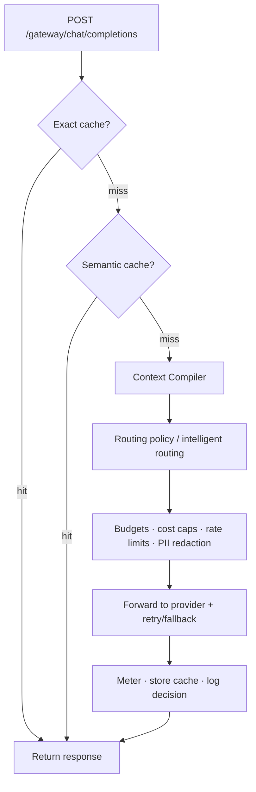

The Model Gateway is RunLedger's **inline data plane**. Point any OpenAI-compatible client at it — change
only `base_url` — and every request flows through a pipeline of caching, optimization, routing, and
enforcement before reaching the provider. No application code changes.

<Frame caption="The Gateway page — routes, routing log, caching, and per-route runtime controls.">
  
</Frame>

## Key features

- **Drop-in OpenAI compatibility** — `/gateway/chat/completions`, streaming and non-streaming.
- **Per-alias routes** — map a model alias to one or more provider routes with priority + fallback.
- **In-band enforcement** — budgets, cost caps, and rate limits stop a runaway loop *before* it hits the provider.
- **Caching & optimization** — exact + semantic cache, Context Compiler, and intelligent routing, all opt-in per route.
- **Full metering** — every forward is metered and cost-attributed like any other call.

## The request pipeline



Each stage is **opt-in and fail-open** — if an optimization service is slow or down, the request proceeds
unoptimized rather than failing.

## Usage

```python
import openai

client = openai.OpenAI(
    api_key="rl_...",                       # your RunLedger key
    base_url="http://localhost:8201/gateway",
)
resp = client.chat.completions.create(model="gpt-4o-mini", messages=[...])
# First call → forwarded to the provider. Identical second call → exact cache hit (<5ms).
```

`model` is a **route alias** you define — the same client call can fall back across providers, cache
exactly and semantically, and be metered, without touching application code.

## Manage routes

Define routes per alias on the **Gateway** dashboard page, or via the API:

```bash
POST /gateway/routes
{
  "alias": "chat",
  "provider": "openai",
  "target_model": "gpt-4o-mini",
  "priority": 10,
  "semantic_cache_enabled": true
}
```

| Endpoint | Purpose |
|---|---|
| `POST /gateway/chat/completions` | OpenAI-compatible proxy (stream + non-stream) |
| `POST/GET/PUT/DELETE /gateway/routes` | Manage routes |
| `GET /gateway/stats` · `GET /gateway/requests` | Stats + routing log |

## Related

<CardGroup cols={2}>
  <Card title="Routing & fallback" icon="route" href="/gateway/routing">
    Policies and intelligent routing.
  </Card>
  <Card title="Caching" icon="database" href="/gateway/caching">
    Exact + semantic cache.
  </Card>
  <Card title="Runtime controls" icon="sliders" href="/gateway/runtime-controls">
    Cost caps, rate limits, PII redaction.
  </Card>
  <Card title="Providers" icon="plug" href="/gateway/providers">
    Hosted and self-hosted models.
  </Card>
</CardGroup>

See [`examples/18_gateway.py`](https://github.com/avs6/runledger-community/blob/master/examples/18_gateway.py).
