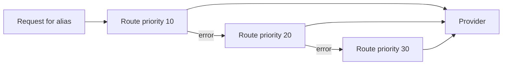

Each model alias can have **multiple routes**. When a request arrives, RunLedger selects a route by the
alias's **routing policy**, forwards to it, and **falls back** to the next route on a transient error.

## Fallback

Routes carry a `priority` (lower = tried first). On a transient provider error the gateway retries once,
then moves to the next-priority active route for the alias — so a provider outage degrades gracefully
instead of failing the request.

## Routing policies

Set a policy per alias to select *which* route rather than just the highest priority:

| Policy | Selects |
|---|---|
| `manual` | Priority order (default). |
| `cost_optimized` | Cheapest route above a quality floor. |
| `latency_optimized` | Lowest recent p95 latency. |
| `quality_optimized` | Highest average quality score. |
| `weighted` | Weighted random split across routes. |
| `canary` | X% to a canary route, the rest by priority. |
| `budget_aware` | Downgrade to a cheaper alias when a budget threshold is hit. |
| `complexity_based` | Branch by input size. |
| `outcome_optimized` | Lowest cost-per-success from the [outcomes ledger](/finops/outcomes). |

Policies read from the same metering, score, and outcome data the rest of RunLedger records — so
`quality_optimized` and `outcome_optimized` reflect *your* traffic.

## Intelligent routing

Beyond route selection, **intelligent routing** classifies each request by **complexity × business risk**
and maps it to a model tier (with reasoning-effort) — so easy work goes to a cheap model and only hard or
high-risk work reaches a frontier model. It's configurable per route (heuristic / LLM / hybrid classifier,
arbitrary N-tier map). See [Intelligent Routing](/optimization/intelligent-routing).

## Related

<CardGroup cols={2}>
  <Card title="Intelligent routing" icon="route" href="/optimization/intelligent-routing">
    Complexity × risk → tier.
  </Card>
  <Card title="Outcomes & ROI" icon="chart-line" href="/finops/outcomes">
    Powers outcome_optimized routing.
  </Card>
</CardGroup>

See [`examples/19_policy_check.py`](https://github.com/avs6/runledger-community/blob/master/examples/19_policy_check.py).
