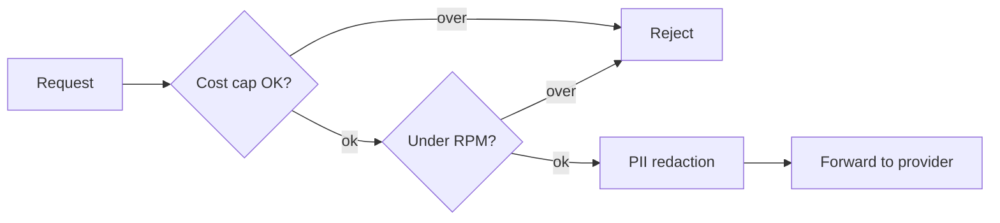

Because inference flows *through* the gateway, RunLedger can enforce controls **in the request path** —
a runaway agent is throttled or blocked before it ever reaches (and bills) the provider.

## Cost caps

Set a daily and/or monthly USD ceiling per route. When the route's spend crosses the cap, further requests
are rejected until the window resets.

```json
{
  "daily_cost_limit_usd": 50.00,
  "monthly_cost_limit_usd": 1000.00
}
```

## Per-user rate limits

Limit requests-per-minute per end user on a route. Pass the user via the
`X-RunLedger-End-User-Id` header; the limit is enforced in Redis on the hot path.

```json
{ "per_user_rpm_limit": 60 }
```

## PII redaction

When enabled on a route, message content is scrubbed of common PII patterns **before** it is forwarded to
the provider — useful for third-party models.

```json
{ "pii_redaction_enabled": true }
```

## Health auto-disable

A route that fails health checks repeatedly is automatically taken out of rotation (`health_auto_disable`),
so fallback routes absorb the traffic until it recovers.

## How it fits



All controls are set per route on the **Gateway** dashboard page or via `POST/PUT /gateway/routes`.

## Related

<CardGroup cols={2}>
  <Card title="Budgets" icon="shield-check" href="/finops/budgets">
    Workspace / user / feature spend limits with automatic actions.
  </Card>
  <Card title="Data retention" icon="clock-rotate-left" href="/governance/retention">
    Control how long payloads and telemetry are kept.
  </Card>
</CardGroup>
