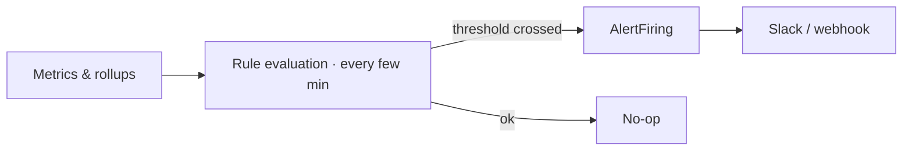

Alert rules watch your metrics and fire when a threshold is crossed, so you hear about a spend spike or a
quality drop in minutes rather than at invoice time.

## Key features

- **Metric-threshold rules** — define a metric, comparator, threshold, and window.
- **Built-in checks** — cost-per-success spikes, success-rate drops, budget breaches, pipeline lag.
- **Channels** — dispatch to a Slack webhook (and other integrations).
- **Scheduled evaluation** — rules are checked on a cadence by a background worker.

## How it works

## Example rules

| Rule | Fires when |
|---|---|
| Spend spike | Daily spend > threshold |
| Cost-per-success spike | +30% vs baseline |
| Success-rate drop | −20% vs baseline |
| Pipeline lag | Ingest lag > 5 min |

Configure rules on **Control Plane -> Alert Rules** and notification channels on **Control Plane -> Integrations**.

## Related

<CardGroup cols={2}>
  <Card title="Outcomes & ROI" icon="chart-line" href="/finops/outcomes">
    The quality metrics alerts watch.
  </Card>
  <Card title="Budgets" icon="shield-check" href="/finops/budgets">
    Alerts complement hard budget actions.
  </Card>
</CardGroup>

See [`examples/17_alerts.py`](https://github.com/avs6/runledger-community/blob/master/examples/17_alerts.py).
