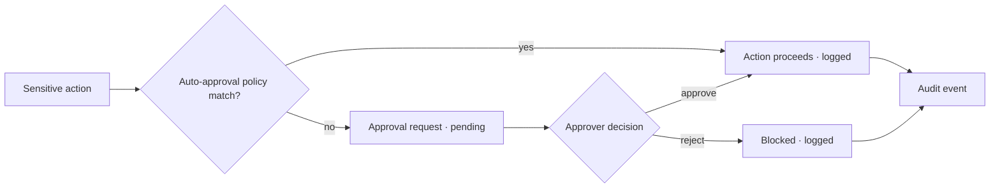

Some actions shouldn't happen without a human. The approvals workflow puts sensitive operations behind a
review queue, with a full audit trail of who requested, who decided, and when.

<Frame caption="Approvals — a governance queue for sensitive actions.">
  
</Frame>

## Key features

- **Approval requests** — an action is queued with its context and payload.
- **Review queue** — approvers see pending items, approve or reject with a note.
- **Audit trail** — every request and decision is recorded immutably.
- **Scoped by role** — who can approve is governed by [RBAC](/governance/rbac).
- **Auto-approval policies** — define conditions under which requests are approved automatically.

## How it works

## Supported request types

| Type | Description |
|---|---|
| `budget_increase` | Raise a budget limit |
| `prompt_promote` | Promote a prompt version to production |
| `tool_allow` | Allow a privileged tool |
| `capture_policy_full` | Enable full payload capture |
| `shadow_routing` | Enable shadow routing |
| `premium_model_use` | Use a premium/reasoning model |
| `external_mcp_tool` | Call an external MCP tool |
| `long_agent_session` | Run a long autonomous agent session |
| `sensitive_export` | Export sensitive data |
| `route_policy_change` | Change a Gateway route policy |

## Identity filters

The approvals list endpoint supports identity-scoped filtering:

| Parameter | Description |
|---|---|
| `requested_by` | Filter by requester email (partial match) |
| `access_group_id` | Filter to approvals from members of a specific access group |
| `api_key_prefix` | Filter to approvals submitted through a specific API key |

These filters let operators answer questions like "what did the engineering team request?" or "which approvals came through the staging API key?"

From identity detail pages (Users, Access Groups, API Keys), use the **Approvals** link to jump directly into the filtered view.

## Auto-approval policies

Auto-approval policies let you skip the review queue for trusted combinations of request type and condition. For example, auto-approve `budget_increase` for `workspace:engineering` or `premium_model_use` for `user:admin@*`.

Manage policies from the Approvals page or via the API:
- `GET /approvals/auto-policies` — list policies
- `POST /approvals/auto-policies` — create a policy
- `DELETE /approvals/auto-policies/:id` — delete a policy

## Related

<CardGroup cols={2}>
  <Card title="RBAC & multi-tenancy" icon="users-gear" href="/governance/rbac">
    Who can approve.
  </Card>
  <Card title="Prompt registry" icon="code-branch" href="/governance/prompts">
    Gate promotions behind approval.
  </Card>
  <Card title="Policy dry run" icon="shield" href="/governance/policy-dry-run">
    Test policies before enforcement.
  </Card>
  <Card title="Governance audit pack" icon="file-check" href="/governance/governance-audit-pack">
    Export approval records as compliance evidence.
  </Card>
</CardGroup>

See [`examples/27_approvals_workflow.py`](https://github.com/avs6/runledger-community/blob/master/examples/27_approvals_workflow.py).
