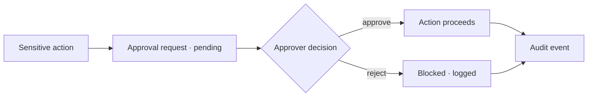

Some actions shouldn't happen without a human. The approvals workflow puts sensitive operations behind a
review queue, with a full audit trail of who requested, who decided, and when.

<Frame caption="Approvals — a governance queue for sensitive actions.">
  
</Frame>

## Key features

- **Approval requests** — an action is queued with its context and payload.
- **Review queue** — approvers see pending items, approve or reject with a note.
- **Audit trail** — every request and decision is recorded immutably.
- **Scoped by role** — who can approve is governed by [RBAC](/governance/rbac).

## How it works

## Typical uses

- Promoting a prompt to production.
- Raising a budget or disabling a guardrail.
- Any workflow you tag as requiring sign-off.

## Related

<CardGroup cols={2}>
  <Card title="RBAC & multi-tenancy" icon="users-gear" href="/governance/rbac">
    Who can approve.
  </Card>
  <Card title="Prompt registry" icon="code-branch" href="/governance/prompts">
    Gate promotions behind approval.
  </Card>
</CardGroup>

See [`examples/27_approvals_workflow.py`](https://github.com/avs6/runledger-community/blob/master/examples/27_approvals_workflow.py).
