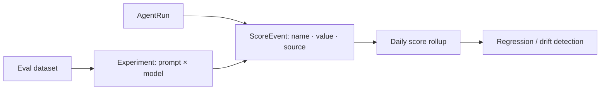

Evaluations attach **quality scores** to runs; experiments compare **prompt × model × dataset** combinations
so you can pick the best configuration and catch regressions before they ship.

<Frame caption="Evaluations & experiments — quality scores, regressions, and prompt × model × dataset runs.">
  
</Frame>

## Key features

- **Score events** — a `name`, `value`, and `source` (`human` / `heuristic` / `llm_judge`) per run or span.
- **LLM-as-judge** — score with a local or hosted model; judge drift is monitored.
- **Experiments** — evaluate a prompt across models and a dataset; compare on quality and cost.
- **Regression tracking** — daily score rollups surface drops over time.

## How it works



## Score a run

```python
rl.score("relevance", 0.92, run_id=run_id, source="human")   # value is 0–1
```

Or `POST /evaluations` / `POST /scores`. Scores feed `quality_optimized` routing and the
[optimization flywheel](/optimization/flywheel)'s quality signal.

## Experiments

Define a dataset and run a prompt across models to compare quality and cost side by side, with regressions
highlighted. See the **Experiments** dashboard page.

## Organization, Gateway & Observe Context (Evaluation & Experiments)

The Evaluation Studio and Experiments pages surface three posture cards:

- **Organization & Access Context** (blue) — workspace, access groups, API keys, hub models with drill-through to Organization, Access Groups, API Keys, AI Hub
- **Gateway & Routing Context** (violet) — providers, routes, guardrails, cache configs with drill-through to Model Gateway, Routes, Guardrails, Response Cache
- **Observe & Runtime Context** (cyan) — runs 30d, provider calls, distinct models, cost 30d with drill-through to Analytics Overview, Runs, Request Flow, Request Explorer, Model Usage, Cost & Savings

```bash
curl -H "Authorization: Bearer $KEY" \
  $HOST/analytics/eval-replay-org-gateway-posture

curl -H "Authorization: Bearer $KEY" \
  $HOST/analytics/eval-replay-observe-posture
```

## Cross-Feature Context (Datasets)

The Datasets page displays four posture cards connecting evaluation assets
to the workspace, observe, cost, and build loops:

- **Workspace & Datasets** (blue) — workspace name, total datasets.
  Drill-through to Workspaces.
- **Observe Context** (cyan) — provider calls 30d.
  Drill-through to Request Explorer.
- **Chargeback & Cost** (emerald) — chargeback rules, cost 30d.
  Drill-through to Chargeback Rules.
- **Build & Eval Loop** (rose) — eval experiments, replay experiments.
  Drill-through to Evaluation Studio, Experiments, Replay Lab.

```bash
curl http://localhost:8201/analytics/datasets-eval-asset-posture \
  -H "Authorization: Bearer rl_..."
```

## Cross-Feature Context (Evaluation Studio Parent)

The Evaluation Studio page displays an amber posture card connecting billing
periods, chargeback rules, and evaluation asset counts:

- **Billing & Chargeback Context** (amber) — billing periods, open periods,
  chargeback rules, cost 30d, total eval assets (datasets + experiments + replay).
  Drill-through to Billing Periods, Chargeback Rules, Cost & Savings,
  Datasets, Experiments, Replay Lab.

```bash
curl http://localhost:8201/analytics/eval-studio-parent-posture \
  -H "Authorization: Bearer rl_..."
```

## Cross-Feature Context (Experiments)

The Experiments page displays an amber posture card connecting billing
periods, chargeback context, and comparison assets:

- **Billing & Chargeback Context** (amber) — billing periods, open periods,
  chargeback rules, cost 30d, comparison assets (eval + replay experiments).
  Drill-through to Billing Periods, Chargeback Rules, Cost & Savings,
  Replay Lab, Optimization.

```bash
curl http://localhost:8201/analytics/experiments-comparison-posture \
  -H "Authorization: Bearer rl_..."
```

## Cross-Feature Context (Replay Lab)

The Replay Lab page displays an amber posture card connecting chargeback
rules and replay asset counts:

- **Chargeback & Replay Context** (amber) — chargeback rules, cost 30d,
  replay experiments, replay datasets.
  Drill-through to Chargeback Rules, Cost & Savings, Evaluation Studio,
  Runbooks.

```bash
curl http://localhost:8201/analytics/replay-lab-mode-posture \
  -H "Authorization: Bearer rl_..."
```

## Cross-Feature Context (Replay Result Analysis)

The Replay Experiment Detail page displays an amber posture card connecting
gateway enforcement, runtime evidence, and cost context:

- **Gateway, Runtime & Cost Context** (amber) — guardrail rules, cache configs,
  runs 30d, provider calls 30d, cost 30d.
  Drill-through to Guardrails, Response Cache, Runs, Cost & Savings,
  Optimization Simulator.

```bash
curl http://localhost:8201/analytics/replay-result-analysis-posture \
  -H "Authorization: Bearer rl_..."
```

## Cross-Feature Context (Runbooks Remediation)

The Runbooks page displays an amber posture card connecting observe context,
alert rules, cost evidence, and optimization:

- **Observe, Alert & Cost Context** (amber) — runs 30d, alert rules,
  alert firings 30d, cost 30d, eval experiments.
  Drill-through to Runs, Alert Rules, Billing Periods, Cost & Savings,
  Optimization.

```bash
curl http://localhost:8201/analytics/runbooks-remediation-posture \
  -H "Authorization: Bearer rl_..."
```

## Cross-Feature Context (Optimization Opportunities Rationale)

The Optimization Opportunities page displays an amber posture card connecting
cost evidence, evaluation experiments, and optimization context:

- **Cost, Evaluation & Optimization Context** (amber) — cost 30d,
  eval experiments, replay experiments, score events 30d.
  Drill-through to Cost & Savings, Optimization Simulator, Evaluation Studio,
  Model Scorecards.

```bash
curl http://localhost:8201/analytics/opt-opps-rationale-posture \
  -H "Authorization: Bearer rl_..."
```

## Cross-Feature Context (Optimization Simulator Decision)

The Optimization Simulator page displays an amber posture card connecting
cost evidence, evaluation experiments, and optimization context:

- **Cost, Evaluation & Optimization Context** (amber) — cost 30d,
  eval experiments, replay experiments, score events 30d.
  Drill-through to Cost & Savings, Optimization Opportunities, Evaluation Studio,
  Model Scorecards.

```bash
curl http://localhost:8201/analytics/opt-sim-decision-posture \
  -H "Authorization: Bearer rl_..."
```

## Cross-Feature Context (Model Scorecards Intelligence)

The Model Scorecards page displays an amber posture card connecting model
intelligence, cost evidence, and evaluation context:

- **Model Intelligence & Cost Context** (amber) — hub models,
  distinct models 30d, cost 30d, score events 30d, eval experiments.
  Drill-through to Model Usage, Cost & Savings, Optimization,
  Evaluation Studio.

```bash
curl http://localhost:8201/analytics/model-scorecards-intel-posture \
  -H "Authorization: Bearer rl_..."
```

## Cross-Feature Context (Vector Stores Lifecycle)

The Vector Stores page displays an amber posture card connecting workspace
context, observe evidence, cost attribution, and build context:

- **Workspace, Cost & Build Context** (amber) — workspace name,
  provider calls 30d, cost 30d, chargeback rules, workflows, eval experiments.
  Drill-through to Workspaces, Request Explorer, Chargeback, Workflows,
  Evaluation Studio, Optimization.

```bash
curl http://localhost:8201/analytics/vector-stores-lifecycle-posture \
  -H "Authorization: Bearer rl_..."
```

## Cross-Feature Context (Vector Store Detail Evidence)

The Vector Store detail page displays an amber posture card connecting
observe evidence, cost attribution, and build context:

- **Observe, Cost & Build Evidence** (amber) — provider calls 30d,
  runs 30d, cost 30d, chargeback rules, workflows, eval experiments.
  Drill-through to Request Explorer, Run Detail, Chargeback, Workflow
  Detail, Evaluation Studio, Runbooks.

```bash
curl http://localhost:8201/analytics/vector-store-detail-evidence-posture \
  -H "Authorization: Bearer rl_..."
```

## Related

<CardGroup cols={2}>
  <Card title="Prompt registry" icon="code-branch" href="/governance/prompts">
    Version the prompts you evaluate.
  </Card>
  <Card title="Outcomes & ROI" icon="chart-line" href="/finops/outcomes">
    Business outcomes vs eval scores.
  </Card>
</CardGroup>

See [`examples/14_evaluations.py`](https://github.com/avs6/runledger-community/blob/master/examples/14_evaluations.py).
