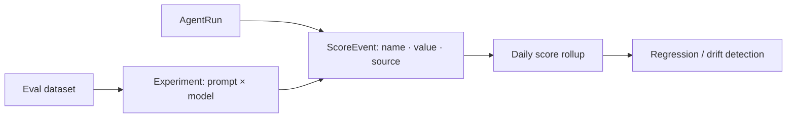

Evaluations attach **quality scores** to runs; experiments compare **prompt × model × dataset** combinations
so you can pick the best configuration and catch regressions before they ship.

<Frame caption="Evaluations & experiments — quality scores, regressions, and prompt × model × dataset runs.">
  
</Frame>

## Key features

- **Score events** — a `name`, `value`, and `source` (`human` / `heuristic` / `llm_judge`) per run or span.
- **LLM-as-judge** — score with a local or hosted model; judge drift is monitored.
- **Experiments** — evaluate a prompt across models and a dataset; compare on quality and cost.
- **Regression tracking** — daily score rollups surface drops over time.

## How it works



## Score a run

```python
rl.score("relevance", 0.92, run_id=run_id, source="human")   # value is 0–1
```

Or `POST /evaluations` / `POST /scores`. Scores feed `quality_optimized` routing and the
[optimization flywheel](/optimization/flywheel)'s quality signal.

## Experiments

Define a dataset and run a prompt across models to compare quality and cost side by side, with regressions
highlighted. See the **Experiments** dashboard page.

## Related

<CardGroup cols={2}>
  <Card title="Prompt registry" icon="code-branch" href="/governance/prompts">
    Version the prompts you evaluate.
  </Card>
  <Card title="Outcomes & ROI" icon="chart-line" href="/finops/outcomes">
    Business outcomes vs eval scores.
  </Card>
</CardGroup>

See [`examples/14_evaluations.py`](https://github.com/avs6/runledger-community/blob/master/examples/14_evaluations.py).
