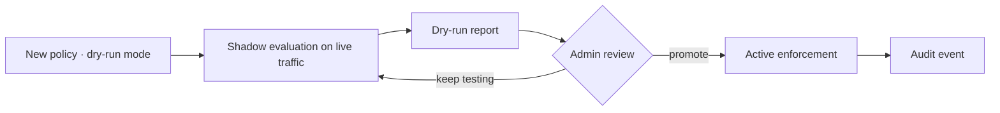

Policy dry-run mode lets you preview the impact of a policy change before it affects live traffic. Run any policy in shadow mode, review what it would have blocked, rerouted, or allowed, then promote it to enforcement with one click.

## Key features

- **Shadow evaluation** — policies run against real traffic but take no action.
- **Dry-run reports** — see requests that would be rejected, agents that would need approval, MCP tools that would be blocked, models that would be rerouted, and expected savings.
- **Promote to enforcement** — after review, promote a dry-run policy to active enforcement.
- **Audit trail** — every dry-run decision is logged to the [audit log](/governance/approvals).

## How it works

## Report contents

| Column | Description |
|---|---|
| Request ID | The request that was evaluated |
| Action | `would_block`, `would_allow`, or `would_reroute` |
| Policy type | Budget, routing, tool filter, or data capture |
| Reason | Why the policy would have acted |

## Related

<CardGroup cols={2}>
  <Card title="Approvals" icon="shield-check" href="/governance/approvals">
    Approval workflows for sensitive actions.
  </Card>
  <Card title="Governance audit pack" icon="file-check" href="/governance/governance-audit-pack">
    Exportable compliance evidence.
  </Card>
</CardGroup>
