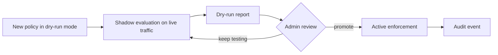

Policy dry-run mode lets you preview the impact of a policy change before it affects live traffic. The main operator surface now lives inside the **Tool Policies** page as the dry-run tab, while `/policy-dry-run` remains as a compatibility route.

## Key features

- **Shadow evaluation** — policies run against real traffic but take no action.
- **Dry-run reports** — see requests that would be rejected, require approval, or be rerouted.
- **Promote to enforcement** — after review, promote a dry-run policy to active enforcement.
- **Audit trail** — every dry-run decision can be pivoted into the audit log.

## How it works

## Current ownership

- use **Tool Policies** for the live dry-run and simulation workflow
- use **Tool Registry** for runtime registrations and search-provider setup
- keep `/policy-dry-run` only as a compatibility entry point

## Related

<CardGroup cols={2}>
  <Card title="Tool Governance" icon="wrench" href="/governance/tool-governance">
    Registry, policy rules, simulation, and dry-run ownership.
  </Card>
  <Card title="Approvals" icon="shield-check" href="/governance/approvals">
    Approval workflows for sensitive actions.
  </Card>
</CardGroup>
