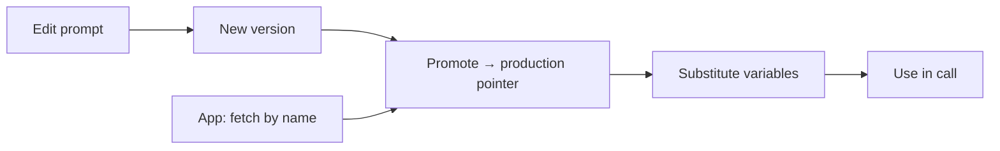

The prompt registry treats prompts as versioned artifacts: edit, diff, promote, and fetch by name at
runtime — so a prompt change is auditable and reversible instead of a silent code edit.

<Frame caption="Prompt registry — versioning, diff viewer, and promote-to-production.">
  
</Frame>

## Workspace & Provider Context

The Prompts list page now displays workspace scope and model/provider awareness through a
posture card:

- **Workspace & Model Context** (blue) — workspace name, hub model catalog (active/total),
  distinct providers, prompts with model hints vs. total, gateway routes, routing policies,
  and workspace users. Drill-through links to Organization, AI Hub, Provider Profiles,
  and Gateway.

```bash
curl http://localhost:8201/analytics/prompts-org-gateway-posture \
  -H "Authorization: Bearer rl_..."
```

---

## Observe & Analytics Context (Prompt Detail)

The Prompt detail page displays a cyan **Observe & Analytics Context** posture card
bridging version-level prompt management to the full observability surface:

- Runs (30d), distinct models, 30-day total cost, and average cost per call.
- Drill-through links to Analytics Overview, Runs, Request Flow, Request Explorer,
  Model Usage, and Cost & Savings.

```bash
curl "http://localhost:8201/analytics/prompt-detail-observe-posture?prompt_name=my-prompt" \
  -H "Authorization: Bearer rl_..."
```

---

## Observe & Analytics Context (Prompts List)

The Prompts list page displays a cyan **Observe & Analytics Context** card and a rose **Build & Improve Loop** card:

- **Observe context** — runs 30d, provider calls 30d, distinct models, spend 30d with drill-through to Analytics Overview, Runs, Model Usage, and Cost & Savings.
- **Build loop** — eval datasets, experiments, workflows, and replay experiments with drill-through to Evaluation Studio, Workflows, Replay Lab, and Optimization.

```bash
curl http://localhost:8201/analytics/prompts-list-observe-posture \
  -H "Authorization: Bearer rl_..."
```

---

## AI Hub & Cost Attribution Context (Prompt Detail)

The Prompt detail page displays an amber **AI Hub & Cost Attribution Context** card connecting prompt versions to the model registry and chargeback attribution:

- Hub models (total/active), chargeback rules, and attributed cost 30d.
- Drill-through links to AI Hub, Chargeback, and Cost & Savings.

```bash
curl http://localhost:8201/analytics/prompt-detail-hub-finops-posture \
  -H "Authorization: Bearer rl_..."
```

---

## Key features

- **Versioning** — every edit is a new immutable version.
- **Diff viewer** — compare any two versions.
- **Promote-to-production** — pin the version your app fetches by name.
- **Variable substitution** — `{{variables}}` filled at fetch time.
- **GitHub sync** — optionally back the registry with a repo.

## How it works



## Fetch at runtime

```python
prompt = rl.get_prompt("support-reply", variables={"tone": "friendly"})
resp = client.chat.completions.create(
    model="gpt-4o-mini",
    messages=[{"role": "system", "content": prompt["content"]}, ...],
)
```

`get_prompt(name, environment="production", variables=...)` returns a dict — `content` (the rendered
string), `version`, `environment`, `model_hint`, and the `variables` schema. The app always fetches the
**production** version by name; promoting a new version rolls everyone forward
(and rolling back is just re-promoting the previous one). Runs record the
`deployment_version` so you can tie quality and cost to a specific prompt version.

## Related

<CardGroup cols={2}>
  <Card title="Evaluations" icon="flask" href="/governance/evaluations">
    Score prompt versions before promoting.
  </Card>
  <Card title="Approvals" icon="user-check" href="/governance/approvals">
    Gate promotion behind an approval.
  </Card>
</CardGroup>

See [`examples/15_prompts.py`](https://github.com/avs6/runledger-community/blob/master/examples/15_prompts.py).
