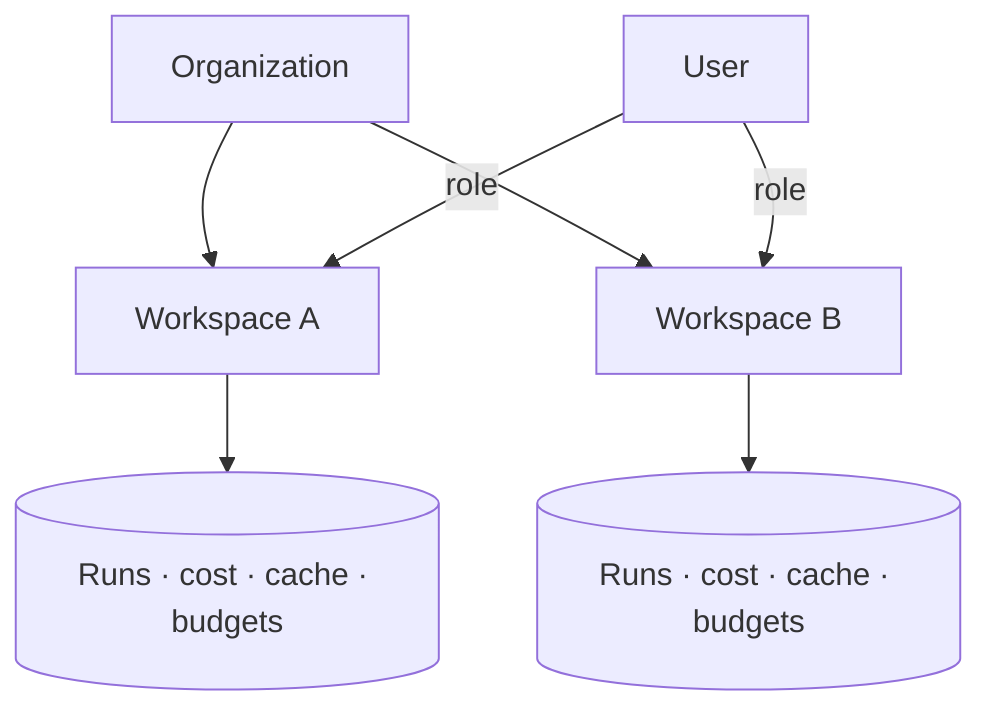

RunLedger is multi-tenant from the ground up. An **organization** contains **workspaces**; users hold roles
at each level; and every piece of data — runs, cost, cache entries, budgets — is scoped to a workspace and
never leaks across the boundary.

<Frame caption="Users & RBAC — org and workspace roles with scoped isolation.">
  
</Frame>

## Model

## Roles

| Scope | Roles |
|---|---|
| **Organization** | org admin, member |
| **Workspace** | workspace admin, member, viewer |

Roles gate management actions (creating routes, editing budgets, approving requests) and data visibility.
Platform admins manage the deployment itself.

## Isolation is a security property

Workspace isolation isn't just organization — it's enforced everywhere:

- **Data** — every query is workspace-filtered.
- **API keys** — each key is workspace-scoped.
- **Cache** — the [semantic cache scope key](/optimization/semantic-cache) includes the tenant, so a
  cached answer can never cross workspaces.

## Related

<CardGroup cols={2}>
  <Card title="Approvals" icon="user-check" href="/governance/approvals">
    Role-gated sign-off.
  </Card>
  <Card title="Settings" icon="gear" href="/observability/product-tour">
    API keys and workspace settings.
  </Card>
</CardGroup>

> **Enterprise:** SSO / OIDC and SCIM user provisioning are available in the Enterprise edition.
