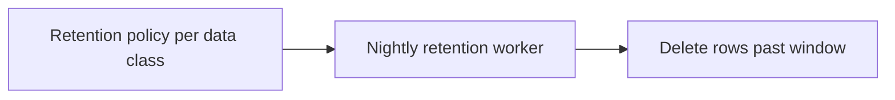

RunLedger is privacy-first: **payload logging is off by default**, and retention policies control how long
any captured data is kept.

## Payload logging

Message content is **not** stored unless you opt in. Capture is an explicit setting:

| Mode | Stores |
|---|---|
| `metadata_only` (default) | No payloads — metadata, tokens, and cost only. |
| `errors_only` | Payloads only for failed runs. |
| `sampled` | A configurable fraction of payloads. |
| `full` | All payloads. |

Set it via the SDK's `privacy_mode` argument (`RunLedger(privacy_mode="errors_only")`), or per workspace.
The [gateway PII redaction](/gateway/runtime-controls) can additionally scrub content before it ever
reaches a provider.

## Retention policies

Define how long each data class is kept; a nightly worker prunes anything past its window.

| Data class | Typical window |
|---|---|
| Payloads | Short (days) |
| Telemetry / spans | Medium |
| Rollups & ledger | Long (audit) |

Configure policies on the **Settings** page or via `POST /retention`.

## Related

<CardGroup cols={2}>
  <Card title="Runtime controls" icon="sliders" href="/gateway/runtime-controls">
    PII redaction at the gateway.
  </Card>
  <Card title="Backup & restore" icon="database" href="/backup-restore">
    What's retained vs backed up.
  </Card>
</CardGroup>
