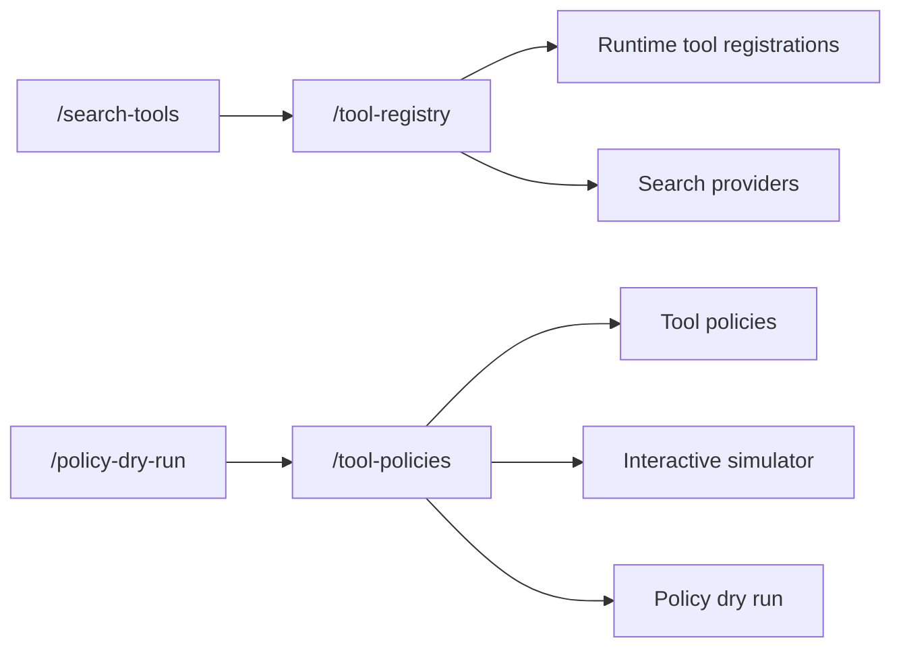

Tool governance in RunLedger now has two primary operator surfaces:

- **Tool Registry** for runtime tool registrations and search-provider management
- **Tool Policies** for allow, audit, block, approval, simulation, and dry-run review

The older standalone routes for Search Tools and Policy Dry Run remain as compatibility redirects, but they are no longer the long-term owner pages.

## Ownership

## What lives where

### Tool Registry

- register runtime tools
- set baseline policy and runtime enforcement on registered tools
- manage search providers and provider metadata
- review policy counts and pivot into Tool Policies

### Tool Policies

- create, edit, deactivate, and simulate tool rules
- scope rules to workspace, access group, or search-provider context
- model `allow`, `audit`, `block`, and `require_approval`
- test policy outcomes before enforcement using the dry-run tab

## Runtime behavior

Tool calls are governed on the request path through the runtime enforcement and plugin/governance services, so this area is not just decorative configuration. The simulator and dry-run views help operators understand what the live runtime would do before turning on stricter enforcement.

## Budget impact and cost attribution

The Tool Registry surface now includes a FinOps Budget Impact card that shows:

- **Tool spend (30d)**: total cost attributable to tool-call-driven provider invocations
- **Budget coverage**: how many active budgets exist and how many use tool-scoped (`feature_tag`) scope
- **Chargeback attribution**: active chargeback rules and how many use the tool dimension

From the tool registry, operators can drill through directly to Budgets, Budget Detail, Chargeback (filtered to the `feature_tag` dimension), and Ledger. Each tool row in the registry list includes a cost attribution link into the chargeback surface.

Budget Detail also links back to Tool Registry so operators can navigate from a budget's performance economics view into the governance surface that controls tool behavior.

The posture data is provided by `GET /analytics/tool-registry-finops-posture`, which returns budget context (total/tool-scoped budgets, total limit), chargeback context (rules, tool-dimension rules), and spend context (tool spend, call count, total spend) for the workspace.

## Budget-driven approvals and alert rules

Approvals and Alert Rules both bridge into the FinOps budget surface:

- **Approvals**: The approvals page shows a FinOps Budget Context card with budget-increase request counts, active budgets, breach counts (30d), and budget-related alert rules. Each `budget_increase` approval row links to Budgets and Budget Detail for context on the override being requested. The posture data comes from `GET /analytics/approvals-alert-finops-posture`.
- **Alert Rules**: Two new metrics — `budget_utilization` and `budget_breach_count` — are available when creating or editing alert rules. The alert rules page shows the same FinOps posture card with drill-through links to Budgets, Budget Detail, Approvals, and Chargeback.

Budget Detail links back to Approvals (filtered to pending) and Alert Rules for operators navigating from a budget's economics view into governance workflows.

## Tag-driven budget attribution and chargeback

Tags bridge into FinOps budgets and chargeback via the Tag Management page:

- **Budget Attribution**: The tags page shows a FinOps Budget Attribution card with tagged spend (30d), tag-scoped budgets, tag dimension chargeback rules, and distinct tags with spend. Posture data comes from `GET /analytics/tags-finops-budget-posture`.
- **Chargeback Dimension**: Chargeback rules that use the `feature_tag` dimension are surfaced in the posture card so operators can see how many rules attribute costs by tag.
- **Drill-through**: The posture card links to Budgets, Budget Detail, and Chargeback. Budget Detail links back to Tags for operators navigating from a budget's economics view into tag governance.

## Scope-aware tool governance

Tool Registry and Tool Policies both bridge into the Org & Access identity surface:

- **Org & Access Posture**: Both pages show an Org & Access Scope card with workspace users, access groups (with tool-policy count), active API keys, and MCP servers. Posture data comes from `GET /analytics/tool-governance-org-posture`.
- **Policy Scope Resolution**: The Tool Policies posture card highlights how active policies distribute across org, workspace, and access-group scopes so operators can see whether governance is centralized or delegated.
- **Drill-through**: Both posture cards link to Organization, Users, Workspaces, Access Groups, API Keys, and MCP Registry. These surfaces link back into tool governance for a bidirectional navigation path.

## Gateway & Observe runtime traceability

Tool Registry and Tool Policies both bridge into the Gateway & Observe runtime surface:

- **Gateway Posture**: Both pages show a Gateway & Observe Runtime card with gateway routes, guardrails, tool calls (30d), and alert firings (30d). Posture data comes from `GET /analytics/tool-governance-gateway-posture`.
- **Runtime Enforcement**: The posture card highlights how many registered tools carry `runtime_enforcement` and how many gateway routes are rate-limited, bridging policy intent to runtime behavior.
- **Drill-through**: Both posture cards link to Gateway, Guardrails, Runs, Request Explorer, and Monitoring so operators can trace from governance config to runtime telemetry.

## Scope-aware exception workflows

Approvals and Alert Rules both bridge into the Org & Access identity surface:

- **Org & Access Posture**: Both pages show an Org & Access Scope card with workspace users, access groups, pending approvals (or active alert rules), and active API keys. Posture data comes from `GET /analytics/exception-workflows-org-posture`.
- **Exception Context**: The posture card lets operators see which organizational units generate exception requests and how identity scope relates to alert rule coverage.
- **Drill-through**: Both posture cards link to Organization, Users, Workspaces, Access Groups, API Keys, and MCP Registry.

## Exception workflows gateway & observe integration

Approvals and Alert Rules both bridge into the Gateway & Observe runtime surface:

- **Gateway Posture**: Both pages show a Gateway & Observe Runtime card with gateway routes, guardrails, tool calls (30d), and alert firings (30d). Posture data comes from `GET /analytics/exception-workflows-gateway-posture`.
- **Investigation Pivot**: The posture card lets operators pivot from exception workflows (approval outcomes, alert firings) into runtime investigation surfaces (Runs, Request Explorer) to trace the root cause.
- **Drill-through**: Both posture cards link to Gateway, Guardrails, Runs, Request Explorer, and Monitoring.

## Scope-aware data protection

Data Capture, Security, and Tags all bridge into the Org & Access identity surface:

- **Org & Access Posture**: All three pages show an Org & Access Scope card with workspace users, relevant context (capture policies, security events, or active tags), and MCP servers. Posture data comes from `GET /analytics/data-protection-org-posture`.
- **Data Protection Scope**: The posture card lets operators see how data protection controls (capture policies, security events, tag taxonomy) relate to the organizational identity hierarchy.
- **Drill-through**: All three posture cards link to Organization, Users, Workspaces, Access Groups, API Keys, and MCP Registry.

## Data protection gateway & observe traceability

Data Capture, Security, and Tags all bridge into the Gateway & Observe runtime surface:

- **Gateway & Observe Posture**: All three pages show a Gateway & Observe Runtime card (violet theme) with gateway routes, guardrails, tool calls (30d), and alert firings (30d). Posture data comes from `GET /analytics/data-protection-gateway-posture`.
- **Runtime Traceability**: The posture card lets operators see how data protection controls relate to the runtime gateway layer — how many routes, guardrail rules, tool calls, and alert firings exist in the workspace.
- **Drill-through**: All three posture cards link to Gateway, Guardrails, Runs, Request Explorer, and Monitoring.

## Evidence & audit cross-feature linkage

Audit Log and Governance Pack bridge across all major feature families:

- **Cross-Feature Evidence Posture**: Both pages show a Cross-Feature Evidence Posture card (amber theme) with active budgets, workspace users, gateway routes, and audit events (30d). Posture data comes from `GET /analytics/evidence-audit-cross-posture`.
- **FinOps Linkage**: The posture card surfaces budget, billing period, chargeback rule, and ledger snapshot counts, connecting audit evidence to FinOps compliance.
- **Org & Gateway Context**: Workspace user count, API key count, gateway provider and route counts give operators a scope-aware view of the audit surface.
- **Drill-through**: Both posture cards link to Budgets, Chargeback, Ledger, Organization, Runs, Monitoring, and Gateway.

## Internal governance cohesion

Every Safety & Governance page includes a Governance Cohesion posture card (rose theme) showing sibling feature stats with drill-through links:

- **Governance Internal Posture**: `GET /analytics/governance-internal-posture` returns tool registry, tool policy, approval, data capture, security event, alert rule, audit event, and tag counts across the workspace.
- **Cross-Surface Navigation**: Each governance page links to all sibling governance surfaces (Tool Registry, Tool Policies, Approvals, Data Capture, Security, Alert Rules, Audit Log, Governance Pack, Tags) excluding itself.
- **Stat Tiles**: Four tiles per page surface the most relevant sibling stats (e.g., registered tools, active policies, pending approvals, security events, audit events, active tags).

## Runtime scope and evidence

The Tool Registry page includes a Runtime Scope & Evidence posture card (cyan theme) showing how registered tools propagate through workspace scope, gateway routing, request evidence, and budget linkage:

- **Runtime Posture**: `GET /analytics/tool-registry-runtime-posture` returns workspace scope (total workspaces, workspace-scoped enforced tools), API key scope (active keys, keys with tool calls in the last 30 days), MCP scope (active servers, MCP tool calls), gateway runtime (model routes, cache configs, rate-limited routes), observe evidence (tool runs, tool requests), and budget linkage (tool-scoped budgets, budget notifications).
- **Drill-Through Links**: Workspaces, API Keys, MCP Registry, Model Gateway, Response Cache, Rate Limits, Run Detail, Request Flow, Budgets, and Budget Detail.
- **Stat Tiles**: API Keys with Tool Calls, Model Routes, Tool Requests (30d), and Budget Notifications (30d).

### Tool policies runtime scope

The Tool Policies page includes its own Runtime Scope & Evidence posture card (cyan theme) showing how policies enforce through gateway, observability, budgets, and ledger context:

- **Runtime Posture**: `GET /analytics/tool-policies-runtime-posture` returns scope context (total workspaces, workspace-scoped policies, access-group-scoped policies, active API keys), gateway enforcement (model routes, guardrail rules, guardrail events 30d), observe evidence (policy violations, request flows, monitoring alerts), budget context (total budgets, budget notifications), and ledger context (ledger snapshots, ledger entries 30d).
- **Drill-Through Links**: Workspaces, API Keys, Model Gateway, Guardrails, Request Flow, Alert Rules, Budgets, and Ledger.
- **Stat Tiles**: Guardrail Events (30d), Policy Violations (30d), Total Budgets, and Ledger Snapshots.

## Related

<CardGroup cols={2}>
  <Card title="Approvals" icon="shield-check" href="/governance/approvals">
    Approval workflows for actions that require sign-off.
  </Card>
  <Card title="Policy Dry Run" icon="flask" href="/governance/policy-dry-run">
    Shadow-evaluate policy decisions before enforcement.
  </Card>
  <Card title="Alert Rules" icon="bell" href="/governance/alert-rules">
    Budget utilization and breach count alerting.
  </Card>
  <Card title="Budgets" icon="wallet" href="/finops/budgets">
    Budget policies including tool-scoped spend controls.
  </Card>
  <Card title="Chargeback" icon="receipt" href="/finops/chargeback">
    Cost allocation and attribution by tool dimension.
  </Card>
  <Card title="Tags" icon="tags" href="/governance/tags">
    Tag-driven budget attribution and spend tracking.
  </Card>
  <Card title="Organization" icon="building" href="/org/organization">
    Org identity context for scope-aware tool governance.
  </Card>
  <Card title="Access Groups" icon="users" href="/org/access-groups">
    Access-group-scoped tool policy resolution.
  </Card>
  <Card title="Gateway" icon="server" href="/gateway/routes">
    Gateway routes and runtime enforcement traceability.
  </Card>
  <Card title="Guardrails" icon="shield" href="/guardrails">
    Guardrail rules bridging governance to runtime safety.
  </Card>
  <Card title="Data Capture" icon="database" href="/governance/data-capture">
    Scope-aware capture policy and PII redaction.
  </Card>
  <Card title="Security" icon="lock" href="/governance/security">
    Enterprise security with OIDC and IP ACL controls.
  </Card>
</CardGroup>
