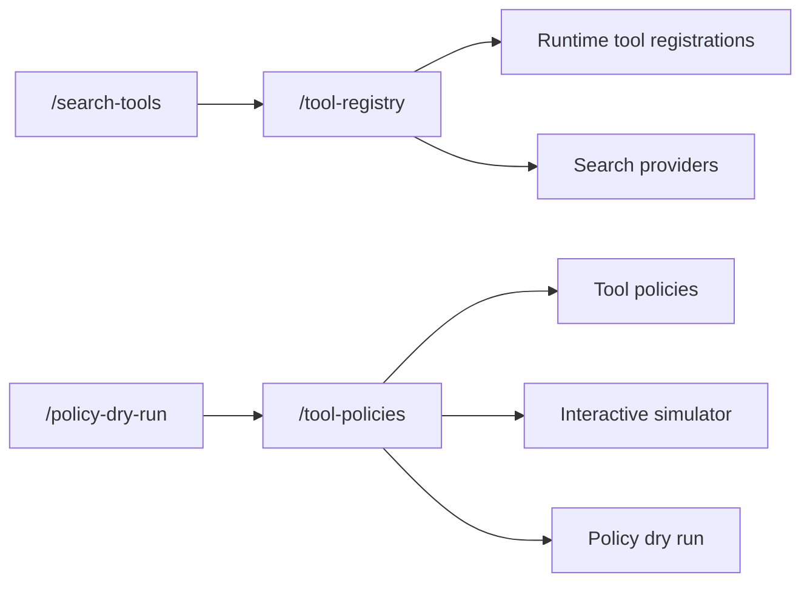

Tool governance in RunLedger now has two primary operator surfaces:

- **Tool Registry** for runtime tool registrations and search-provider management
- **Tool Policies** for allow, audit, block, approval, simulation, and dry-run review

The older standalone routes for Search Tools and Policy Dry Run remain as compatibility redirects, but they are no longer the long-term owner pages.

## Ownership

## What lives where

### Tool Registry

- register runtime tools
- set baseline policy and runtime enforcement on registered tools
- manage search providers and provider metadata
- review policy counts and pivot into Tool Policies

### Tool Policies

- create, edit, deactivate, and simulate tool rules
- scope rules to workspace, access group, or search-provider context
- model `allow`, `audit`, `block`, and `require_approval`
- test policy outcomes before enforcement using the dry-run tab

## Runtime behavior

Tool calls are governed on the request path through the runtime enforcement and plugin/governance services, so this area is not just decorative configuration. The simulator and dry-run views help operators understand what the live runtime would do before turning on stricter enforcement.

## Related

<CardGroup cols={2}>
  <Card title="Approvals" icon="shield-check" href="/governance/approvals">
    Approval workflows for actions that require sign-off.
  </Card>
  <Card title="Policy Dry Run" icon="flask" href="/governance/policy-dry-run">
    Shadow-evaluate policy decisions before enforcement.
  </Card>
</CardGroup>
