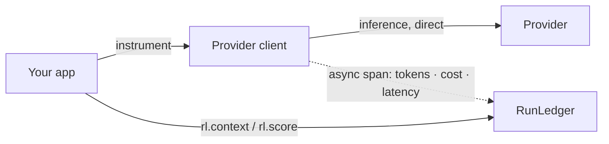

The Python SDK (`runledger-sdk`) wraps your provider clients so every call is metered, cost-attributed, and
linked to a run — while inference still goes **directly** to the provider. Telemetry is sent to RunLedger
asynchronously, so there is **no added inference latency**.

## Key features

- **Two-line setup** — `instrument()` monkey-patches supported clients in place.
- **Direct inference** — the SDK observes; it never proxies your model calls.
- **Rich run context** — attach `end_user_id`, `feature_tag`, session, and custom metadata.
- **Quality scoring** — `rl.score()` attaches evaluation scores to a run.
- **Budget pre-checks** — optionally gate a request before the call.
- **Cross-service propagation** — headers carry the run context across service boundaries.

## Install

```bash
pip install runledger-sdk
```

## How it works



`instrument()` wraps the client's `create` methods. On each call it opens a **Span** under the current
**AgentRun**, records the provider, model, token usage, latency, and cost, and flushes it to RunLedger in
the background.

## Usage

```python
from runledger_sdk import RunLedger
import openai

rl = RunLedger(api_key="rl_...")   # or the RUNLEDGER_API_KEY env var
rl.instrument()                     # wraps openai.OpenAI + AsyncOpenAI

client = openai.OpenAI()

with rl.context(end_user_id="u_123", feature_tag="support-chat") as run_id:
    resp = client.chat.completions.create(
        model="gpt-4o-mini",
        messages=[{"role": "user", "content": "Hello!"}],
    )

rl.shutdown()   # flush pending telemetry
```

### Attach a quality score

```python
with rl.context(feature_tag="summarize") as run_id:
    resp = client.chat.completions.create(model="gpt-4o-mini", messages=[...])
    rl.score(run_id, name="relevance", value=0.92, source="human")
```

Scores flow into [Evaluations](/governance/evaluations) and the [Outcomes & ROI](/finops/outcomes) ledger.

### Frameworks

`instrument()` also patches Anthropic and the LangChain / LangGraph callback stack:

```python
rl.instrument()                    # OpenAI + Anthropic
from runledger_sdk.langchain import RunLedgerCallbackHandler
chain.invoke(input, config={"callbacks": [RunLedgerCallbackHandler()]})
```

Async clients, FastAPI services, and cross-service propagation are supported — see the examples below.

## Configuration

| Option | Env var | Default | Notes |
|---|---|---|---|
| API key | `RUNLEDGER_API_KEY` | — | Workspace-scoped key (`rl_...`). |
| Base URL | `RUNLEDGER_BASE_URL` | `http://localhost:8201` | Your RunLedger API. |
| Payload logging | `RUNLEDGER_CAPTURE` | `off` | `off` / `errors` / `sampled` / `full` — off by default for privacy. |

## Examples

- [`examples/01_openai_basic.py`](https://github.com/avs6/runledger-community/blob/master/examples/01_openai_basic.py)
- [`examples/03_langchain_chain.py`](https://github.com/avs6/runledger-community/blob/master/examples/03_langchain_chain.py)
- [`examples/04_langgraph_agent.py`](https://github.com/avs6/runledger-community/blob/master/examples/04_langgraph_agent.py)
- [`examples/05_fastapi_service.py`](https://github.com/avs6/runledger-community/blob/master/examples/05_fastapi_service.py)

## Related

<CardGroup cols={2}>
  <Card title="TypeScript SDK" icon="js" href="/instrumentation/typescript-sdk">
    The same, for Node.
  </Card>
  <Card title="Budgets" icon="shield-check" href="/finops/budgets">
    Gate requests with a budget pre-check.
  </Card>
</CardGroup>
