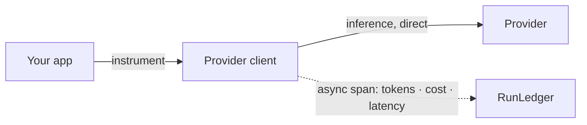

The TypeScript SDK (`@runledger/sdk`) wraps your provider clients so every call is metered and linked to a
run, while inference goes **directly** to the provider. Telemetry is flushed asynchronously — **no added
inference latency**.

## Key features

- **Two-line setup** — `instrument(client)` patches the client in place.
- **Direct inference** — observe-only; the SDK never proxies your calls.
- **Run context** — `withContext()` attaches `endUserId`, `featureTag`, and metadata.
- **Multi-provider** — OpenAI, Google Gemini, Mistral, Cohere.
- **Async-first** — batched, non-blocking export; `flush()` on shutdown.

## Install

```bash
npm install @runledger/sdk
```

## Usage

```typescript
import OpenAI from 'openai'
import { RunLedger } from '@runledger/sdk'

const rl = new RunLedger({ apiKey: process.env.RUNLEDGER_API_KEY })
const openai = new OpenAI()
rl.instrument(openai)

const result = await rl.withContext(
  { endUserId: 'u_123', featureTag: 'support-chat' },
  async () =>
    openai.chat.completions.create({
      model: 'gpt-4o-mini',
      messages: [{ role: 'user', content: 'Hello!' }],
    }),
)

await rl.flush()
```

## How it works



`instrument()` wraps the client's completion methods; each call opens a span under the active run context
(propagated via `AsyncLocalStorage`) and is exported in the background.

## Configuration

| Option | Env var | Default |
|---|---|---|
| `apiKey` | `RUNLEDGER_API_KEY` | — |
| `baseUrl` | `RUNLEDGER_BASE_URL` | `http://localhost:8201` |

## Examples

See the [`packages/ts-sdk`](https://github.com/avs6/runledger-community/tree/master/packages/ts-sdk) package
for OpenAI, Gemini, Mistral, and Cohere usage.

## Related

<CardGroup cols={2}>
  <Card title="Python SDK" icon="python" href="/instrumentation/python-sdk">
    The same, for Python.
  </Card>
  <Card title="Model Gateway" icon="server" href="/gateway/overview">
    Prefer a base_url swap? Route through the gateway instead.
  </Card>
</CardGroup>
