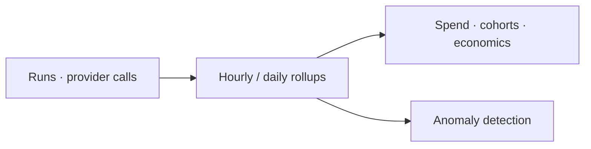

Analytics is the aggregate view: where the money goes, who spends it, how it trends, and when something
looks wrong.

<Frame caption="Analytics — spend charts, top spenders, cohorts, and anomalies.">
  
</Frame>

## Key features

- **Spend charts** — over time, by model, provider, feature, and tenant.
- **Top spenders** — the users, features, and workflows driving cost.
- **Cohorts** — compare segments of traffic.
- **Unit economics** — cost per run, per outcome, per step.
- **Anomaly detection** — surfaces sudden spend or usage spikes.
- **Scoped summary** — workspace, org, or platform-level aggregates with savings and intent breakdown.
- **Savings attribution** — realized savings by category (cache, routing, compression) over time.
- **Optimization opportunities** — auto-detected patterns where caching, routing, or model changes would cut cost.
- **Trends** — cost, usage, and savings trends with period-over-period comparison (hourly/daily/weekly).

## How it works

Analytics reads from the same rollups the budgets and dashboards use, so numbers are consistent across the
product. Everything is queryable via the API for your own BI.

## Related

<CardGroup cols={3}>
  <Card title="Cost attribution" icon="building" href="/finops/attribution">
    The dimensions analytics slices by.
  </Card>
  <Card title="Alerts" icon="bell" href="/governance/alerts">
    Get notified on anomalies.
  </Card>
  <Card title="Engineering Dashboard" icon="wrench" href="/observability/engineering">
    Latency, errors, cache hit rates, and quality funnel.
  </Card>
  <Card title="Request Explorer" icon="search" href="/observability/request-explorer">
    Drill into individual provider calls.
  </Card>
  <Card title="Optimization Simulator" icon="flask" href="/observability/optimization-simulator">
    What-if analysis for model and optimization changes.
  </Card>
</CardGroup>

See [`examples/07_analytics_query.py`](https://github.com/avs6/runledger-community/blob/master/examples/07_analytics_query.py).
