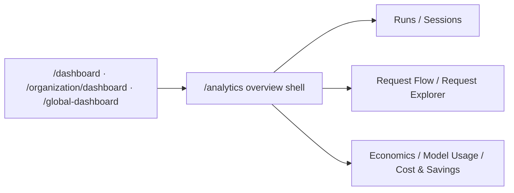

Analytics is the main Observe landing surface. It is the shared overview shell for:

- workspace operators coming from `/dashboard`
- organization administrators coming from `/organization/dashboard`
- platform administrators coming from `/global-dashboard`

<Frame caption="Analytics overview — one scoped entry point for workload health, spend, model mix, and request-analysis drill-downs.">
  
</Frame>

## Key features

- **Scoped overview** — switch between workspace, organization, and platform perspectives.
- **Top intents** — see which workflows are driving demand and cost in the current scope.
- **Request-analysis bridge** — jump directly into Runs, Request Flow, and Request Explorer.
- **Model mix** — inspect which providers and models dominate the selected window.
- **Recent activity** — review the latest runs or scope summary without leaving the overview.
- **Breakdown handoff** — use Analytics Breakdown for denser workspace charting when you need deeper charts.

## How it works

The page reads from the same scoped summary and request-analysis APIs that power deeper economics and observability drill-downs, so the numbers stay aligned across the product.

## Access-group scoped investigation

The Analytics Overview includes an **Investigation Scope** posture card that surfaces access-group context alongside workspace investigation metrics. `GET /analytics/investigation-access-group-posture` returns:

- **Access group context** — active groups and total members
- **Investigation context** — 30-day runs, requests, active users, and active routes

All investigation surfaces (Runs, Run Detail, Request Flow, Request Explorer) accept an `access_group_id` query parameter that filters results to the group's scoped observability profile. The analytics overview, when filtered by access group, propagates the scope through all cross-navigation links.

## Governance-aware investigation

All investigation surfaces also accept governance-dimension filters (`tag`, `tool_name`, `security_event_only`) that narrow results to runs matching a governance tag, a specific tool, or runs with correlated security events. The per-run governance context endpoint (`GET /runs/{run_id}/governance`) returns tool policy outcomes, security events, alert firings, audit log entries, and governance pack evidence.

See [Governance-Aware Investigation](/observability/governance-investigation) for the full workflow.

## FinOps budget bridge

Investigation surfaces show inline FinOps budget context — active budgets, breach status, 30-day spend, billing periods, and chargeback rules. The `GET /analytics/investigation-finops-budget-posture` endpoint powers investigation cards with drill-through links to Budgets, Billing Periods, Chargeback, and Model Budgets.

The **Analytics Overview** page adds a budget posture card via `GET /analytics/overview-finops-budget-posture`, which includes budget notification status alongside the standard budget, billing, and spend context. The **Model Usage** page adds per-model budget utilization via `GET /analytics/model-budget-utilization`, showing spend vs. budget limit with utilization percentage and drill-through to Model Budgets, Billing Periods, and Chargeback.

See [FinOps Investigation Bridge](/observability/finops-investigation) for the full workflow.

## Economics & outcomes FinOps bridge

Economics, cost/savings, outcomes, and monitoring surfaces carry their own FinOps posture cards (emerald theme) that surface budget context, billing period attribution, and chargeback linkage specific to each surface's focus area.

- **Analytics Economics** and **Cost & Savings** use `GET /analytics/economics-finops-posture` — budgets, overrides, notifications, ledger snapshots, and 30-day spend context.
- **Outcomes & ROI** uses `GET /analytics/outcomes-finops-posture` — budgets, billing periods, chargeback rules, and 30-day outcome count.
- **Monitoring** uses `GET /analytics/monitoring-finops-posture` — budgets, overrides, notifications, billing periods, and ledger snapshots for spend containment alongside runtime events.

See [Economics & Outcomes FinOps Bridge](/observability/economics-finops-bridge) for the full workflow.

## Org identity bridge

Investigation surfaces show inline org identity context — workspace users, API keys, telemetry batches, and MCP registry correlation. The `GET /analytics/investigation-org-identity-posture` endpoint powers identity posture cards across Runs list, Request Flow, Request Explorer, and Sessions with drill-through links to Organization, Users, API Keys, Telemetry, and MCP Registry.

Run Detail adds an Identity Provenance panel showing per-run end user, API key, model, and feature tag with drill-through links. Runs list, Request Flow, and Request Explorer accept `api_key_id` and `end_user_id` filters for identity-scoped investigation.

See [Org Identity Investigation](/observability/org-identity-investigation) for the full workflow.

## Gateway runtime bridge

Investigation surfaces show inline gateway runtime context — provider routing, guardrail evaluation, response cache, and rate limit posture. The `GET /analytics/investigation-gateway-runtime-posture` endpoint powers gateway posture cards across Runs list, Run detail, Request flow, and Request explorer with drill-through links to Provider Profiles, Gateway Routes, Guardrails, Response Cache, and Rate Limits.

Request Explorer additionally correlates each request with its gateway request log to surface per-request route alias, decision reason, cache status, and optimization evidence.

See [Gateway-Aware Investigation](/observability/gateway-investigation) for the full workflow.

## Overview cross-feature posture

The Analytics Overview page serves as the cross-feature entry point with posture cards from Gateway, Safety & Governance, and Organization:

- **Gateway Posture** (violet theme) via `GET /analytics/overview-gateway-posture` — distinct providers, active/total routes, routing policies, guardrail rules, 30-day guardrail events and blocks, passthrough endpoints. Drill-through links to Provider Profiles, Model Gateway, Guardrails, Gateway Routes, and Rate Limits.
- **Governance Posture** (amber theme) via `GET /analytics/overview-governance-posture` — security events (total and 30d), alert rules (total/active + active firings), audit events (30d), tags (total/active), approvals, and capture policies. Drill-through links to Security, Alert Rules, Audit Log, Governance Pack, and Tags.
- **Org Identity** (blue theme) via `GET /analytics/overview-org-posture` — workspace users, API keys (total/active), telemetry batches (total/30d), MCP servers (total/active), AI hub models (total/active). Drill-through links to Onboarding, Users, API Keys, Telemetry, MCP Registry, and AI Hub.

## Economics & model intelligence gateway links

Economics, Cost & Savings, and Model Usage now carry gateway and investigation context:

- **Model Usage — Gateway & Intelligence Context** (violet theme) via `GET /analytics/model-usage-gateway-posture` — active/total routes, distinct models, routing policies, 30d runs, gateway requests, provider calls, and tag context. Drill-through links to Model Gateway, Provider Profiles, Runs, Request Flow, Request Explorer, and Tags.
- **Economics / Cost & Savings — Gateway & Provider Context** (violet theme) via `GET /analytics/economics-gateway-posture` — distinct providers, 30d gateway requests, active routes, distinct models, routing policies, 30d runs, provider calls, and monitoring alerts. Drill-through links to Provider Profiles, Model Gateway, Runs, Request Flow, Request Explorer, and Monitoring.
- **Model Scorecards — Workspace Scope** — Scorecards are now explicitly workspace-scoped with a context bar linking to Workspaces for cross-workspace comparison.

## Monitoring & ops governance integration

Monitoring and Telemetry now carry gateway, governance, org, and investigation context:

- **Monitoring — Gateway Ops Context** (violet theme) via `GET /analytics/monitoring-ops-posture` — distinct providers, active routes, guardrail rules/events, cache configs, rate-limit routes. Drill-through links to Provider Profiles, Model Gateway, Guardrails, Response Cache, and Rate Limits.
- **Monitoring — Governance Ops Context** (amber theme) — tool registry, tool policies, capture policies, audit events 30d, approvals, tags. Drill-through links to Tool Registry, Tool Policies, Data Capture, Audit Log, and Governance Pack.
- **Monitoring — Org & Investigation Context** (blue theme) — workspace users, MCP servers (active/total), 30d runs and gateway requests. Drill-through links to Organization, Onboarding, Workspaces, MCP Registry, Analytics Overview, Runs, Request Flow, and Request Explorer.
- **Telemetry — Gateway Context** (violet theme) via `GET /analytics/telemetry-ops-posture` — active routes, distinct models, 30d gateway requests. Drill-through links to Model Gateway and Provider Profiles.
- **Telemetry — Governance Context** (amber theme) — capture policies, security events 30d, alert rules (active/total), audit events 30d, approvals, tags. Drill-through links to Data Capture, Security, Alert Rules, Audit Log, and Governance Pack.
- **Telemetry — Org & Investigation Context** (blue theme) — workspace users, 30d telemetry batches, 30d runs and provider calls. Drill-through links to Organization, Onboarding, Workspaces, Analytics Overview, Runs, Request Flow, and Request Explorer.

## User analytics & overview org links

Analytics Users now shows org and workspace context, Analytics Overview strengthens cross-navigation, and Model Usage adds telemetry context:

- **Analytics Users — Org & Workspace Context** (blue theme) via `GET /analytics/user-analytics-org-posture` — org name, workspace count, workspace users, end users (active/total), API keys (active/total), and telemetry batches. Drill-through links to Organization, Workspaces, Users, API Keys, and Telemetry.
- **Analytics Overview — Monitoring Integration** — Overview now includes Monitoring as a first-class investigation destination alongside Request Flow and Request Explorer in the header nav, next actions, and investigation scope card.
- **Model Usage — Telemetry Context** — Model Usage gateway posture card now includes a Telemetry drill-through link, connecting model traffic analysis to the underlying telemetry ingest pipeline.

## Overview scope posture refresh

The Analytics Overview page now exposes enriched posture data for access groups, response caching, rate limiting, and governance tooling via `GET /analytics/overview-scope-posture`:

- **Gateway Protection** (violet sub-cards) — Response cache status (enabled/total configs, hit count, savings), rate-limited vs unlimited routes, and passthrough endpoints. Drill-through links now include Response Cache alongside Guardrails and Rate Limits.
- **Governance Tools** (amber sub-cards) — Tool Registry entries, Tool Policies (active/total), pending Approvals, and Data Capture policies. Drill-through links now include Tool Registry, Tool Policies, Approvals, and Data Capture alongside existing Security and Audit links.
- **Org & Access** (blue) — Access Groups tile (active/total with member count) added to the Org Identity card. Drill-through link to Access Groups added alongside Users and API Keys.

## Runs list investigation bridge

The Runs list page now surfaces richer governance and identity context for investigation workflows:

- **Governance card** — Approvals and Data Capture now appear as explicit stat tiles (no longer hidden in sub-text). Drill-through links to Approvals and Data Capture added alongside Tool Registry, Tool Policies, Security, Alert Rules, Audit Log, Governance Pack, and Tags.
- **Org Identity card** — Access Groups tile (active/total with member count) added alongside Users, API Keys, MCP Servers, and Telemetry. Drill-through link to Access Groups added.
- **FinOps card** — Budget Detail drill-through link added alongside Budgets, Billing Periods, Chargeback, and Model Budgets.

## Run detail runtime evidence refresh

The Run detail page (`/runs/{run_id}`) now surfaces richer runtime evidence, making it the clearest single-surface explanation of routing, policy, cost, and tool outcomes:

- **Identity Provenance panel** — Workspace name and user count, MCP Registry server and tool-call counts, and Telemetry batch counts now appear as dedicated sub-cards when org posture data is available. Workspaces drill-through link added.
- **Governance evidence panel** — Pending approvals and capture policy counts now surface inline. Approvals and Data Capture drill-through links added.
- **Budget context panel** — Budget Detail drill-through link added alongside Budgets, Billing Periods, Chargeback, and Model Budgets.
- **Gateway runtime panel** — Guardrail event count (events in 30d) now appears alongside block count for stronger runtime evidence.

## Sessions investigation scope refresh

Sessions list and Session detail now surface practical identity and cost context so operators can investigate a conversation without losing scope and attribution posture:

- **Sessions list** — FinOps drill-through links (Budgets, Budget Detail, Chargeback) added alongside existing Org Identity links. Operators can pivot from session cost data into budget and chargeback investigation.
- **Session detail** — Identity & Investigation context bar added with User Runs (filtered by end_user_id), Users, API Keys, Telemetry, Budgets, Budget Detail, and Chargeback drill-through links. Operators can now investigate identity and cost attribution from a single session without navigating away.

## Related

<CardGroup cols={3}>
  <Card title="Runs" icon="activity" href="/observability/runs">
    Inspect the concrete executions behind the overview metrics.
  </Card>
  <Card title="Request Flow" icon="git-branch" href="/observability/request-flow">
    Follow routing and outcome causality across the request path.
  </Card>
  <Card title="Economics" icon="wallet" href="/observability/economics">
    Continue into spend, savings, and optimization outcomes.
  </Card>
</CardGroup>

See [`examples/07_analytics_query.py`](https://github.com/avs6/runledger-community/blob/master/examples/07_analytics_query.py).
