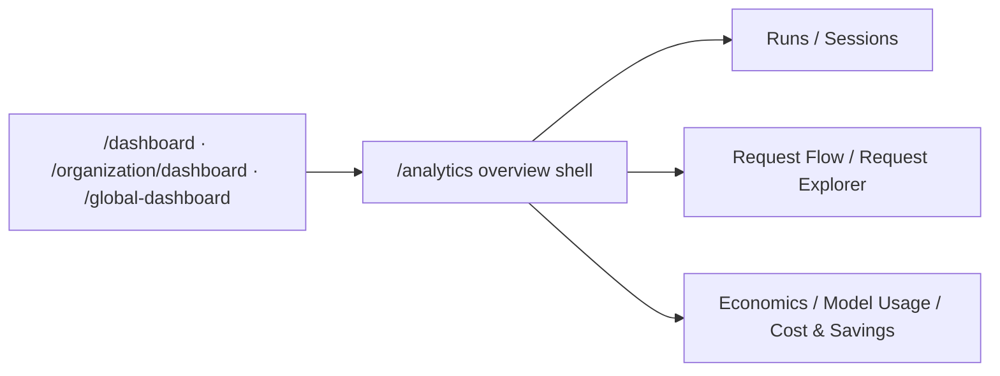

Analytics is the main Observe landing surface. It is the shared overview shell for:

- workspace operators coming from `/dashboard`
- organization administrators coming from `/organization/dashboard`
- platform administrators coming from `/global-dashboard`

<Frame caption="Analytics overview — one scoped entry point for workload health, spend, model mix, and request-analysis drill-downs.">
  
</Frame>

## Key features

- **Scoped overview** — switch between workspace, organization, and platform perspectives.
- **Top intents** — see which workflows are driving demand and cost in the current scope.
- **Request-analysis bridge** — jump directly into Runs, Request Flow, and Request Explorer.
- **Model mix** — inspect which providers and models dominate the selected window.
- **Recent activity** — review the latest runs or scope summary without leaving the overview.
- **Breakdown handoff** — use Analytics Breakdown for denser workspace charting when you need deeper charts.

## How it works

The page reads from the same scoped summary and request-analysis APIs that power deeper economics and observability drill-downs, so the numbers stay aligned across the product.

## Related

<CardGroup cols={3}>
  <Card title="Runs" icon="activity" href="/observability/runs">
    Inspect the concrete executions behind the overview metrics.
  </Card>
  <Card title="Request Flow" icon="git-branch" href="/observability/request-flow">
    Follow routing and outcome causality across the request path.
  </Card>
  <Card title="Economics" icon="wallet" href="/observability/economics">
    Continue into spend, savings, and optimization outcomes.
  </Card>
</CardGroup>

See [`examples/07_analytics_query.py`](https://github.com/avs6/runledger-community/blob/master/examples/07_analytics_query.py).
