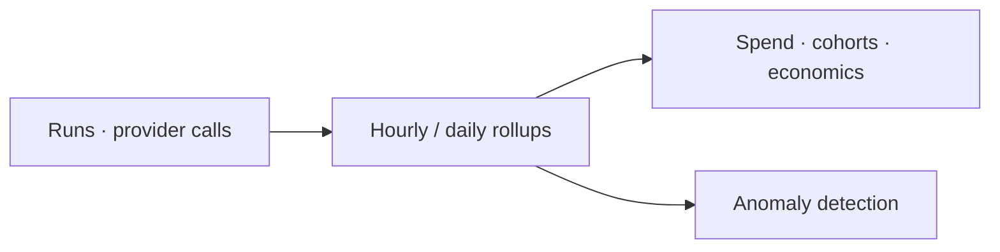

Analytics is the aggregate view: where the money goes, who spends it, how it trends, and when something
looks wrong.

<Frame caption="Analytics — spend charts, top spenders, cohorts, and anomalies.">
  
</Frame>

## Key features

- **Spend charts** — over time, by model, provider, feature, and tenant.
- **Top spenders** — the users, features, and workflows driving cost.
- **Cohorts** — compare segments of traffic.
- **Unit economics** — cost per run, per outcome, per step.
- **Anomaly detection** — surfaces sudden spend or usage spikes.

## How it works

Analytics reads from the same rollups the budgets and dashboards use, so numbers are consistent across the
product. Everything is queryable via the API for your own BI.

## Related

<CardGroup cols={2}>
  <Card title="Cost attribution" icon="building" href="/finops/attribution">
    The dimensions analytics slices by.
  </Card>
  <Card title="Alerts" icon="bell" href="/governance/alerts">
    Get notified on anomalies.
  </Card>
</CardGroup>

See [`examples/07_analytics_query.py`](https://github.com/avs6/runledger-community/blob/master/examples/07_analytics_query.py).
