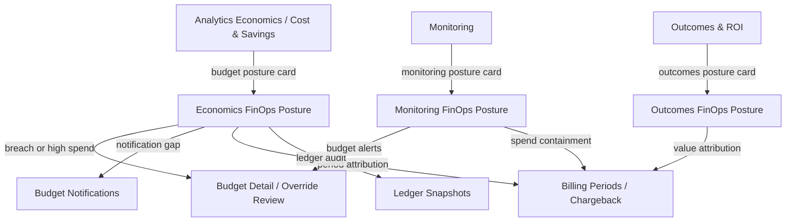

Economics, cost/savings, outcomes, and monitoring surfaces carry inline FinOps budget context so operators can trace AI spend through budget utilization, billing periods, and chargeback attribution without leaving the analytics flow.

## Economics & cost/savings posture

`GET /analytics/economics-finops-posture` returns the workspace-level FinOps posture for economics surfaces:

| Section | Fields |
|---|---|
| `budget_context` | `budgets`, `active_budgets`, `total_limit_usd`, `breach_count`, `overrides`, `active_overrides` |
| `billing_context` | `billing_periods`, `open_billing_periods`, `chargeback_rules` |
| `notification_context` | `notifications`, `active_notifications` |
| `ledger_context` | `ledger_snapshots`, `ledger_snapshots_30d` |
| `spend_context` | `total_spend_30d`, `total_runs_30d` |

This posture surfaces on the **Analytics Economics** and **Cost & Savings** pages as emerald-themed FinOps context cards with drill-through links to Budgets, Budget Detail, Budget Overrides, Notifications, Billing Periods, Chargeback, and Ledger.

### Analytics Economics

The Analytics Economics page shows a FinOps Budget Context card with:

- **Budgets** — active/total count
- **Overrides** — active/total override count
- **Notifications** — active/total notification count
- **Ledger (30d)** — recent ledger snapshot count

### Cost & Savings

The Cost & Savings page shows a FinOps Detail Context card with:

- **Billing Periods** — open/total billing period count
- **Overrides** — active/total override count
- **Notifications** — active/total notification count
- **Ledger Snapshots** — total snapshot count

## Outcomes & ROI posture

`GET /analytics/outcomes-finops-posture` returns the workspace-level FinOps posture for outcomes surfaces:

| Section | Fields |
|---|---|
| `budget_context` | `budgets`, `active_budgets`, `total_limit_usd`, `breach_count` |
| `billing_context` | `billing_periods`, `open_billing_periods`, `chargeback_rules` |
| `spend_context` | `total_spend_30d`, `outcomes_30d` |

The **Outcomes & ROI** page shows a FinOps Outcomes Context card with:

- **Budgets** — active/total count
- **Breaches** — breach count
- **Billing Periods** — open/total period count
- **Outcomes (30d)** — recent outcome count

Drill-through links: Budgets, Billing Periods, Billing Period Detail, Chargeback.

## Monitoring posture

`GET /analytics/monitoring-finops-posture` returns the workspace-level FinOps posture for monitoring surfaces:

| Section | Fields |
|---|---|
| `budget_context` | `budgets`, `active_budgets`, `breach_count`, `overrides`, `active_overrides` |
| `billing_context` | `billing_periods`, `open_billing_periods`, `chargeback_rules` |
| `notification_context` | `notifications`, `active_notifications` |
| `ledger_context` | `ledger_snapshots` |

The **Monitoring** page shows a FinOps Monitoring Context card with:

- **Budgets** — active/total count
- **Overrides** — active/total override count
- **Notifications** — active/total notification count
- **Billing Periods** — open/total period count

Drill-through links: Budgets, Budget Overrides, Notifications, Billing Periods, Chargeback, Ledger.

## Economics-to-FinOps workflow

1. **Economics surfaces** — Analytics Economics and Cost & Savings show budget detail links, override impact, notification status, and ledger readiness.
2. **Outcomes** — Outcomes & ROI links to billing period attribution and chargeback for value-based cost analysis.
3. **Monitoring** — Monitoring shows budget threshold alerts alongside runtime events for spend containment.
4. **Follow the links** — drill through to Budgets, Budget Detail, Budget Overrides, Notifications, Billing Periods, Chargeback, or Ledger.

## Related

<CardGroup cols={3}>
  <Card title="Analytics Economics" icon="wallet" href="/observability/economics">
    Spend, savings, and optimization outcomes.
  </Card>
  <Card title="Budgets" icon="wallet" href="/finops/budgets">
    Manage budget limits, overrides, and breach actions.
  </Card>
  <Card title="Chargeback" icon="receipt" href="/finops/chargeback">
    Cost allocation rules and cost center attribution.
  </Card>
</CardGroup>

See [`examples/79_economics_finops_posture.py`](https://github.com/avs6/runledger-community/blob/master/examples/79_economics_finops_posture.py).
