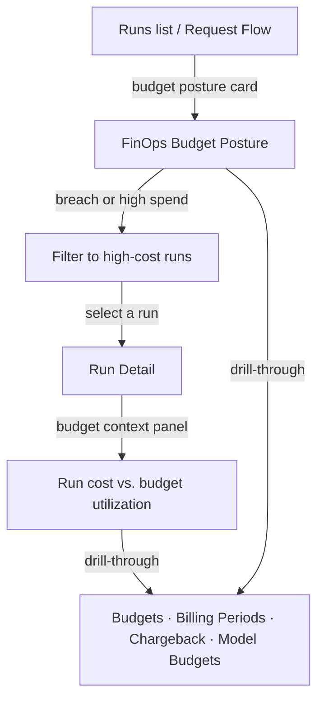

Every Observe investigation surface carries inline FinOps budget context so operators can trace AI requests through budget utilization, billing periods, and chargeback attribution without leaving the investigation flow.

## Budget posture across investigation scope

`GET /analytics/investigation-finops-budget-posture` returns the workspace-level FinOps posture:

| Section | Fields |
|---|---|
| `budget_context` | `budgets`, `active_budgets`, `total_limit_usd`, `breach_count`, `overrides`, `active_overrides` |
| `billing_context` | `billing_periods`, `open_billing_periods`, `chargeback_rules` |
| `spend_context` | `total_spend_30d`, `total_runs_30d` |

This posture surfaces on the **Runs list**, **Run detail**, **Request Flow**, and **Request Explorer** pages as a budget context card with drill-through links to Budgets, Billing Periods, Chargeback, and Model Budgets.

## Investigation surfaces

### Runs list

The Runs list page shows a FinOps budget summary card grid alongside the governance card grid:

- **Active Budgets** — active/total count with breach indicator
- **Budget Limit** — aggregate limit with active override count
- **Spend (30d)** — total 30-day spend with run count
- **Billing** — open billing periods with chargeback rule count

### Run detail

The Run Detail page shows a budget context panel below the governance evidence panel. It displays the run's cost alongside workspace budget utilization (active budgets, breach count, 30d spend vs. budget limit).

### Request Flow

The Request Flow page shows a FinOps budget posture card below the governance context card, summarizing active budgets, breach status, spend, and billing periods for the current investigation scope.

### Request Explorer

The Request Explorer's per-request detail view includes a Budget Context card with lifecycle cards for active budgets, budget limit, 30d spend, and billing periods — each with drill-through links.

### Analytics Overview

`GET /analytics/overview-finops-budget-posture` returns the workspace-level FinOps posture with notification status:

| Section | Fields |
|---|---|
| `budget_context` | `budgets`, `active_budgets`, `total_limit_usd`, `breach_count`, `overrides`, `active_overrides` |
| `billing_context` | `billing_periods`, `open_billing_periods`, `chargeback_rules` |
| `spend_context` | `total_spend_30d`, `total_runs_30d` |
| `notification_context` | `notifications`, `active_notifications` |

The Analytics Overview page shows a FinOps Budget Posture card (emerald theme) with:

- **Active Budgets** — active/total count with breach indicator
- **Budget Limit** — aggregate limit with active override count
- **Spend (30d)** — total 30-day spend with run count
- **Notifications** — active notification endpoints configured
- **Billing** — billing period count and open periods
- **Chargeback** — attribution rule count
- **Budget Health** — percentage of budgets within limit

Drill-through links: Budgets, Budget Detail, Budget Overrides, Notifications, Billing Periods, Billing Detail, Chargeback, Ledger, Model Budgets.

### Model Usage

`GET /analytics/model-budget-utilization` returns per-model budget utilization:

| Field | Description |
|---|---|
| `models[].model` | Model identifier |
| `models[].spend_30d` | 30-day spend for this model |
| `models[].request_count` | Request count for this model |
| `models[].budget_limit_usd` | Per-model budget limit (null if no budget) |
| `models[].budget_action` | Action when budget exceeded (`block`, `warn`, etc.) |
| `models[].period_type` | Budget period (`monthly`, `daily`, etc.) |
| `models[].is_active` | Whether the model budget is active |
| `total_model_budgets` | Total model budgets in workspace |
| `active_model_budgets` | Active model budgets |
| `billing_periods` | Total billing periods |
| `open_billing_periods` | Open billing periods |
| `chargeback_rules` | Chargeback attribution rules |

The Model Usage page shows a FinOps Model Budget Utilization card (emerald theme) with stat cards for model budgets, billing periods, chargeback rules, and models with budgets. A per-model budget table shows spend vs. limit with utilization percentage (color-coded: green < 80%, amber 80-100%, red > 100%).

Drill-through links: Model Budgets, Budgets, Budget Detail, Billing Periods, Billing Detail, Chargeback.

## Cost investigation workflow

1. **Start broad** — open Runs or Request Flow. The FinOps budget posture card shows aggregate budget health (active budgets, breaches, 30d spend).
2. **Identify cost pressure** — if budgets are in breach or spend is approaching limits, drill into the Runs list with cost filters (`min_cost`, `max_cost`).
3. **Inspect a run** — open Run Detail to see the run's cost in the context of workspace budget utilization.
4. **Follow the links** — drill through to Budgets for limit/override management, Billing Periods for period attribution, Chargeback for cost allocation, or Model Budgets for per-model spend controls.

## Related

<CardGroup cols={3}>
  <Card title="Runs" icon="activity" href="/observability/runs">
    Browse runs with cost filters and budget context.
  </Card>
  <Card title="Budgets" icon="wallet" href="/finops/budgets">
    Manage budget limits, overrides, and breach actions.
  </Card>
  <Card title="Chargeback" icon="receipt" href="/finops/chargeback">
    Cost allocation rules and cost center attribution.
  </Card>
</CardGroup>

See [`examples/75_investigation_finops_budget_bridge.py`](https://github.com/avs6/runledger-community/blob/master/examples/75_investigation_finops_budget_bridge.py).
