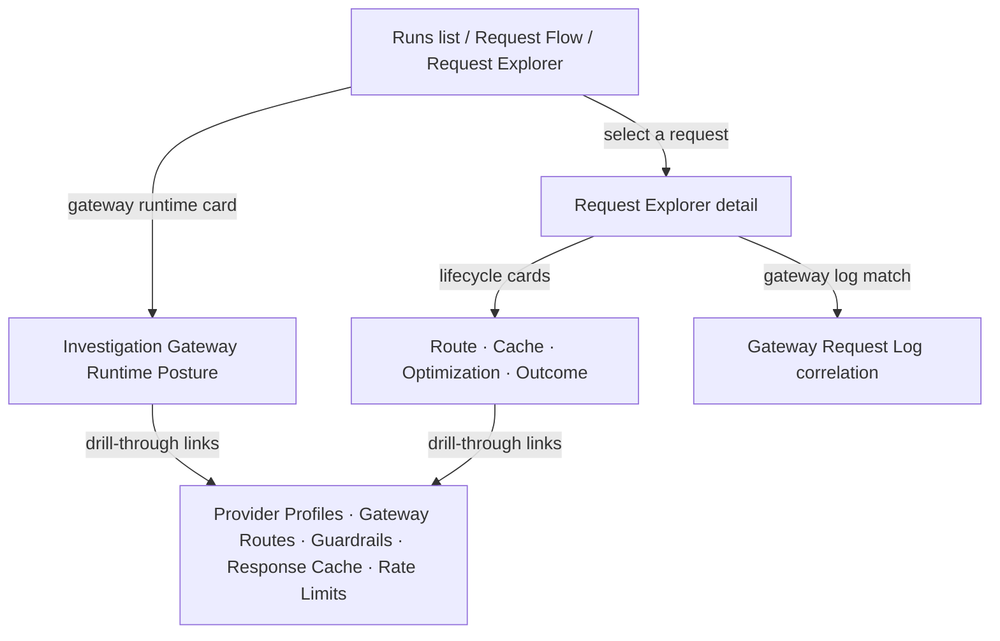

Every Observe investigation surface carries inline gateway runtime context so operators can trace AI requests through provider routing, guardrail evaluation, cache behavior, and rate limit enforcement without leaving the investigation flow.

## Gateway runtime posture across investigation scope

`GET /analytics/investigation-gateway-runtime-posture` aggregates gateway runtime signals across the workspace:

| Field | Description |
|---|---|
| `provider_context` | Distinct providers, active/total routes, active routing policies |
| `route_context` | Gateway requests (30d), cache hits (30d), passthrough endpoints |
| `guardrail_context` | Active guardrail rules, events (30d), blocks (30d) |
| `cache_context` | Enabled cache configs, cache entries, total hits, savings in USD |
| `rate_limit_context` | Routes with RPM limits, routes with cost limits |

This endpoint accepts an optional `access_group_id` filter.

## Per-request gateway evidence

The **Request Explorer** already correlates each request with its `GatewayRequestLog` match to surface:

- **Route alias** — which gateway route served the request
- **Decision reason** — why the gateway selected that route
- **Cache status** — whether a cache hit occurred and how many tokens were cached
- **Optimization status** — whether cache, semantic cache, or compiler optimizations applied

## Investigation surfaces

| Surface | Gateway runtime card | Gateway request match | Drill-through links |
|---|---|---|---|
| Runs list | Yes (violet theme) | — | Provider Profiles, Gateway Routes, Guardrails, Response Cache, Rate Limits |
| Run detail | Yes (violet theme) | — | Provider Profiles, Gateway Routes, Guardrails, Response Cache, Rate Limits |
| Request flow | Yes (violet theme) | — | Provider Profiles, Gateway Routes, Guardrails, Response Cache, Rate Limits |
| Request explorer | Yes (violet theme) | Yes (per-request) | Provider Profiles, Gateway Routes, Guardrails, Response Cache, Rate Limits |

## Investigation workflow

1. **Start broad** — open Runs, Request Flow, or Request Explorer. The gateway runtime posture card shows aggregate provider, guardrail, cache, and rate limit counts.
2. **Read the posture card** — identify how many providers, guardrail rules, cache configs, and rate-limited routes exist for the workspace.
3. **Drill into a request** — open Request Explorer to see per-request route, cache, and optimization evidence from gateway log correlation.
4. **Follow the links** — drill through to Provider Profiles, Gateway Routes, Guardrails, Response Cache, or Rate Limits for the full configuration.

## Related

<CardGroup cols={3}>
  <Card title="Runs" icon="activity" href="/observability/runs">
    Browse individual runs with gateway context.
  </Card>
  <Card title="Request Flow" icon="git-branch" href="/observability/request-flow">
    Sankey flow with gateway runtime posture.
  </Card>
  <Card title="Gateway" icon="route" href="/gateway/overview">
    Manage routes, routing policies, and provider profiles.
  </Card>
</CardGroup>

See [`examples/78_investigation_gateway_runtime.py`](https://github.com/avs6/runledger-community/blob/master/examples/78_investigation_gateway_runtime.py).
