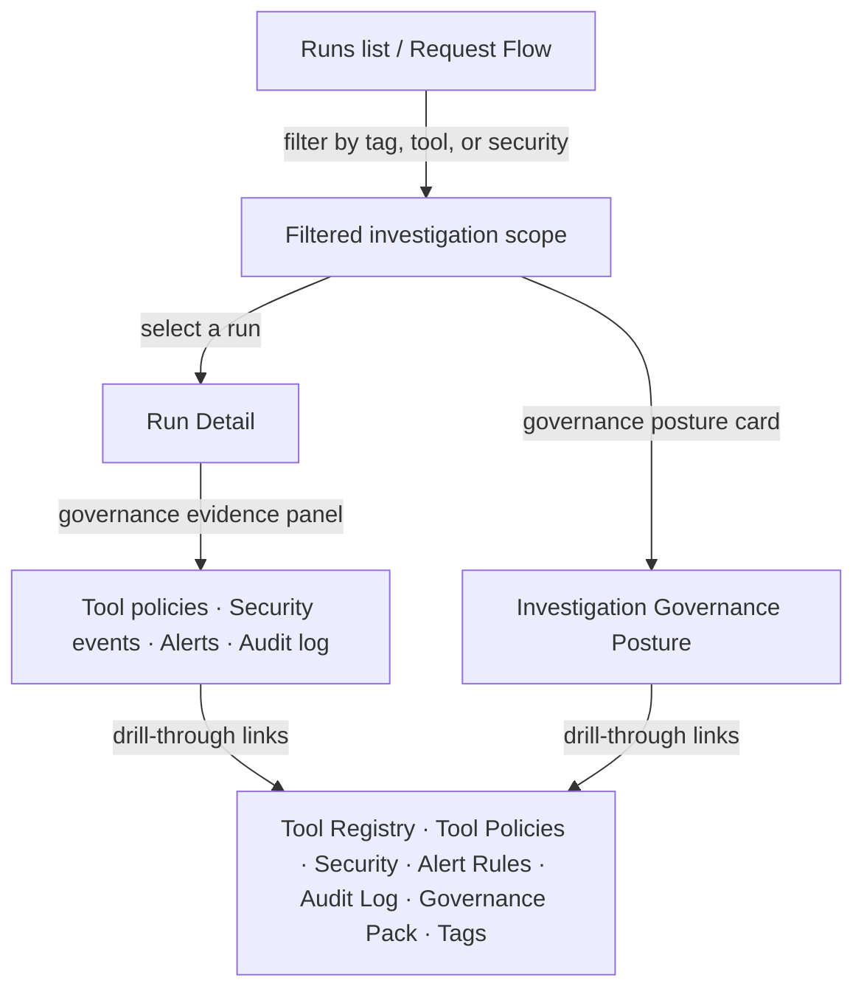

Every Observe investigation surface carries inline governance context so operators can trace AI requests through tool policy evaluation, security event correlation, audit log linkage, and governance pack evidence without leaving the investigation flow.

## Governance context per run

`GET /runs/{run_id}/governance` returns the full governance evidence for a single run:

| Field | Description |
|---|---|
| `tags` | Metadata tags associated with the run |
| `tool_evidence` | Per-tool-call policy matches: matched policy names, actions, risk score, registry enforcement |
| `security_events` | Correlated security events (by run ID, end user, or tool name) |
| `alert_evidence` | Alert rule firings within the run's time window |
| `audit_events` | Audit log entries targeting the run, its tools, or governance-related resources |
| `governance_pack_summary` | Workspace-level counts: approvals, tool policies, capture policies, tags |

The **Run Detail** page renders this as a Governance Evidence Panel with counts and drill-through links to Tool Registry, Tool Policies, Security, Alert Rules, Audit Log, Governance Pack, and Tags.

## Governance posture across investigation scope

`GET /analytics/investigation-governance-posture` aggregates governance signals across the current investigation scope:

- **Tool governance** — active policies, total tool calls, filtered tool calls, average risk score
- **Security** — total events, recent events, distinct event types
- **Alert rules** — active rules, recent firings, unresolved firings
- **Audit log** — governance events, recent entries
- **Governance pack** — approval count, tool policy count, capture policy count, tag count

This endpoint accepts `from`, `to`, `access_group_id`, `tag`, `tool_name`, and `security_event_only` filters.

## Governance-dimension filters

The following investigation surfaces accept governance-dimension filters:

| Surface | `tag` | `tool_name` | `security_event_only` |
|---|---|---|---|
| Runs list (`GET /runs`) | Yes | Yes | Yes |
| Runs export (`GET /runs/export`) | Yes | Yes | Yes |
| Request flow (`GET /runs/flow`) | Yes | Yes | Yes |
| Request explorer (`GET /analytics/request-explorer`) | Yes | Yes | Yes |

- **`tag`** — filters to runs matching a feature tag or metadata tag value.
- **`tool_name`** — filters to runs that invoked the named tool.
- **`security_event_only`** — filters to runs with at least one correlated security event.

In the UI, these appear in the **Governance** section of the Run Filters panel (Runs list, Request Explorer) and as URL query parameters on Request Flow.

## Investigation workflow

1. **Start broad** — open Runs or Request Flow. Use governance filters to narrow to a tag, tool, or security-event scope.
2. **Read the posture card** — the governance posture summary shows aggregate counts (policies, events, firings, audit entries) for the filtered scope.
3. **Drill into a run** — open Run Detail to see the per-run Governance Evidence Panel with specific tool policy matches, security events, and alert firings.
4. **Follow the links** — drill through to Tool Registry, Tool Policies, Security, Alert Rules, Audit Log, or Governance Pack for the full record.

## Related

<CardGroup cols={3}>
  <Card title="Runs" icon="activity" href="/observability/runs">
    Browse individual runs with governance filters.
  </Card>
  <Card title="Request Flow" icon="git-branch" href="/observability/request-flow">
    Sankey flow with governance-dimension filtering.
  </Card>
  <Card title="Tool Governance" icon="shield" href="/governance/tool-governance">
    Manage tool registry, policies, and enforcement.
  </Card>
</CardGroup>

See [`examples/74_investigation_governance_traceability.py`](https://github.com/avs6/runledger-community/blob/master/examples/74_investigation_governance_traceability.py).
