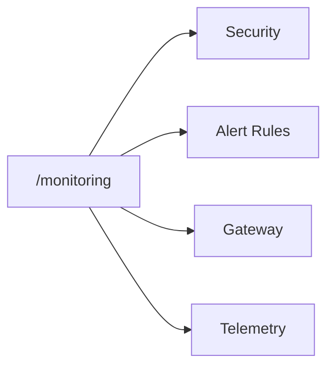

Monitoring is the lightweight triage surface for operators who need to check what is firing right now before jumping into deeper admin pages.

## What it covers

- **Security events** — recent security findings and tool-related events.
- **Alert firings** — active and recent alert activity.
- **Gateway log** — recent gateway request outcomes and failures.
- **Telemetry handoff** — quick route into Telemetry for OTLP ingest health, batches, and signal coverage.

Monitoring is not the place to configure everything. It is the page you land on to triage a problem and then branch into the right operational owner.

## Workflow

## Related

<CardGroup cols={2}>
  <Card title="Telemetry" icon="radio" href="/otlp">
    OTLP ingest health, batches, and signal coverage live in the Telemetry surface.
  </Card>
  <Card title="Request Explorer" icon="search" href="/observability/request-explorer">
    Investigate failed or suspicious requests in more detail.
  </Card>
</CardGroup>
