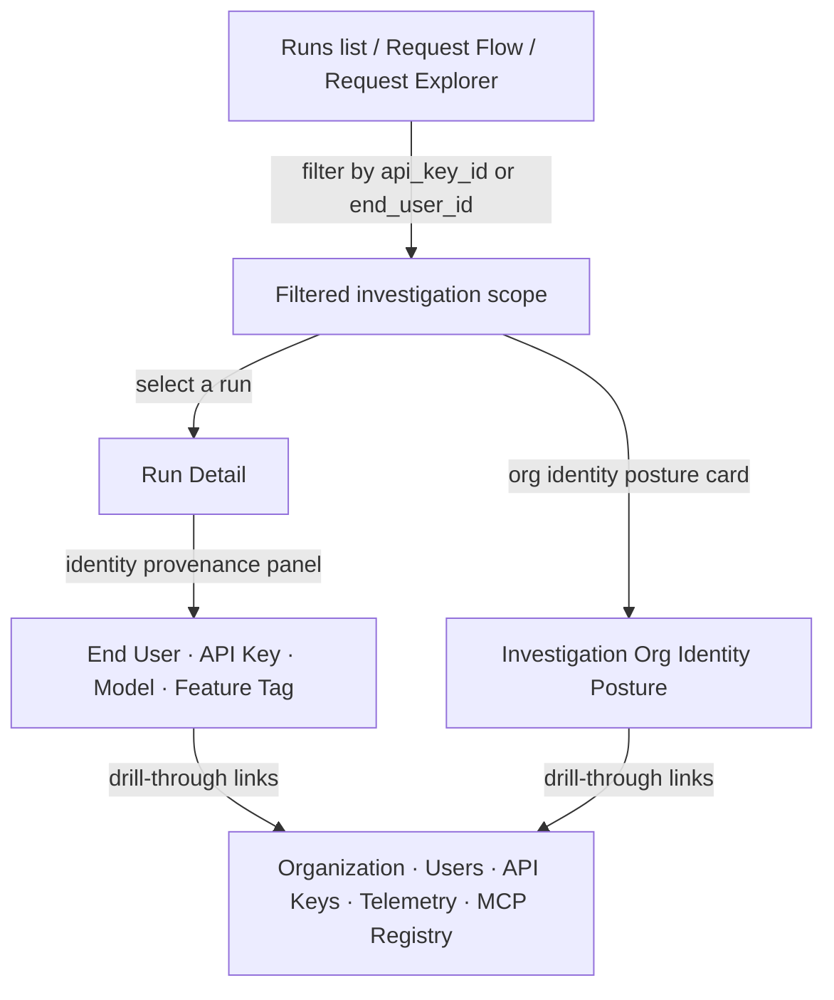

Every Observe investigation surface carries inline org identity context so operators can trace AI requests through user identity, API key provenance, telemetry batch correlation, and MCP registry linkage without leaving the investigation flow.

## Org identity posture across investigation scope

`GET /analytics/investigation-org-identity-posture` aggregates org identity signals across the workspace:

| Field | Description |
|---|---|
| `org_context` | Workspace name and total workspace users |
| `user_context` | Workspace users, distinct end users (30d), runs (30d) |
| `api_key_context` | Total keys, active keys, keys with traffic (30d) |
| `telemetry_context` | Telemetry batches (30d), runs (30d) |
| `mcp_context` | MCP servers, tool calls (30d) |

## Identity-dimension filters

The following investigation surfaces accept identity-dimension filters:

| Surface | `api_key_id` | `end_user_id` |
|---|---|---|
| Runs list (`GET /runs`) | Yes | Yes |
| Runs export (`GET /runs/export`) | Yes | Yes |
| Request flow (`GET /runs/flow`) | Yes | Yes |
| Request explorer (`GET /analytics/request-explorer`) | — | Yes |
| Sessions (`GET /sessions`) | — | Yes |

- **`api_key_id`** — filters to runs originating from a specific API key.
- **`end_user_id`** — filters to runs associated with a specific end user identity.

In the UI, these appear in the Run Filters panel (Runs list), FilterBar (Request Explorer), and session filters (Sessions page).

## Per-run identity provenance

The **Run Detail** page renders an Identity Provenance panel showing:

- **End User** — the end user identity associated with the run
- **API Key** — the API key used (truncated), with a link to filter runs by that key
- **Model** — the primary model used
- **Feature Tag** — the intent tag

Each field links to the relevant Org & Access surface (Organization, Users, API Keys, Telemetry, MCP Registry).

## Investigation workflow

1. **Start broad** — open Runs, Request Flow, or Request Explorer. Use identity filters to narrow to an API key or end user.
2. **Read the posture card** — the org identity posture summary shows aggregate counts (users, keys, MCP servers, telemetry batches) for the workspace.
3. **Drill into a run** — open Run Detail to see the Identity Provenance panel with specific user, key, and model information.
4. **Follow the links** — drill through to Organization, Users, API Keys, Telemetry, or MCP Registry for the full record.

## Related

<CardGroup cols={3}>
  <Card title="Runs" icon="activity" href="/observability/runs">
    Browse individual runs with identity filters.
  </Card>
  <Card title="Request Flow" icon="git-branch" href="/observability/request-flow">
    Sankey flow with identity-dimension filtering.
  </Card>
  <Card title="Organization" icon="building" href="/access/organization">
    Manage workspace profile, users, and API keys.
  </Card>
</CardGroup>

See [`examples/73_investigation_access_group_posture.py`](https://github.com/avs6/runledger-community/blob/master/examples/73_investigation_access_group_posture.py).
