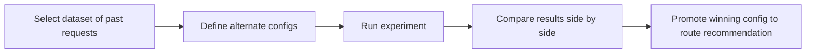

The Replay Lab lets you take real requests from production and replay them through different model configurations to find the optimal route. Compare cost, quality, tokens, and latency side by side, then promote the winning config as a Gateway route recommendation.

## Key features

- **Multi-config comparison** — replay the same requests through different models, providers, cache policies, and compression settings.
- **Side-by-side results** — compare response quality, cost, tokens, latency, tool usage, and outcome score.
- **Experiment creation** — replay results become experiments for further analysis.
- **Route recommendations** — promote a winning config directly to a Gateway route recommendation.
- **Cost delta analysis** — see percentage savings between configurations.

## Workflow

## Related

<CardGroup cols={2}>
  <Card title="Model scorecards" icon="trophy" href="/observability/model-scorecards">
    Quality metrics that inform replay decisions.
  </Card>
  <Card title="Optimization simulator" icon="flask" href="/observability/optimization-simulator">
    What-if analysis without replaying real traffic.
  </Card>
</CardGroup>
