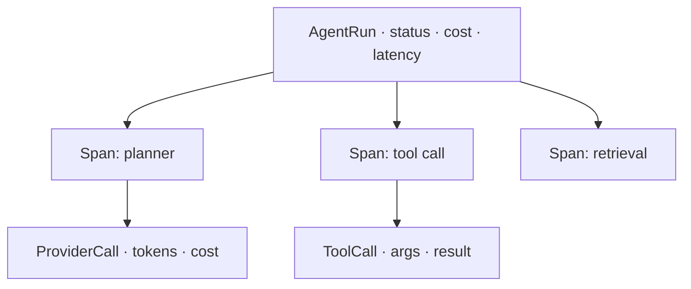

The Run Explorer is where you inspect individual agent runs: filter and paginate, open the execution DAG,
and see exactly where the time and money went.

<Frame caption="Run Explorer — filter runs, open the DAG viewer, export CSV.">
  
</Frame>

## Key features

- **Filter & paginate** — by model, user, feature, status, time.
- **DAG viewer** — the run's `AgentRun → Span → ProviderCall / ToolCall` tree, interactively.
- **Per-step cost** — cost and latency decomposed across steps, tools, retrieval, and retries.
- **CSV export** — pull filtered runs for offline analysis.

## The run tree

Every run is trace-linked to its metering, so the DAG doubles as a cost breakdown — the basis for
[cost attribution](/finops/attribution) and [unit economics](/finops/attribution#unit-economics).

## Related

<CardGroup cols={2}>
  <Card title="Sessions" icon="comments" href="/observability/sessions">
    Group runs into conversations.
  </Card>
  <Card title="Analytics" icon="chart-mixed" href="/observability/analytics">
    Aggregate across runs.
  </Card>
</CardGroup>

See [`examples/10_replay_experiment.py`](https://github.com/avs6/runledger-community/blob/master/examples/10_replay_experiment.py).
