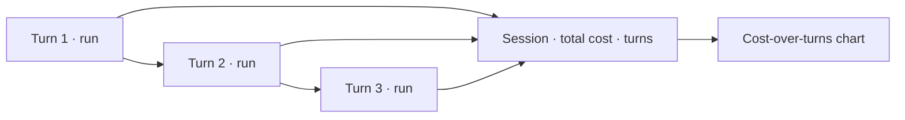

A **session** groups the runs of a multi-turn conversation. Instead of seeing isolated calls, you see the
whole conversation — how cost accumulates turn over turn, and where it spiked.

## Key features

- **Conversation grouping** — pass a `session_id`; runs with the same id form a session.
- **Cost-over-turns** — a chart of spend per turn and cumulative session cost.
- **Per-turn drill-down** — jump from any turn into its [run](/observability/runs).

## How it works



Attach the session id at instrumentation time:

```python
with rl.context(session_id="conv_42", end_user_id="u_123"):
    ...  # each turn is one run in session conv_42
```

## Related

<CardGroup cols={2}>
  <Card title="Run Explorer" icon="magnifying-glass-chart" href="/observability/runs">
    Drill into any turn.
  </Card>
  <Card title="Cost attribution" icon="building" href="/finops/attribution">
    Attribute session cost to users/features.
  </Card>
</CardGroup>

See [`examples/16_sessions.py`](https://github.com/avs6/runledger-community/blob/master/examples/16_sessions.py).
