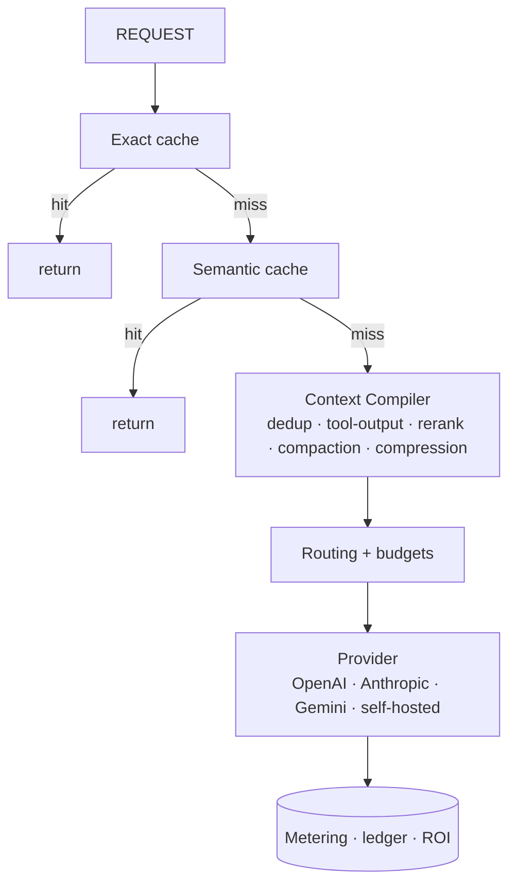

RunLedger doesn't just *measure* AI cost — it *reduces* it. The optimization layer sits inline in the
Model Gateway and cuts tokens before they're ever sent to a provider. Every stage is **opt-in,
fail-open, and default-off**, so it can never break a working request, and everything runs on **CPU —
no GPU required**.

## The pipeline



## Features

<CardGroup cols={2}>
  <Card title="Semantic Cache" href="/optimization/semantic-cache">
    Serve paraphrases from cache with strict scope isolation.
  </Card>
  <Card title="Self-Hosted & Local Models" href="/optimization/local-models">
    Ollama, vLLM, or any OpenAI-compatible endpoint as a metered provider.
  </Card>
  <Card title="Context Compiler" href="/optimization/context-compiler">
    Shrink oversized requests: dedup, tool-output, rerank, compaction.
  </Card>
  <Card title="Prompt Compression" href="/optimization/prompt-compression">
    Opt-in LLMLingua-2 token compression, under a quality floor.
  </Card>
  <Card title="Intelligent Routing" href="/optimization/intelligent-routing">
    Route by complexity × risk to the right model tier; set reasoning effort.
  </Card>
  <Card title="Cognitive Layer" href="/optimization/cognitive-layer">
    Shared memory, knowledge graph, and skills over MCP.
  </Card>
  <Card title="Tool Filtering & Skills" href="/optimization/tool-filtering">
    Keep only relevant tools; inject the body of matched skills.
  </Card>
  <Card title="Optimization Flywheel" href="/optimization/flywheel">
    Learn the cheapest config per segment that holds your quality SLA — then recommend or auto-apply it.
  </Card>
</CardGroup>

## Services & ports

Everything comes up with `docker compose up -d`:

| Service | Port | Role |
|---------|------|------|
| `runledger-qdrant` | 8202 | Vector store (semantic cache) |
| `runledger-embedding-svc` | 8204 | Shared CPU embedding model of record |
| `runledger-semantic-cache-svc` | 8205 | Scope-isolated near-duplicate cache |
| `runledger-mcp-gateway` | 8206 | MCP server (`compile_context`, `health`) |
| `runledger-context-compiler` | 8207 | The Context Compiler |
| `runledger-reranker` | 8208 | Cross-encoder reranker (MiniLM / BGE) |
| `runledger-compression` | 8209 | LLMLingua-2 prompt compression (opt-in) |
| `runledger-router` | 8210 | Intelligent routing (complexity × risk → tier) |
| `runledger-memory-svc` / `runledger-letta` | 8211 / 8214 | Shared memory (Letta) |
| `runledger-kg-svc` | 8212 | Knowledge graph (Kùzu) |
| `runledger-skill-registry` | 8213 | Skill registry |
| `runledger-flywheel` | 8215 | Cost × quality flywheel analyzer |

Local LLM runtimes (Ollama / vLLM) are external and reached via `OLLAMA_BASE_URL` / `VLLM_BASE_URL`.

## Running in production

On Kubernetes, every stateless service here autoscales (HPA + PDB + anti-affinity) and the stateful
stores are pluggable — in-cluster or managed. See [Helm deployment](/helm), [high availability](/ha), and
[backup & restore](/backup-restore).

## Measuring savings

The `scripts/bench` harness runs the same workload under different profiles and reports tokens, cache
hits, decision reasons, and latency:

```bash
# Baseline
python scripts/bench/run_benchmark.py --api-key $RL_KEY --alias my-route --profile baseline --repeat 5
# With the optimizers on
python scripts/bench/run_benchmark.py --api-key $RL_KEY --alias my-route --profile optimized \
    --semantic-cache --context-compiler --repeat 5
# Compare
python scripts/bench/report.py --api-key $RL_KEY --alias my-route
```

The invariant across every stage: **cost reduction subject to a quality floor**. Optimizations are
measured on the evaluation harness and can be turned off per route the moment quality regresses.

## Organization, Gateway & Observe Context (Optimization Opportunities)

The Optimization Opportunities page surfaces three posture cards:

- **Organization & Access Context** (blue) — workspace, API keys, hub models with drill-through to Organization, API Keys, AI Hub
- **Gateway & Routing Context** (violet) — providers, routes, guardrails, cache configs, rate limits with drill-through to Model Gateway, Routes, Guardrails, Response Cache, Rate Limits
- **Observe & Runtime Context** (cyan) — runs 30d, provider calls, distinct models, cost 30d with drill-through to Analytics Overview, Runs, Request Flow, Request Explorer, Model Usage

```bash
curl -H "Authorization: Bearer $KEY" \
  $HOST/analytics/optimization-org-gateway-posture

curl -H "Authorization: Bearer $KEY" \
  $HOST/analytics/optimization-observe-posture

curl -H "Authorization: Bearer $KEY" \
  $HOST/analytics/optimization-finops-posture
```

## FinOps & Budget Context (Optimization Surfaces)

All three optimization surfaces (Opportunities, Simulator, Model Scorecards) show a **FinOps & Budget Context** card (emerald) via `GET /analytics/optimization-finops-posture`:

- **Budget context** — active budgets, total limit, 30d spend, notifications
- **Billing context** — active / total billing periods
- **Chargeback context** — chargeback rules (active / total)

Drill-through links: Budgets, Billing Periods, Chargeback, Cost & Savings.

## Build & Improve Loop (Optimization Surfaces)

All three optimization surfaces also show a **Build & Improve Loop** card (rose) via `GET /analytics/build-internal-posture`:

```bash
curl -H "Authorization: Bearer $KEY" \
  $HOST/analytics/build-internal-posture
```

- **Playground context** — sessions 30d, provider calls 30d
- **Prompts context** — total prompts
- **Workflows context** — definitions, runs 30d
- **Evaluation context** — datasets, experiments
- **Replay context** — datasets, experiments
- **Optimization context** — hub models, spend 30d
- **Scorecards context** — hub models, score events 30d

Drill-through links connect each optimization surface to Playground, Workflows, Evaluation Studio, and Model Scorecards.
